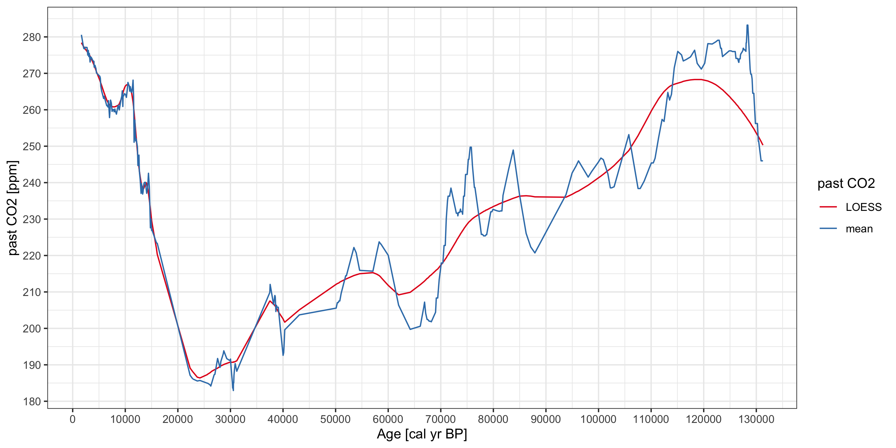
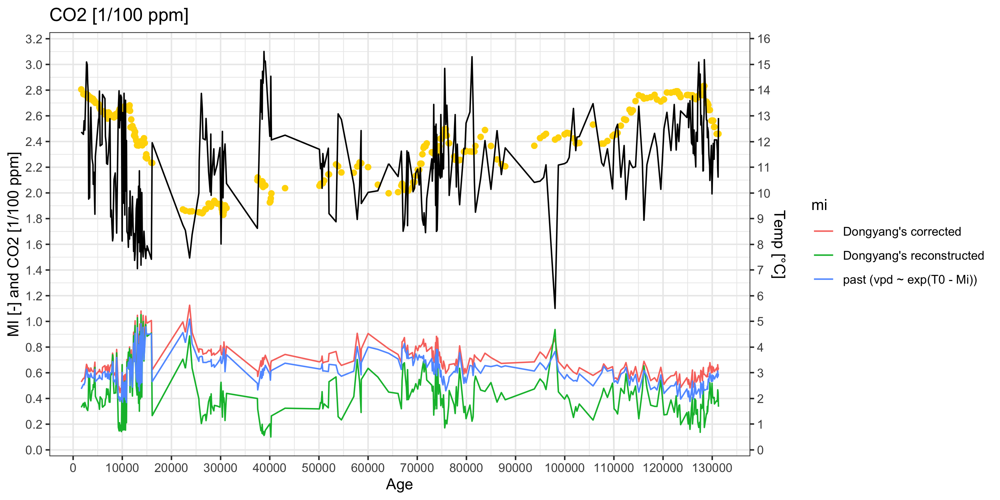

El Cañizar de Villarquemado
================

### Obtain corrected `MI` from reconstructed `MI` and past & modern temperature and CO2

``` r
out <- mi_input %>%
  dplyr::mutate(ca_temp = past_temp - present_t,
                ca_co2 = past_co2 / modern_co2) %>%
  purrr::pmap(function(ca_temp, present_t, recon_mi, ca_co2, ...) {
    codos:::P_model_inverter$new(ca_temp, present_t, recon_mi, ca_co2)$calculate_m_true()
  }) %>% purrr::transpose() %>%
  tibble::as_tibble()

knitr::kable(head(out))
```

| mi        | cph  | ci       |
| :-------- | :--- | :------- |
| 0.528581  | TRUE | 45.15672 |
| 0.5566239 | TRUE | 45.29001 |
| 0.5550583 | TRUE | 45.73162 |
| 0.5730361 | TRUE | 45.59425 |
| 0.6659247 | TRUE | 49.82797 |
| 0.650894  | TRUE | 49.37501 |

Load files with `MTCO`, `GDD_0`, and `recontructed MI`:

``` r
gdd0 <- readr::read_csv(here::here("inst/extdata/gdd0.csv"))
mtco <- readr::read_csv(here::here("inst/extdata/mtco.csv"))
recon_mi <- readr::read_csv(here::here("inst/extdata/recon_mi.csv"))
```

Load input and output of the MI adjuster script:

``` r
mi_input <- readr::read_csv(here::here("inst/extdata/mi_input.csv"))
mi_output <- readr::read_csv(here::here("inst/extdata/mi_output.csv"))
```

Solve relation between `GDD0`, `Tmin` and `Tmax`:

``` r
GDD0 <- dplyr::pull(gdd0[, 1])
MTCO <- dplyr::pull(mtco[, 1]) # Tmin
MAT <- rep(NA, length(GDD0))
# =============================================================================
# If Tmin >= 0 MAT = GDD0/(2*pi)
# =============================================================================
MAT[MTCO >= 0] <- GDD0[MTCO >= 0] / (2 * pi)
# =============================================================================
# If Tmin < 0 and GDD0 = 0, MAT = less than Tmin/2 but cannot be accurately
# determined
# =============================================================================
if (length(MTCO[(MTCO < 0) & (GDD0 == 0.0)]) > 0)
  message("There are values where MTCO < 0 and GDD0 = 0. ",
          "Only the maximum MAT can be determined (Tmin/2). ",
          "Return -9999 as values")
MAT[(MTCO < 0) & (GDD0 == 0.0)] <- -9999
# =============================================================================
# If Tmin >= 0 and GDD0 = 0, something is fishy
# =============================================================================
if (length(MAT[(MTCO >= 0) & (GDD0 == 0.0)]) > 0)
  message("There seems to be some values where Tmin >= 0 and GDD0 = 0; ",
          "This is very fishy and should never happen (would mean that ",
          "MTCO was not really MTCO)")
# =============================================================================
# If Tmin < 0 and GDD0 > 0, MAT can be calculated using the optimise method
# =============================================================================
t0 <- GDD0 / MTCO
min_u <- -1 # minimum valid value for 'u' is -1
max_u <- 0.9999999999 # maximum valid value for 'u' is 1

t0_input = t0[(MTCO < 0) & (GDD0 > 0)]

u <- purrr::map(.x = t0_input,
                .f = find_u,
                min_u = min_u,
                max_u = max_u,
                method = "Brent") %>%
  purrr::transpose("par") %>%
  purrr::pluck("par") %>% 
  purrr::flatten_dbl()

MAT[(MTCO < 0) & (GDD0 > 0)] <- -MTCO[(MTCO < 0) & (GDD0 > 0)] * u / (1 - u)
```

Calculate `u` for all values pf `GDDD0 / MTCO`:

``` r
x <- GDD0 / MTCO
x[x > 0] <- -x[x > 0]
u <- purrr::map(.x = x, .f = find_u) %>%
  purrr::transpose("par") %>%
  purrr::pluck("par") %>% 
  purrr::flatten_dbl()
```

Calculate growing season length (GSL):

``` r
GSL <- (365 / pi) * acos(-u)
ggplot2::qplot(y = GSL) +
  ggplot2::geom_line() +
  ggplot2::labs(title = "Growing season length",
                x = NULL, 
                y = "GSL") +
  ggplot2::theme_bw()
```

Calculate the mean growing season temperature:

``` r
gs <- GDD0 / GSL
data.frame(x = rep(seq_len(332), 2),
                 y = c(gs, MAT * 2 * pi / 365),
                 cat = rep(c("GDD0/GSL", "MAT"), each = 332)) %>%
  ggplot2::ggplot(., ggplot2::aes(x, y, )) + 
    ggplot2::geom_line(ggplot2::aes(color = cat)) +
    ggplot2::labs(title = "Mean growing season temperature",
                  x = NULL, 
                  y = "GS [°C]") +
    ggplot2::scale_color_brewer(name = "Growing Season",
                                palette = "Set1", 
                                direction = -1) +
    ggplot2::theme_bw()
```

# CRU TS 4.04

Solve relation between `GDD0`, `Tmin` and `Tmax`:

``` r
path <- "~/Desktop/iCloud/UoR/Data/CRU/4.04/"
GDD0 <- matrix(codos:::nc_var_get(file.path(path, 
                                            "cru_ts4.04-clim-1961-1990-daily.tmp-gdd0.nc"),
                                  "tmp")$data, ncol = 1, byrow = TRUE)
MTCO <- matrix(codos:::nc_var_get(file.path(path,
                                            "cru_ts4.04.1901.2019.tmn.dat-clim-1961-1990-int-gs.nc"), 
                                  "tmn")$data, ncol = 1, byrow = TRUE)
Tmp <- matrix(codos:::nc_var_get(file.path(path, 
                                           "cru_ts4.04-clim-1961-1990-daily.tmp-gs.nc"), 
                                 "tmp")$data, ncol = 1, byrow = TRUE)

# Remove NAs
idx <- !is.na(GDD0) & !is.na(MTCO)
GDD0 <- GDD0[idx]
MTCO <- MTCO[idx]
MAT <- rep(NA, length(GDD0))
Tmp <- Tmp[idx]
# =============================================================================
# If Tmin >= 0 MAT = GDD0/(2*pi)
# =============================================================================
MAT[MTCO >= 0] <- GDD0[MTCO >= 0] / (2 * pi)
# =============================================================================
# If Tmin < 0 and GDD0 = 0, MAT = less than Tmin/2 but cannot be accurately
# determined
# =============================================================================
if (length(MTCO[(MTCO < 0) & (GDD0 == 0.0)]) > 0)
  message("There are values where MTCO < 0 and GDD0 = 0. ",
          "Only the maximum MAT can be determined (Tmin/2). ",
          "Return -9999 as values")
MAT[(MTCO < 0) & (GDD0 == 0.0)] <- -9999
# =============================================================================
# If Tmin >= 0 and GDD0 = 0, something is fishy
# =============================================================================
if (length(MAT[(MTCO >= 0) & (GDD0 == 0.0)]) > 0)
  message("There seems to be some values where Tmin >= 0 and GDD0 = 0; ",
          "This is very fishy and should never happen (would mean that ",
          "MTCO was not really MTCO)")
# # =============================================================================
# # If Tmin < 0 and GDD0 > 0, MAT can be calculated using the optimise method
# # =============================================================================
# t0 <- GDD0 / MTCO
# min_u <- -1 # minimum valid value for 'u' is -1
# max_u <- 0.9999999999 # maximum valid value for 'u' is 1
# 
# t0_input = t0[(MTCO < 0) & (GDD0 > 0)]
# 
# u <- purrr::map(.x = t0_input,
#                 .f = find_u,
#                 min_u = min_u,
#                 max_u = max_u,
#                 method = "Brent") %>%
#   purrr::transpose("par") %>%
#   purrr::pluck("par") %>% 
#   purrr::flatten_dbl()
# 
# MAT[(MTCO < 0) & (GDD0 > 0)] <- -MTCO[(MTCO < 0) & (GDD0 > 0)] * u / (1 - u)
```

Calculate `u` for all values of `GDDD0 / MTCO`:

``` r
x <- GDD0 / MTCO
x[x > 0] <- -x[x > 0]
u <- purrr::map(.x = x, .f = codos:::find_u) %>%
  purrr::transpose("par") %>%
  purrr::pluck("par") %>% 
  purrr::flatten_dbl()
MTCO_cat <- ifelse(is.na(MTCO), "UNK",
            ifelse(MTCO >= 0 & MTCO <= 5, "0-5",
              ifelse(MTCO > 5 & MTCO <= 10, "5-10",
                ifelse(MTCO > 10 & MTCO <= 15, "10-15",
                  ifelse(MTCO > 15 & MTCO <= 20, "15-20",
                    ifelse(MTCO > 20 & MTCO <= 25, "20-25",
                      ifelse(MTCO > 25 & MTCO <= 30, "25-30",
                        ifelse(MTCO > 30 & MTCO <= 35, "30-35", "35+"))))))))
```

Calculate growing season length (GSL):

``` r
GSL <- (365 / pi) * acos(-u)
ggplot2::qplot(y = GSL) +
  ggplot2::geom_line(ggplot2::aes(color = MTCO_cat)) +
  ggplot2::labs(title = "Growing season length",
                x = NULL, 
                y = "GSL") +
  ggplot2::theme_bw()
```

Calculate the mean growing season temperature:

``` r
gs <- GDD0 / GSL
data.frame(x = rep(seq_len(length(GDD0)), 2),
                 y = c(gs, Tmp),#GDD0* 2 * pi / 365), #MAT * 2 * pi / 365),
                 cat = rep(c("GDD0/GSL", "Tmp [T0]"), each = length(GDD0))) %>%
  ggplot2::ggplot(., ggplot2::aes(x, y, )) + 
    ggplot2::geom_point(ggplot2::aes(color = cat), alpha = 0.3) +
    ggplot2::labs(title = "Mean growing season temperature",
                  x = NULL, 
                  y = "GS [°C]") +
    ggplot2::scale_color_brewer(name = "Growing Season",
                                palette = "Set1", 
                                direction = -1) +
    ggplot2::theme_bw()

data.frame(x = Tmp,
           y = gs) %>%
  ggplot2::ggplot(., ggplot2::aes(x, y, )) + 
    ggplot2::geom_point(alpha = 0.3) +
    ggplot2::labs(title = "Mean growing season temperature",
                  x = "Tmp [°C]", 
                  y = "GDD0/GSL [°C]") +
    ggplot2::scale_color_brewer(name = "Growing Season",
                                palette = "Set1", 
                                direction = -1) +
    ggplot2::theme_bw()
```

## Obtain past CO2 from (Bereiter et al. 2015)

``` r
past_co2 <- purrr::map_dbl(m0$age, codos::past_co2)
```

#### Compare to original values (past CO2 calculated using LOESS with `span = 0.1`)



## Corrected MI

``` r
codos::corrected_mi(m0$present_t, m0$past_temp, m0$recon_mi, m0$modern_co2, m0$past_co2)
```



  - `age < 20k`


# Appendix

## A1. El Cañizar de Villarquemado Data

Download the CSV file:
[villarquemado-with-corrected-mi.csv](https://raw.githubusercontent.com/special-uor/codos/main/inst/extdocs/villarquemado-with-corrected-mi.csv)

|      age | past\_temp | past\_co2 | modern\_co2 | present\_t | recon\_mi |
| -------: | ---------: | --------: | ----------: | ---------: | --------: |
|   1655.9 |  12.369315 |   280.575 |         340 |   11.57957 | 0.3307945 |
|   2093.5 |  12.278883 |   276.900 |         340 |   11.57957 | 0.3625546 |
|   2239.4 |  12.810336 |   276.700 |         340 |   11.57957 | 0.3305932 |
|   2385.3 |  12.444368 |   277.150 |         340 |   11.57957 | 0.3691501 |
|   2725.7 |  15.095334 |   277.100 |         340 |   11.57957 | 0.3245905 |
|   2871.7 |  14.988073 |   275.000 |         340 |   11.57957 | 0.3128479 |
|   2968.9 |  14.261389 |   276.300 |         340 |   11.57957 | 0.3063976 |
|   3066.1 |  13.898441 |   274.600 |         340 |   11.57957 | 0.3425738 |
|   3163.4 |   9.759079 |   275.450 |         340 |   11.57957 | 0.5767323 |
|   3309.3 |  11.348229 |   273.100 |         340 |   11.57957 | 0.4623578 |
|   3358.0 |   9.804685 |   273.550 |         340 |   11.57957 | 0.5547067 |
|   3455.3 |  12.411282 |   274.500 |         340 |   11.57957 | 0.4033150 |
|   3601.1 |  13.331929 |   274.200 |         340 |   11.57957 | 0.3817716 |
|   3844.3 |  11.337097 |   273.450 |         340 |   11.57957 | 0.4620254 |
|   4038.9 |  11.094700 |   273.300 |         340 |   11.57957 | 0.4696227 |
|   4087.5 |  10.334675 |   271.700 |         340 |   11.57957 | 0.5076132 |
|   4233.3 |  10.804928 |   272.200 |         340 |   11.57957 | 0.4872196 |
|   4427.9 |   9.170901 |   271.300 |         340 |   11.57957 | 0.6418646 |
|   4525.1 |  11.419825 |   270.100 |         340 |   11.57957 | 0.4171207 |
|   5157.3 |  12.846909 |   269.200 |         340 |   11.57957 | 0.3618640 |
|   5254.5 |  12.916914 |   268.700 |         340 |   11.57957 | 0.3549761 |
|   5351.9 |  13.963937 |   266.450 |         340 |   11.57957 | 0.3160562 |
|   5497.7 |  11.831268 |   265.200 |         340 |   11.57957 | 0.4124906 |
|   5886.7 |  11.885894 |   263.100 |         340 |   11.57957 | 0.3911332 |
|   5935.4 |  13.246767 |   263.700 |         340 |   11.57957 | 0.3398986 |
|   5984.1 |  13.832036 |   263.700 |         340 |   11.57957 | 0.3322531 |
|   6470.4 |  13.670727 |   261.150 |         340 |   11.57957 | 0.3500736 |
|   6567.6 |  12.204609 |   261.100 |         340 |   11.57957 | 0.3891459 |
|   6713.5 |  11.941244 |   260.750 |         340 |   11.57957 | 0.4073953 |
|   6810.9 |  11.141880 |   262.500 |         340 |   11.57957 | 0.4758337 |
|   7005.4 |  11.113891 |   257.850 |         340 |   11.57957 | 0.4303563 |
|   7102.6 |  11.398241 |   259.950 |         340 |   11.57957 | 0.4730562 |
|   7199.9 |  11.584645 |   262.650 |         340 |   11.57957 | 0.4424756 |
|   7345.8 |  12.203061 |   261.850 |         340 |   11.57957 | 0.3720489 |
|   7491.9 |  12.886010 |   259.550 |         340 |   11.57957 | 0.3707632 |
|   7637.8 |   9.064651 |   260.100 |         340 |   11.57957 | 0.5970890 |
|   7783.9 |   9.333725 |   260.050 |         340 |   11.57957 | 0.5846541 |
|   7881.1 |   8.794354 |   259.450 |         340 |   11.57957 | 0.6243717 |
|   8027.1 |   8.134635 |   260.200 |         340 |   11.57957 | 0.7404645 |
|   8124.3 |   8.275212 |   259.450 |         340 |   11.57957 | 0.7124126 |
|   8173.0 |   9.205571 |   259.450 |         340 |   11.57957 | 0.5383318 |
|   8319.0 |  10.518044 |   258.800 |         340 |   11.57957 | 0.4397843 |
|   8562.3 |  10.775916 |   260.700 |         340 |   11.57957 | 0.4446193 |
|   8659.5 |  10.190446 |   261.250 |         340 |   11.57957 | 0.4427591 |
|   8854.2 |   8.437032 |   259.950 |         340 |   11.57957 | 0.7546913 |
|   9194.8 |  13.250141 |   262.850 |         340 |   11.57957 | 0.1760948 |
|   9340.7 |  13.973423 |   263.750 |         340 |   11.57957 | 0.1497491 |
|   9389.3 |  13.607278 |   264.500 |         340 |   11.57957 | 0.1469599 |
|   9437.9 |  12.531811 |   265.200 |         340 |   11.57957 | 0.2107913 |
|   9535.1 |  13.051673 |   260.900 |         340 |   11.57957 | 0.1563338 |
|   9583.8 |  12.821860 |   263.800 |         340 |   11.57957 | 0.1930016 |
|   9681.0 |  13.805595 |   263.800 |         340 |   11.57957 | 0.1519674 |
|   9827.0 |  13.720574 |   264.400 |         340 |   11.57957 | 0.1421782 |
|   9973.1 |   8.128312 |   264.300 |         340 |   11.57957 | 0.6634363 |
|  10070.4 |  13.126319 |   264.100 |         340 |   11.57957 | 0.1540338 |
|  10216.0 |   9.600080 |   263.400 |         340 |   11.57957 | 0.4991893 |
|  10361.9 |  13.877804 |   265.300 |         340 |   11.57957 | 0.1559303 |
|  10507.8 |   9.140485 |   267.500 |         340 |   11.57957 | 0.5349011 |
|  10653.8 |  13.606814 |   266.900 |         340 |   11.57957 | 0.1535654 |
|  10751.0 |  10.069871 |   266.450 |         340 |   11.57957 | 0.4885950 |
|  10848.1 |  12.039321 |   265.100 |         340 |   11.57957 | 0.2113163 |
|  10945.4 |   8.492277 |   266.350 |         340 |   11.57957 | 0.6864394 |
|  11140.0 |   8.396249 |   264.800 |         340 |   11.57957 | 0.6837062 |
|  11237.4 |   7.884818 |   264.850 |         340 |   11.57957 | 0.7609682 |
|  11383.4 |   9.427713 |   266.500 |         340 |   11.57957 | 0.6274929 |
|  11480.7 |   8.205430 |   268.135 |         340 |   11.57957 | 0.7882028 |
|  11577.7 |  10.095936 |   263.895 |         340 |   11.57957 | 0.4470606 |
|  11675.0 |   9.024050 |   251.085 |         340 |   11.57957 | 0.6320223 |
|  11820.9 |   8.340856 |   257.170 |         340 |   11.57957 | 0.7428901 |
|  11966.7 |   9.145960 |   251.455 |         340 |   11.57957 | 0.5152480 |
|  12064.0 |   9.864316 |   252.065 |         340 |   11.57957 | 0.4188326 |
|  12307.3 |   7.724061 |   249.825 |         340 |   11.57957 | 0.8880351 |
|  12404.3 |   8.423341 |   244.700 |         340 |   11.57957 | 0.6878457 |
|  12504.6 |   7.375107 |   245.580 |         340 |   11.57957 | 0.8860412 |
|  12605.1 |   7.612779 |   247.555 |         340 |   11.57957 | 0.9680625 |
|  12672.1 |   8.088368 |   243.240 |         340 |   11.57957 | 0.7039221 |
|  12839.2 |   9.401961 |   240.750 |         340 |   11.57957 | 0.4969051 |
|  13006.4 |   9.762096 |   237.050 |         340 |   11.57957 | 0.4267234 |
|  13073.4 |   7.053631 |   239.735 |         340 |   11.57957 | 1.0281220 |
|  13307.2 |  10.263005 |   236.860 |         340 |   11.57957 | 0.3620700 |
|  13374.3 |   9.914492 |   237.345 |         340 |   11.57957 | 0.3961118 |
|  13407.8 |   8.067141 |   237.830 |         340 |   11.57957 | 0.8231219 |
|  13474.6 |  10.860577 |   239.040 |         340 |   11.57957 | 0.3008432 |
|  13575.0 |   7.712268 |   239.845 |         340 |   11.57957 | 0.9210171 |
|  13675.2 |  10.158509 |   240.070 |         340 |   11.57957 | 0.3975393 |
|  13809.1 |   7.188131 |   240.095 |         340 |   11.57957 | 1.0522505 |
|  13909.1 |   8.483453 |   239.260 |         340 |   11.57957 | 0.7325919 |
|  13976.1 |  10.014395 |   238.245 |         340 |   11.57957 | 0.4108065 |
|  14076.5 |   7.939903 |   237.075 |         340 |   11.57957 | 0.8198612 |
|  14243.7 |   7.508673 |   238.405 |         340 |   11.57957 | 0.9986810 |
|  14410.8 |   8.507830 |   242.575 |         340 |   11.57957 | 0.6918874 |
|  14577.8 |   7.896280 |   238.870 |         340 |   11.57957 | 0.8328343 |
|  14778.5 |   7.447235 |   227.590 |         340 |   11.57957 | 0.9761591 |
|  14878.8 |   7.823516 |   230.035 |         340 |   11.57957 | 0.9132437 |
|  15012.4 |   7.759372 |   226.875 |         340 |   11.57957 | 0.8967411 |
|  15046.0 |   7.941690 |   227.185 |         340 |   11.57957 | 0.8843613 |
|  15917.7 |   7.418364 |   223.510 |         340 |   11.57957 | 0.9088824 |
|  16085.0 |  11.952913 |   223.325 |         340 |   11.57957 | 0.2668348 |
|  22327.5 |   8.750205 |   187.120 |         340 |   11.57957 | 0.7058565 |
|  22836.3 |   8.543124 |   186.130 |         340 |   11.57957 | 0.6342902 |
|  23698.0 |   7.468590 |   185.560 |         340 |   11.57957 | 0.8869676 |
|  24206.4 |   8.378137 |   185.705 |         340 |   11.57957 | 0.6353440 |
|  25577.7 |   9.989920 |   184.960 |         340 |   11.57957 | 0.3974651 |
|  25644.2 |  11.253377 |   184.960 |         340 |   11.57957 | 0.3543274 |
|  26087.0 |  13.873164 |   184.545 |         340 |   11.57957 | 0.2049368 |
|  26264.1 |  13.282281 |   184.170 |         340 |   11.57957 | 0.2355576 |
|  26414.2 |  12.115212 |   184.890 |         340 |   11.57957 | 0.2632106 |
|  26897.0 |  12.064585 |   187.255 |         340 |   11.57957 | 0.2765760 |
|  27038.9 |  12.897021 |   187.390 |         340 |   11.57957 | 0.2278315 |
|  27558.3 |  10.820076 |   191.740 |         340 |   11.57957 | 0.3752458 |
|  27876.4 |  10.039848 |   189.930 |         340 |   11.57957 | 0.4149764 |
|  28006.3 |  12.289988 |   189.290 |         340 |   11.57957 | 0.2795443 |
|  28076.8 |   9.905440 |   189.625 |         340 |   11.57957 | 0.4359976 |
|  28171.0 |  10.564054 |   190.890 |         340 |   11.57957 | 0.3486645 |
|  28618.7 |  11.715219 |   192.960 |         340 |   11.57957 | 0.3040983 |
|  28736.5 |  10.698934 |   193.845 |         340 |   11.57957 | 0.3461706 |
|  29301.3 |  11.100536 |   191.700 |         340 |   11.57957 | 0.3412641 |
|  29877.0 |  11.763727 |   191.175 |         340 |   11.57957 | 0.3325954 |
|  30017.8 |   9.334366 |   191.570 |         340 |   11.57957 | 0.4997758 |
|  30087.9 |   8.011005 |   189.910 |         340 |   11.57957 | 0.5259534 |
|  30227.7 |  10.168890 |   187.500 |         340 |   11.57957 | 0.3811223 |
|  30367.4 |  12.394092 |   185.145 |         340 |   11.57957 | 0.2548525 |
|  30426.1 |  10.313403 |   183.620 |         340 |   11.57957 | 0.3838142 |
|  30495.4 |   9.807597 |   183.620 |         340 |   11.57957 | 0.4584769 |
|  30554.7 |  10.726282 |   182.940 |         340 |   11.57957 | 0.4130350 |
|  30566.5 |  10.815237 |   185.040 |         340 |   11.57957 | 0.3708856 |
|  30624.2 |  11.110922 |   185.040 |         340 |   11.57957 | 0.3727746 |
|  30671.2 |  11.620636 |   187.140 |         340 |   11.57957 | 0.4051214 |
|  30768.4 |  11.619156 |   188.735 |         340 |   11.57957 | 0.3649415 |
|  30896.8 |  11.904116 |   190.330 |         340 |   11.57957 | 0.2286723 |
|  31202.7 |  10.365645 |   188.240 |         340 |   11.57957 | 0.4397610 |
|  37481.6 |   8.621657 |   209.840 |         340 |   11.57957 | 0.4000060 |
|  37550.9 |   9.294491 |   212.070 |         340 |   11.57957 | 0.3170805 |
|  38201.9 |  14.421833 |   206.520 |         340 |   11.57957 | 0.1493365 |
|  38313.3 |  13.141346 |   207.705 |         340 |   11.57957 | 0.1723462 |
|  38432.8 |  14.293103 |   209.010 |         340 |   11.57957 | 0.1284056 |
|  38457.9 |  12.868215 |   209.010 |         340 |   11.57957 | 0.1989467 |
|  38522.7 |  14.733764 |   208.655 |         340 |   11.57957 | 0.1564022 |
|  38643.0 |  14.270195 |   204.625 |         340 |   11.57957 | 0.1221898 |
|  38755.5 |  14.773426 |   206.315 |         340 |   11.57957 | 0.1421253 |
|  38822.4 |  15.504293 |   205.870 |         340 |   11.57957 | 0.1120892 |
|  38898.8 |  15.105936 |   205.820 |         340 |   11.57957 | 0.1163882 |
|  39088.6 |  15.129874 |   205.800 |         340 |   11.57957 | 0.1517927 |
|  40010.6 |  12.204042 |   192.600 |         340 |   11.57957 | 0.2024871 |
|  40128.3 |  12.203207 |   193.385 |         340 |   11.57957 | 0.1598597 |
|  40213.5 |  14.539820 |   195.795 |         340 |   11.57957 | 0.1003031 |
|  40328.2 |  12.063683 |   199.610 |         340 |   11.57957 | 0.2643187 |
|  43112.3 |  12.246828 |   203.710 |         340 |   11.57957 | 0.3242764 |
|  50103.4 |  11.696752 |   205.560 |         340 |   11.57957 | 0.3190148 |
|  50327.5 |  10.941627 |   207.075 |         340 |   11.57957 | 0.3684263 |
|  50494.6 |  11.141554 |   207.075 |         340 |   11.57957 | 0.3648163 |
|  50644.9 |  10.180739 |   207.525 |         340 |   11.57957 | 0.4529321 |
|  50794.7 |  11.530990 |   207.525 |         340 |   11.57957 | 0.3202555 |
|  51054.1 |  11.008871 |   209.605 |         340 |   11.57957 | 0.3578349 |
|  51917.3 |  11.742056 |   214.450 |         340 |   11.57957 | 0.3271515 |
|  52051.3 |   9.194942 |   214.450 |         340 |   11.57957 | 0.5305394 |
|  53474.9 |   8.876912 |   222.200 |         340 |   11.57957 | 0.5679505 |
|  53907.5 |  13.076114 |   220.755 |         340 |   11.57957 | 0.2584301 |
|  54566.8 |  12.859886 |   215.925 |         340 |   11.57957 | 0.2331515 |
|  57094.6 |  10.331462 |   215.700 |         340 |   11.57957 | 0.4149566 |
|  57790.9 |   8.968028 |   220.550 |         340 |   11.57957 | 0.7033494 |
|  58278.8 |  10.272022 |   223.750 |         340 |   11.57957 | 0.5240653 |
|  58577.4 |  12.426316 |   223.150 |         340 |   11.57957 | 0.2909741 |
|  58615.8 |   9.588726 |   223.150 |         340 |   11.57957 | 0.5477740 |
|  60003.3 |  10.020254 |   220.055 |         340 |   11.57957 | 0.6348289 |
|  61978.6 |  10.083173 |   206.380 |         340 |   11.57957 | 0.5670943 |
|  64182.3 |  11.139135 |   199.730 |         340 |   11.57957 | 0.4498343 |
|  66099.6 |  10.637245 |   200.590 |         340 |   11.57957 | 0.4389652 |
|  66764.1 |  11.624901 |   205.800 |         340 |   11.57957 | 0.3199585 |
|  66916.3 |  10.665397 |   207.210 |         340 |   11.57957 | 0.5410475 |
|  67125.4 |   8.508066 |   204.175 |         340 |   11.57957 | 0.6663479 |
|  67390.9 |   8.770875 |   202.450 |         340 |   11.57957 | 0.6777624 |
|  67520.0 |   9.207820 |   202.450 |         340 |   11.57957 | 0.5947340 |
|  67794.3 |  10.612339 |   201.965 |         340 |   11.57957 | 0.4859353 |
|  67904.8 |  11.637044 |   201.965 |         340 |   11.57957 | 0.3898162 |
|  68027.8 |   8.725631 |   201.965 |         340 |   11.57957 | 0.6242590 |
|  68193.9 |  11.581364 |   201.800 |         340 |   11.57957 | 0.3914754 |
|  69007.2 |  10.553958 |   204.425 |         340 |   11.57957 | 0.4723161 |
|  69145.4 |  10.047083 |   208.340 |         340 |   11.57957 | 0.4507478 |
|  69417.4 |  10.163476 |   208.340 |         340 |   11.57957 | 0.4758250 |
|  69696.6 |  10.773337 |   213.405 |         340 |   11.57957 | 0.5149073 |
|  70097.5 |  10.925563 |   217.940 |         340 |   11.57957 | 0.4734601 |
|  70400.9 |  10.309700 |   217.940 |         340 |   11.57957 | 0.5485271 |
|  70623.0 |  10.975304 |   222.750 |         340 |   11.57957 | 0.5041285 |
|  70849.2 |   9.755560 |   222.750 |         340 |   11.57957 | 0.5846889 |
|  71044.4 |   8.968506 |   230.095 |         340 |   11.57957 | 0.6387306 |
|  71279.3 |   8.744081 |   235.020 |         340 |   11.57957 | 0.6886381 |
|  71393.0 |   9.227673 |   236.290 |         340 |   11.57957 | 0.6071532 |
|  71680.6 |   8.453658 |   236.290 |         340 |   11.57957 | 0.6754146 |
|  71931.0 |   9.776834 |   238.510 |         340 |   11.57957 | 0.5436850 |
|  72956.6 |  11.326985 |   231.610 |         340 |   11.57957 | 0.5036510 |
|  73060.4 |  10.458458 |   231.610 |         340 |   11.57957 | 0.4576930 |
|  73179.3 |  10.989212 |   231.610 |         340 |   11.57957 | 0.4549346 |
|  73247.8 |  10.941738 |   230.890 |         340 |   11.57957 | 0.4949586 |
|  73356.3 |  13.442654 |   231.815 |         340 |   11.57957 | 0.2707729 |
|  73444.2 |  11.199767 |   231.815 |         340 |   11.57957 | 0.3894941 |
|  73581.4 |  12.588539 |   231.815 |         340 |   11.57957 | 0.3181739 |
|  73736.8 |   9.509299 |   232.740 |         340 |   11.57957 | 0.6411193 |
|  73826.7 |  12.678039 |   232.035 |         340 |   11.57957 | 0.3478307 |
|  73915.0 |   8.479175 |   232.035 |         340 |   11.57957 | 0.7494196 |
|  73970.2 |  12.276665 |   232.035 |         340 |   11.57957 | 0.3200138 |
|  74049.2 |   8.547721 |   232.035 |         340 |   11.57957 | 0.7173744 |
|  74151.0 |   9.458208 |   231.330 |         340 |   11.57957 | 0.6813508 |
|  74327.6 |  11.509762 |   236.285 |         340 |   11.57957 | 0.4341816 |
|  74502.5 |  10.737438 |   236.285 |         340 |   11.57957 | 0.5070661 |
|  74714.2 |  10.575667 |   242.255 |         340 |   11.57957 | 0.4342481 |
|  74796.0 |  13.048755 |   242.255 |         340 |   11.57957 | 0.3442720 |
|  75018.3 |  10.619914 |   242.255 |         340 |   11.57957 | 0.3992279 |
|  75239.4 |  11.524815 |   246.395 |         340 |   11.57957 | 0.3303299 |
|  75345.2 |  10.935489 |   246.395 |         340 |   11.57957 | 0.4284520 |
|  75588.4 |  14.846786 |   249.730 |         340 |   11.57957 | 0.1713302 |
|  75805.0 |  12.662761 |   249.730 |         340 |   11.57957 | 0.2305014 |
|  76022.3 |  13.413114 |   244.640 |         340 |   11.57957 | 0.2030110 |
|  76388.6 |  11.436550 |   238.675 |         340 |   11.57957 | 0.3437086 |
|  76495.4 |   9.903207 |   238.675 |         340 |   11.57957 | 0.4619456 |
|  77497.2 |  12.112341 |   228.300 |         340 |   11.57957 | 0.3505447 |
|  77713.4 |  13.046182 |   225.785 |         340 |   11.57957 | 0.2832527 |
|  77950.7 |  10.231403 |   225.785 |         340 |   11.57957 | 0.4914191 |
|  78145.2 |  11.897598 |   225.395 |         340 |   11.57957 | 0.3428379 |
|  78468.6 |   9.943644 |   225.395 |         340 |   11.57957 | 0.5440420 |
|  78624.9 |   9.541531 |   225.720 |         340 |   11.57957 | 0.6353780 |
|  78728.2 |   9.839326 |   225.720 |         340 |   11.57957 | 0.5913819 |
|  79501.5 |  11.735255 |   232.000 |         340 |   11.57957 | 0.2908238 |
|  79708.0 |  11.719221 |   232.000 |         340 |   11.57957 | 0.3382297 |
|  79925.7 |  12.717413 |   232.670 |         340 |   11.57957 | 0.2429352 |
|  80714.2 |  13.147530 |   232.260 |         340 |   11.57957 | 0.3485051 |
|  81138.2 |  15.298229 |   232.125 |         340 |   11.57957 | 0.2231823 |
|  81358.7 |  13.444687 |   232.230 |         340 |   11.57957 | 0.2558755 |
|  81623.3 |  10.430003 |   232.230 |         340 |   11.57957 | 0.5230418 |
|  81835.0 |   9.250155 |   236.510 |         340 |   11.57957 | 0.5738022 |
|  82893.5 |  10.571488 |   243.595 |         340 |   11.57957 | 0.4656391 |
|  83775.9 |  12.035906 |   248.945 |         340 |   11.57957 | 0.4550853 |
|  84990.7 |  10.140096 |   236.555 |         340 |   11.57957 | 0.5238723 |
|  86230.5 |  12.440668 |   226.070 |         340 |   11.57957 | 0.3716611 |
|  87105.7 |  10.715734 |   222.345 |         340 |   11.57957 | 0.4457432 |
|  87895.4 |  11.753042 |   220.715 |         340 |   11.57957 | 0.3899515 |
|  93808.8 |  10.410122 |   236.685 |         340 |   11.57957 | 0.4740581 |
|  94979.1 |  10.456716 |   242.660 |         340 |   11.57957 | 0.5520538 |
|  95716.6 |  10.600032 |   244.555 |         340 |   11.57957 | 0.5204242 |
|  96188.0 |  11.092232 |   245.980 |         340 |   11.57957 | 0.4698490 |
|  98027.5 |   5.505091 |   241.520 |         340 |   11.57957 | 0.9367636 |
|  98709.7 |  11.084283 |   243.085 |         340 |   11.57957 | 0.4517865 |
|  99962.7 |  11.140097 |   245.630 |         340 |   11.57957 | 0.3949553 |
| 100449.4 |  11.198743 |   246.750 |         340 |   11.57957 | 0.4284302 |
| 100904.9 |  11.380754 |   246.315 |         340 |   11.57957 | 0.3944682 |
| 101773.9 |  13.286853 |   242.415 |         340 |   11.57957 | 0.2523240 |
| 102241.3 |  11.646840 |   238.570 |         340 |   11.57957 | 0.3364483 |
| 102482.3 |  12.169420 |   238.570 |         340 |   11.57957 | 0.3010117 |
| 102962.7 |  12.193900 |   238.875 |         340 |   11.57957 | 0.3568660 |
| 105756.1 |  13.473646 |   253.180 |         340 |   11.57957 | 0.2320112 |
| 107516.1 |  11.171422 |   238.385 |         340 |   11.57957 | 0.4205639 |
| 107923.1 |  11.046191 |   238.385 |         340 |   11.57957 | 0.4789961 |
| 108683.1 |  11.716369 |   240.435 |         340 |   11.57957 | 0.4083472 |
| 109721.8 |  10.156338 |   244.285 |         340 |   11.57957 | 0.5195532 |
| 110046.0 |  12.049625 |   245.410 |         340 |   11.57957 | 0.3193626 |
| 110410.7 |  12.501412 |   245.410 |         340 |   11.57957 | 0.3047066 |
| 110749.0 |  12.672051 |   246.690 |         340 |   11.57957 | 0.2793597 |
| 111417.7 |  10.613031 |   252.310 |         340 |   11.57957 | 0.4788444 |
| 112079.2 |  11.843707 |   257.360 |         340 |   11.57957 | 0.4390066 |
| 112458.6 |   9.746313 |   256.790 |         340 |   11.57957 | 0.5915523 |
| 113175.1 |  11.252501 |   264.750 |         340 |   11.57957 | 0.3840202 |
| 113513.0 |  11.094049 |   262.665 |         340 |   11.57957 | 0.4556566 |
| 113866.9 |  10.983418 |   264.240 |         340 |   11.57957 | 0.4291493 |
| 114396.6 |  11.019463 |   271.485 |         340 |   11.57957 | 0.4971717 |
| 115062.8 |  13.374749 |   276.015 |         340 |   11.57957 | 0.2422746 |
| 115781.1 |  11.247739 |   275.060 |         340 |   11.57957 | 0.4615568 |
| 116113.1 |   8.916917 |   273.395 |         340 |   11.57957 | 0.6540708 |
| 116716.3 |  11.098259 |   273.830 |         340 |   11.57957 | 0.4825078 |
| 117485.2 |  11.733925 |   274.505 |         340 |   11.57957 | 0.3476749 |
| 118271.7 |  12.318627 |   276.350 |         340 |   11.57957 | 0.3389485 |
| 118760.7 |  11.777267 |   272.730 |         340 |   11.57957 | 0.3380108 |
| 119547.2 |  10.139371 |   271.165 |         340 |   11.57957 | 0.5426767 |
| 120190.6 |  12.496893 |   272.775 |         340 |   11.57957 | 0.2724931 |
| 120787.0 |  13.136676 |   278.150 |         340 |   11.57957 | 0.2756974 |
| 121607.2 |  11.650312 |   278.045 |         340 |   11.57957 | 0.3882158 |
| 122274.4 |  13.440054 |   278.625 |         340 |   11.57957 | 0.2925180 |
| 122671.2 |  11.669329 |   279.080 |         340 |   11.57957 | 0.4202409 |
| 122942.9 |  12.675596 |   279.080 |         340 |   11.57957 | 0.2549743 |
| 123213.8 |  11.996490 |   276.880 |         340 |   11.57957 | 0.3442714 |
| 123363.9 |  12.540655 |   276.880 |         340 |   11.57957 | 0.3500401 |
| 123573.2 |  13.190911 |   274.600 |         340 |   11.57957 | 0.1964624 |
| 124848.8 |  12.935335 |   276.165 |         340 |   11.57957 | 0.2900541 |
| 125110.0 |  13.489674 |   276.165 |         340 |   11.57957 | 0.2012962 |
| 125205.7 |  12.541094 |   276.165 |         340 |   11.57957 | 0.2958522 |
| 125476.3 |  13.591386 |   275.980 |         340 |   11.57957 | 0.1598915 |
| 125785.6 |  11.940332 |   275.980 |         340 |   11.57957 | 0.3295856 |
| 125975.8 |  11.867022 |   275.980 |         340 |   11.57957 | 0.4087338 |
| 125989.1 |  13.775263 |   275.980 |         340 |   11.57957 | 0.2023650 |
| 126136.8 |  11.534696 |   274.085 |         340 |   11.57957 | 0.2844772 |
| 126303.9 |  12.446690 |   274.085 |         340 |   11.57957 | 0.2735865 |
| 126390.5 |  11.472391 |   274.085 |         340 |   11.57957 | 0.3450203 |
| 126448.8 |  11.714258 |   274.085 |         340 |   11.57957 | 0.3974307 |
| 126654.0 |  11.011898 |   273.020 |         340 |   11.57957 | 0.3848220 |
| 126690.4 |  12.199358 |   273.020 |         340 |   11.57957 | 0.2856841 |
| 126747.1 |  12.358087 |   273.975 |         340 |   11.57957 | 0.2776502 |
| 126937.0 |  12.067514 |   273.975 |         340 |   11.57957 | 0.3042270 |
| 126980.1 |  12.003555 |   274.930 |         340 |   11.57957 | 0.3141509 |
| 127060.4 |  14.010011 |   275.355 |         340 |   11.57957 | 0.2159125 |
| 127265.1 |  15.088981 |   275.780 |         340 |   11.57957 | 0.1742387 |
| 127457.6 |  13.818278 |   276.330 |         340 |   11.57957 | 0.2195273 |
| 127505.4 |  13.717524 |   276.880 |         340 |   11.57957 | 0.2053141 |
| 127541.7 |  14.612987 |   276.880 |         340 |   11.57957 | 0.1659228 |
| 127553.3 |  14.624963 |   276.880 |         340 |   11.57957 | 0.1368882 |
| 127678.4 |  12.644108 |   276.455 |         340 |   11.57957 | 0.3543054 |
| 127814.3 |  13.013749 |   276.455 |         340 |   11.57957 | 0.3211588 |
| 128021.0 |  11.504513 |   276.030 |         340 |   11.57957 | 0.3291535 |
| 128071.6 |  11.835843 |   278.375 |         340 |   11.57957 | 0.3817783 |
| 128117.9 |  10.853437 |   278.375 |         340 |   11.57957 | 0.4528403 |
| 128204.0 |  10.865302 |   280.720 |         340 |   11.57957 | 0.4715989 |
| 128253.7 |  12.735311 |   283.240 |         340 |   11.57957 | 0.3114563 |
| 128341.2 |  13.093253 |   283.240 |         340 |   11.57957 | 0.2952943 |
| 128392.1 |  15.185115 |   283.240 |         340 |   11.57957 | 0.1744310 |
| 128828.1 |  12.839272 |   271.080 |         340 |   11.57957 | 0.2819079 |
| 128949.6 |  12.831106 |   269.760 |         340 |   11.57957 | 0.2810622 |
| 129007.1 |  12.150213 |   269.760 |         340 |   11.57957 | 0.3385382 |
| 129070.4 |  12.546970 |   269.760 |         340 |   11.57957 | 0.2960820 |
| 129202.7 |  12.377524 |   268.440 |         340 |   11.57957 | 0.3801613 |
| 129328.7 |  11.473793 |   264.525 |         340 |   11.57957 | 0.3988137 |
| 129389.1 |  11.290671 |   264.525 |         340 |   11.57957 | 0.4514543 |
| 129476.1 |  11.061393 |   264.525 |         340 |   11.57957 | 0.4595776 |
| 129526.9 |  10.485338 |   264.525 |         340 |   11.57957 | 0.5219006 |
| 129828.4 |  11.849087 |   256.225 |         340 |   11.57957 | 0.3622487 |
| 129954.4 |   9.962512 |   256.225 |         340 |   11.57957 | 0.5187317 |
| 130075.3 |  10.911969 |   256.225 |         340 |   11.57957 | 0.4170323 |
| 130212.2 |  11.923132 |   256.225 |         340 |   11.57957 | 0.4023872 |
| 130382.3 |  11.308777 |   251.340 |         340 |   11.57957 | 0.4083790 |
| 130454.1 |  12.064393 |   251.340 |         340 |   11.57957 | 0.3574991 |
| 130909.1 |  12.063293 |   245.985 |         340 |   11.57957 | 0.3830676 |
| 131044.0 |  11.647268 |   245.985 |         340 |   11.57957 | 0.3776099 |
| 131118.7 |  10.959157 |   245.985 |         340 |   11.57957 | 0.4675718 |
| 131192.4 |  10.617069 |   245.985 |         340 |   11.57957 | 0.4461614 |
| 131270.6 |  12.914141 |   245.985 |         340 |   11.57957 | 0.3357231 |

# References

<div id="refs" class="references">

<div id="ref-Bereiter2015">

Bereiter, Bernhard, Sarah Eggleston, Jochen Schmitt, Christoph
Nehrbass-Ahles, Thomas F. Stocker, Hubertus Fischer, Sepp Kipfstuhl, and
Jerome Chappellaz. 2015. “Revision of the EPICA Dome c CO2 Record from
800 to 6000.167emkyr Before Present.” *Geophysical Research Letters* 42
(2): 542–49. <https://doi.org/10.1002/2014gl061957>.

</div>

</div>
