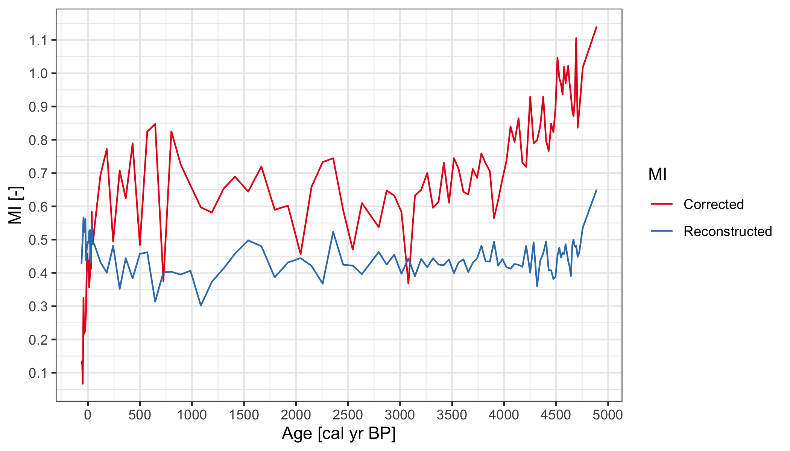
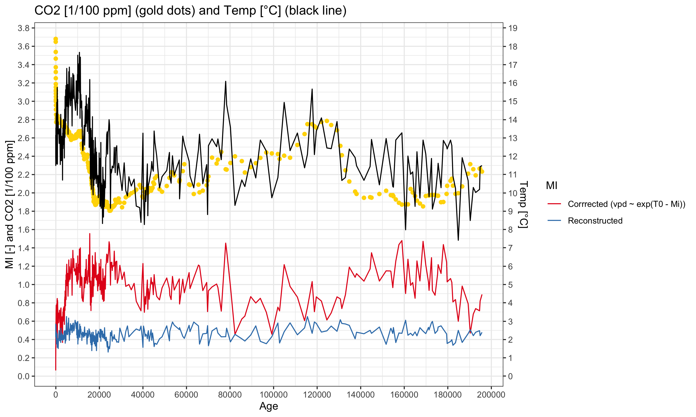
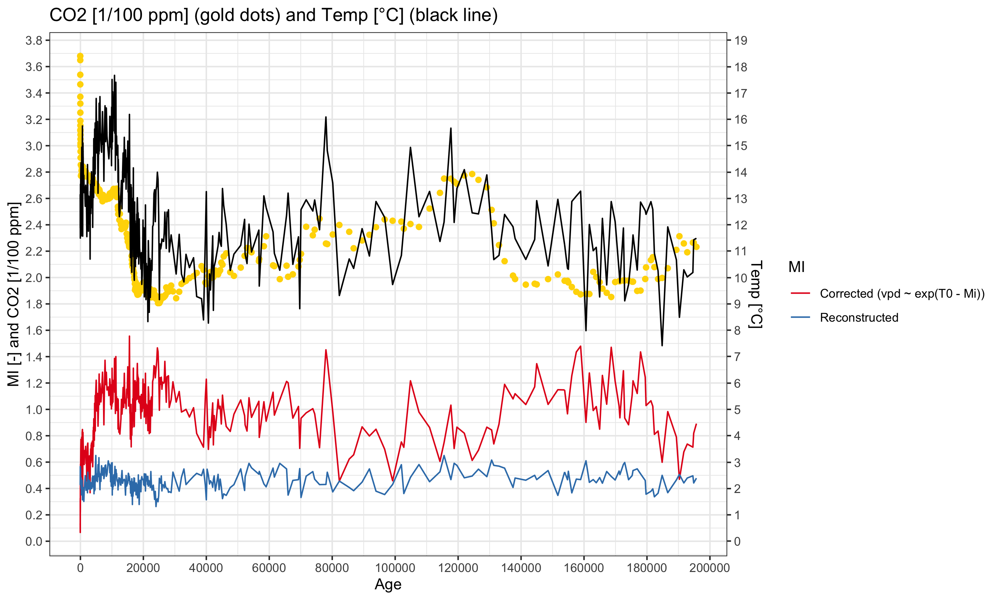
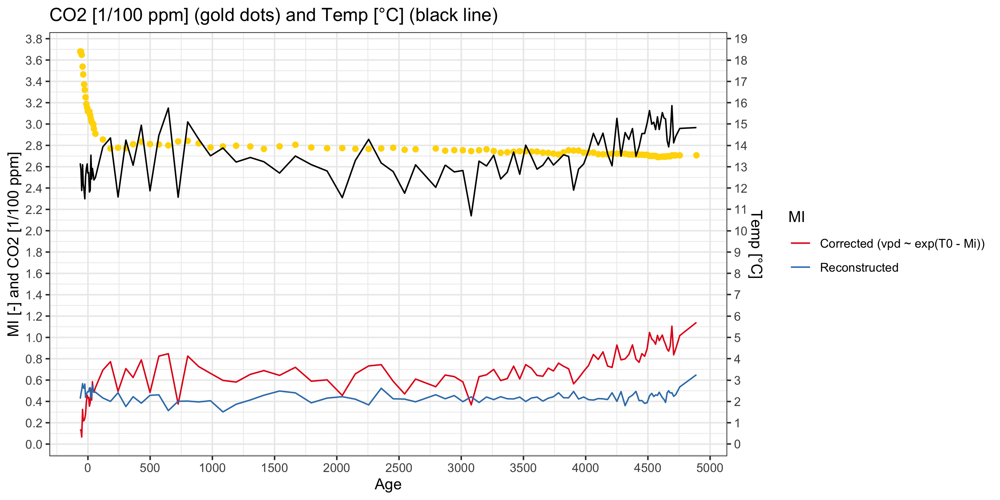
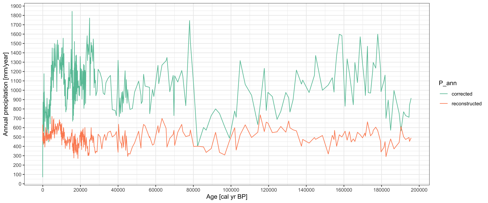
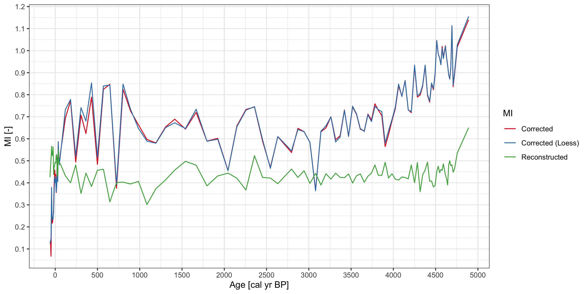
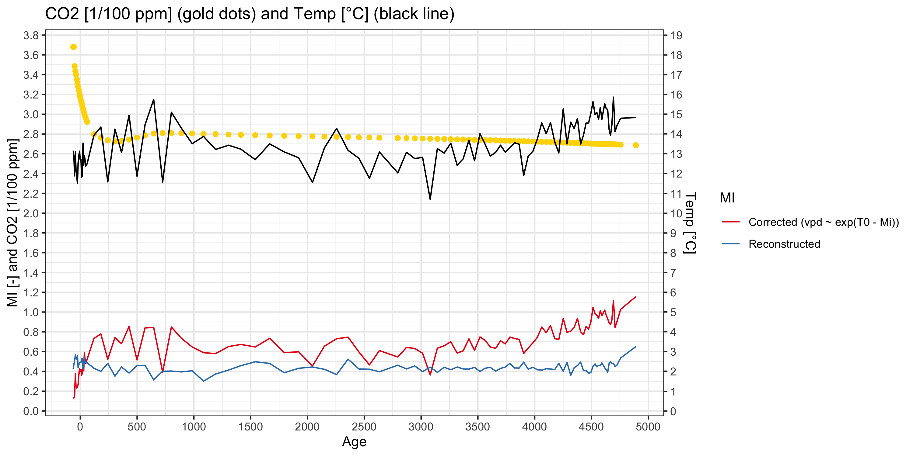
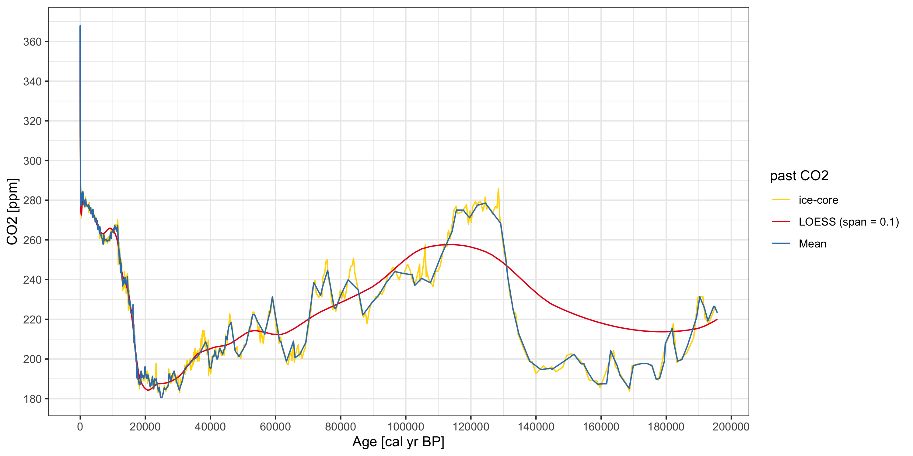
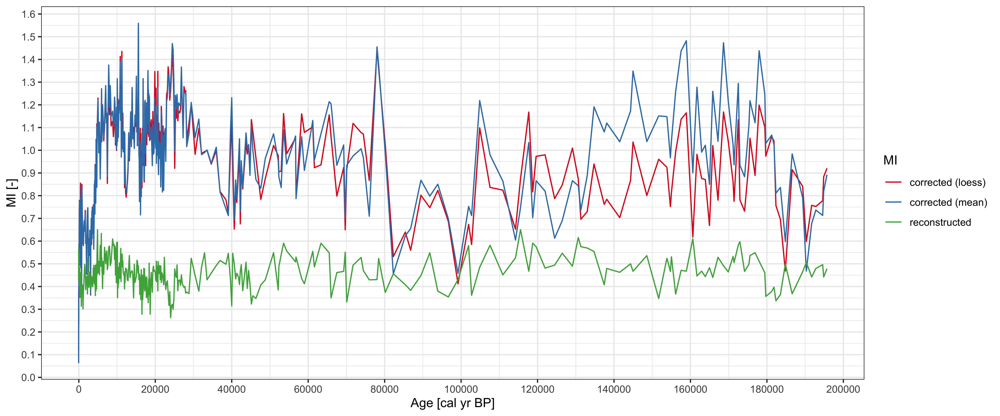
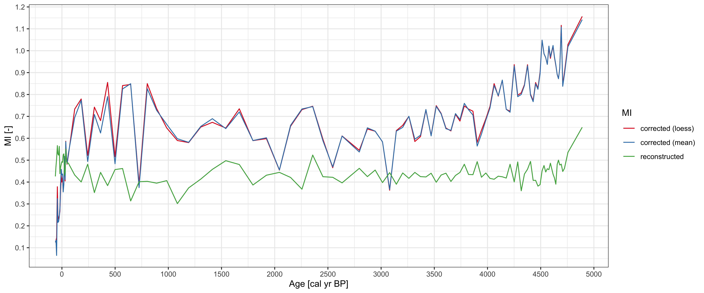

Padul Data
================

## Calculate daily temperature (modern)

CRU TS 4.04 daily interpolation from monthly data:

``` r
path <- "/path/to/CRU/4.04/"
tmin <- file.path(path, "cru_ts4.04.1901.2019.tmn.dat-clim-1961-1990-int.nc")
tmax <- file.path(path, "cru_ts4.04.1901.2019.tmx.dat-clim-1961-1990-int.nc")
output_filename <- file.path(path, "cru_ts4.04-clim-1961-1990-daily.tmp.nc")
codos::daily_temp(tmin = list(filename = tmin, id = "tmn"),
                  tmax = list(filename = tmax, id = "tmx"),
                  output_filename = output_filename)
```

##### Output file

    "cru_ts4.04-clim-1961-1990-daily.tmp.nc"

## Calculate mean growing season for daily temperature (`tmp`)

``` r
path <- "~/Desktop/iCloud/UoR/Data/CRU/4.04/"
codos::nc_gs(file.path(path, "cru_ts4.04-clim-1961-1990-daily.tmp.nc"), "tmp", thr = 0, cpus = 10)
```

##### Output file

    "cru_ts4.04-clim-1961-1990-daily.tmp-gs.nc"

Padul location: 37.0108, -3.6039

``` r
Tmp <- codos:::nc_var_get(file.path(path, "cru_ts4.04-clim-1961-1990-daily.tmp-gs.nc"), "tmp")
lat <- codos:::nc_var_get(file.path(path, "cru_ts4.04-clim-1961-1990-daily.tmp-gs.nc"), "lat")
lon <- codos:::nc_var_get(file.path(path, "cru_ts4.04-clim-1961-1990-daily.tmp-gs.nc"), "lon")
idx_y <- which.min(abs(lat$data - 37.0108))
idx_x <- which.min(abs(lon$data + 3.6039))

aux <- Tmp$data[c(idx_x, idx_x + 1), c(idx_y - 1, idx_y)]
rownames(aux) <- lat$data[c(idx_y, idx_y - 1)]
colnames(aux) <- lon$data[c(idx_x, idx_x + 1)]
aux
```

    #>         -3.75    -3.25
    #> 37.25 15.9465 14.80801
    #> 36.75 15.2319 11.76962

``` r
(modern_tmp <- mean(aux))
```

    #> [1] 14.43901

## Reconstruct past temperature from `T_djf` and `T_jja`:

``` r
padul <- readr::read_csv("/path/to/padul.csv")
```

#### Calculate daily mean temperature

``` r
padul_tmp <- rowMeans(padul[, c("T_djf", "T_jja")])
```

## Obtain past CO2 from (Bereiter et al. 2015)

``` r
past_co2 <- purrr::map_dbl(padul$`Age (cal yr BP)`, codos::past_co2)
```

## Assemble the Padul data

``` r
padul2 <- tibble::tibble(age = padul$`Age (cal yr BP)`,
                         past_temp = padul_tmp,
                         past_co2 = past_co2,
                         modern_co2 = 340,
                         present_t = modern_tmp, 
                         recon_mi = padul$MI)
```

## Find the corrected `MI`

``` r
padul2$corrected_mi <- codos::corrected_mi(padul2$present_t,
                                           padul2$past_temp,
                                           padul2$recon_mi,
                                           padul2$modern_co2,
                                           padul2$past_co2)
# Small subset
knitr::kable(head(padul2, 10), "html")
```

<table>

<thead>

<tr>

<th style="text-align:right;">

age

</th>

<th style="text-align:right;">

past\_temp

</th>

<th style="text-align:right;">

past\_co2

</th>

<th style="text-align:right;">

modern\_co2

</th>

<th style="text-align:right;">

present\_t

</th>

<th style="text-align:right;">

recon\_mi

</th>

<th style="text-align:right;">

corrected\_mi

</th>

</tr>

</thead>

<tbody>

<tr>

<td style="text-align:right;">

\-62

</td>

<td style="text-align:right;">

13.15918

</td>

<td style="text-align:right;">

368.020

</td>

<td style="text-align:right;">

340

</td>

<td style="text-align:right;">

14.43901

</td>

<td style="text-align:right;">

0.425809

</td>

<td style="text-align:right;">

0.1255855

</td>

</tr>

<tr>

<td style="text-align:right;">

\-56

</td>

<td style="text-align:right;">

12.86272

</td>

<td style="text-align:right;">

368.020

</td>

<td style="text-align:right;">

340

</td>

<td style="text-align:right;">

14.43901

</td>

<td style="text-align:right;">

0.471798

</td>

<td style="text-align:right;">

0.1346688

</td>

</tr>

<tr>

<td style="text-align:right;">

\-50

</td>

<td style="text-align:right;">

11.88472

</td>

<td style="text-align:right;">

364.900

</td>

<td style="text-align:right;">

340

</td>

<td style="text-align:right;">

14.43901

</td>

<td style="text-align:right;">

0.506921

</td>

<td style="text-align:right;">

0.0666097

</td>

</tr>

<tr>

<td style="text-align:right;">

\-43

</td>

<td style="text-align:right;">

13.09339

</td>

<td style="text-align:right;">

353.835

</td>

<td style="text-align:right;">

340

</td>

<td style="text-align:right;">

14.43901

</td>

<td style="text-align:right;">

0.566461

</td>

<td style="text-align:right;">

0.3253820

</td>

</tr>

<tr>

<td style="text-align:right;">

\-38

</td>

<td style="text-align:right;">

12.20387

</td>

<td style="text-align:right;">

346.520

</td>

<td style="text-align:right;">

340

</td>

<td style="text-align:right;">

14.43901

</td>

<td style="text-align:right;">

0.528049

</td>

<td style="text-align:right;">

0.2167713

</td>

</tr>

<tr>

<td style="text-align:right;">

\-31

</td>

<td style="text-align:right;">

11.87980

</td>

<td style="text-align:right;">

337.155

</td>

<td style="text-align:right;">

340

</td>

<td style="text-align:right;">

14.43901

</td>

<td style="text-align:right;">

0.522880

</td>

<td style="text-align:right;">

0.2213131

</td>

</tr>

<tr>

<td style="text-align:right;">

\-25

</td>

<td style="text-align:right;">

11.49567

</td>

<td style="text-align:right;">

331.960

</td>

<td style="text-align:right;">

340

</td>

<td style="text-align:right;">

14.43901

</td>

<td style="text-align:right;">

0.562884

</td>

<td style="text-align:right;">

0.2413042

</td>

</tr>

<tr>

<td style="text-align:right;">

\-19

</td>

<td style="text-align:right;">

12.52563

</td>

<td style="text-align:right;">

325.080

</td>

<td style="text-align:right;">

340

</td>

<td style="text-align:right;">

14.43901

</td>

<td style="text-align:right;">

0.438233

</td>

<td style="text-align:right;">

0.2826083

</td>

</tr>

<tr>

<td style="text-align:right;">

\-13

</td>

<td style="text-align:right;">

12.88969

</td>

<td style="text-align:right;">

318.840

</td>

<td style="text-align:right;">

340

</td>

<td style="text-align:right;">

14.43901

</td>

<td style="text-align:right;">

0.468382

</td>

<td style="text-align:right;">

0.3924903

</td>

</tr>

<tr>

<td style="text-align:right;">

\-6

</td>

<td style="text-align:right;">

13.13016

</td>

<td style="text-align:right;">

315.340

</td>

<td style="text-align:right;">

340

</td>

<td style="text-align:right;">

14.43901

</td>

<td style="text-align:right;">

0.483879

</td>

<td style="text-align:right;">

0.4581020

</td>

</tr>

</tbody>

</table>

Check out and download the entire dataset in [Appendix A5](#A5).



  - `age < 5k`



#### Past CO2 calculated using `mean`



  - `age < 5k`



# References

Bereiter, B., Eggleston, S., Schmitt, J., Nehrbass‐Ahles, C., Stocker,
T. F., Fischer, H., Kipfstuhl, S., and Chappellaz, J. (2015), Revision
of the EPICA Dome C CO2 record from 800 to 600 kyr before present,
Geophys. Res. Lett., 42, 542– 549, <doi:10.1002/2014GL061957>.

# Appendix

## A1. Find reconstructed MI using `loess`

``` r
past_co2_loess <- function(age, ref = codos::ice_core) {
  # Extract the reference age and co2
  ref_age <- purrr::pluck(ref, 1)
  ref_co2 <- purrr::pluck(ref, 2)
  if (age < min(ref_age))
    return(ref_co2[which.min(ref_age)])
  
  if (age > max(ref_age))
    return(ref_co2[which.max(ref_age)])
  loessMod10 <- loess(co2 ~ age,
                      tibble::tibble(age = ref_age,
                                     co2 = ref_co2), span = 0.1)
  return(predict(loessMod10, age))
}

padul2$past_co2_loess <- purrr::map_dbl(padul2$age, 
                                        past_co2_loess)
padul2$corrected_mi_loess <- codos::corrected_mi(padul2$present_t,
                                                 padul2$past_temp,
                                                 padul2$recon_mi,
                                                 padul2$modern_co2,
                                                 padul2$past_co2_loess)
```

## A2. Plot reconstructed vs corrected `MI`



  - `age < 5k`



## A3. Past CO2 calculated using `loess`


  - `age < 5k`



## A4. Compare `codos::ice_core` vs reconstructed CO2 using `mean` and `loess`



  - `age < 5k`



  - `age < 500`



## A5. Padul Data

Download the CSV:
[padul-with-corrected-mi.csv](padul-with-corrected-mi.csv)

<table>

<thead>

<tr>

<th style="text-align:right;">

age

</th>

<th style="text-align:right;">

past\_temp

</th>

<th style="text-align:right;">

past\_co2

</th>

<th style="text-align:right;">

modern\_co2

</th>

<th style="text-align:right;">

present\_t

</th>

<th style="text-align:right;">

recon\_mi

</th>

<th style="text-align:right;">

corrected\_mi

</th>

</tr>

</thead>

<tbody>

<tr>

<td style="text-align:right;">

\-62

</td>

<td style="text-align:right;">

13.159180

</td>

<td style="text-align:right;">

368.020

</td>

<td style="text-align:right;">

340

</td>

<td style="text-align:right;">

14.43901

</td>

<td style="text-align:right;">

0.425809

</td>

<td style="text-align:right;">

0.1255855

</td>

</tr>

<tr>

<td style="text-align:right;">

\-56

</td>

<td style="text-align:right;">

12.862720

</td>

<td style="text-align:right;">

368.020

</td>

<td style="text-align:right;">

340

</td>

<td style="text-align:right;">

14.43901

</td>

<td style="text-align:right;">

0.471798

</td>

<td style="text-align:right;">

0.1346688

</td>

</tr>

<tr>

<td style="text-align:right;">

\-50

</td>

<td style="text-align:right;">

11.884725

</td>

<td style="text-align:right;">

364.900

</td>

<td style="text-align:right;">

340

</td>

<td style="text-align:right;">

14.43901

</td>

<td style="text-align:right;">

0.506921

</td>

<td style="text-align:right;">

0.0666097

</td>

</tr>

<tr>

<td style="text-align:right;">

\-43

</td>

<td style="text-align:right;">

13.093390

</td>

<td style="text-align:right;">

353.835

</td>

<td style="text-align:right;">

340

</td>

<td style="text-align:right;">

14.43901

</td>

<td style="text-align:right;">

0.566461

</td>

<td style="text-align:right;">

0.3253820

</td>

</tr>

<tr>

<td style="text-align:right;">

\-38

</td>

<td style="text-align:right;">

12.203865

</td>

<td style="text-align:right;">

346.520

</td>

<td style="text-align:right;">

340

</td>

<td style="text-align:right;">

14.43901

</td>

<td style="text-align:right;">

0.528049

</td>

<td style="text-align:right;">

0.2167713

</td>

</tr>

<tr>

<td style="text-align:right;">

\-31

</td>

<td style="text-align:right;">

11.879800

</td>

<td style="text-align:right;">

337.155

</td>

<td style="text-align:right;">

340

</td>

<td style="text-align:right;">

14.43901

</td>

<td style="text-align:right;">

0.522880

</td>

<td style="text-align:right;">

0.2213131

</td>

</tr>

<tr>

<td style="text-align:right;">

\-25

</td>

<td style="text-align:right;">

11.495670

</td>

<td style="text-align:right;">

331.960

</td>

<td style="text-align:right;">

340

</td>

<td style="text-align:right;">

14.43901

</td>

<td style="text-align:right;">

0.562884

</td>

<td style="text-align:right;">

0.2413042

</td>

</tr>

<tr>

<td style="text-align:right;">

\-19

</td>

<td style="text-align:right;">

12.525630

</td>

<td style="text-align:right;">

325.080

</td>

<td style="text-align:right;">

340

</td>

<td style="text-align:right;">

14.43901

</td>

<td style="text-align:right;">

0.438233

</td>

<td style="text-align:right;">

0.2826083

</td>

</tr>

<tr>

<td style="text-align:right;">

\-13

</td>

<td style="text-align:right;">

12.889695

</td>

<td style="text-align:right;">

318.840

</td>

<td style="text-align:right;">

340

</td>

<td style="text-align:right;">

14.43901

</td>

<td style="text-align:right;">

0.468382

</td>

<td style="text-align:right;">

0.3924903

</td>

</tr>

<tr>

<td style="text-align:right;">

\-6

</td>

<td style="text-align:right;">

13.130160

</td>

<td style="text-align:right;">

315.340

</td>

<td style="text-align:right;">

340

</td>

<td style="text-align:right;">

14.43901

</td>

<td style="text-align:right;">

0.483879

</td>

<td style="text-align:right;">

0.4581020

</td>

</tr>

<tr>

<td style="text-align:right;">

\-1

</td>

<td style="text-align:right;">

12.701260

</td>

<td style="text-align:right;">

312.000

</td>

<td style="text-align:right;">

340

</td>

<td style="text-align:right;">

14.43901

</td>

<td style="text-align:right;">

0.493117

</td>

<td style="text-align:right;">

0.4331878

</td>

</tr>

<tr>

<td style="text-align:right;">

6

</td>

<td style="text-align:right;">

12.724970

</td>

<td style="text-align:right;">

311.290

</td>

<td style="text-align:right;">

340

</td>

<td style="text-align:right;">

14.43901

</td>

<td style="text-align:right;">

0.490124

</td>

<td style="text-align:right;">

0.4373496

</td>

</tr>

<tr>

<td style="text-align:right;">

12

</td>

<td style="text-align:right;">

11.815300

</td>

<td style="text-align:right;">

311.730

</td>

<td style="text-align:right;">

340

</td>

<td style="text-align:right;">

14.43901

</td>

<td style="text-align:right;">

0.524648

</td>

<td style="text-align:right;">

0.3560325

</td>

</tr>

<tr>

<td style="text-align:right;">

18

</td>

<td style="text-align:right;">

11.888230

</td>

<td style="text-align:right;">

308.260

</td>

<td style="text-align:right;">

340

</td>

<td style="text-align:right;">

14.43901

</td>

<td style="text-align:right;">

0.528909

</td>

<td style="text-align:right;">

0.3895324

</td>

</tr>

<tr>

<td style="text-align:right;">

24

</td>

<td style="text-align:right;">

13.540305

</td>

<td style="text-align:right;">

304.970

</td>

<td style="text-align:right;">

340

</td>

<td style="text-align:right;">

14.43901

</td>

<td style="text-align:right;">

0.429877

</td>

<td style="text-align:right;">

0.5175019

</td>

</tr>

<tr>

<td style="text-align:right;">

30

</td>

<td style="text-align:right;">

12.423860

</td>

<td style="text-align:right;">

301.880

</td>

<td style="text-align:right;">

340

</td>

<td style="text-align:right;">

14.43901

</td>

<td style="text-align:right;">

0.446556

</td>

<td style="text-align:right;">

0.4127332

</td>

</tr>

<tr>

<td style="text-align:right;">

36

</td>

<td style="text-align:right;">

12.921615

</td>

<td style="text-align:right;">

301.000

</td>

<td style="text-align:right;">

340

</td>

<td style="text-align:right;">

14.43901

</td>

<td style="text-align:right;">

0.550525

</td>

<td style="text-align:right;">

0.5842940

</td>

</tr>

<tr>

<td style="text-align:right;">

43

</td>

<td style="text-align:right;">

12.653010

</td>

<td style="text-align:right;">

299.630

</td>

<td style="text-align:right;">

340

</td>

<td style="text-align:right;">

14.43901

</td>

<td style="text-align:right;">

0.494339

</td>

<td style="text-align:right;">

0.5027184

</td>

</tr>

<tr>

<td style="text-align:right;">

48

</td>

<td style="text-align:right;">

12.378860

</td>

<td style="text-align:right;">

295.610

</td>

<td style="text-align:right;">

340

</td>

<td style="text-align:right;">

14.43901

</td>

<td style="text-align:right;">

0.486138

</td>

<td style="text-align:right;">

0.4849940

</td>

</tr>

<tr>

<td style="text-align:right;">

60

</td>

<td style="text-align:right;">

12.490615

</td>

<td style="text-align:right;">

290.920

</td>

<td style="text-align:right;">

340

</td>

<td style="text-align:right;">

14.43901

</td>

<td style="text-align:right;">

0.486739

</td>

<td style="text-align:right;">

0.5291952

</td>

</tr>

<tr>

<td style="text-align:right;">

120

</td>

<td style="text-align:right;">

13.932820

</td>

<td style="text-align:right;">

285.500

</td>

<td style="text-align:right;">

340

</td>

<td style="text-align:right;">

14.43901

</td>

<td style="text-align:right;">

0.432149

</td>

<td style="text-align:right;">

0.6937752

</td>

</tr>

<tr>

<td style="text-align:right;">

181

</td>

<td style="text-align:right;">

14.350570

</td>

<td style="text-align:right;">

277.130

</td>

<td style="text-align:right;">

340

</td>

<td style="text-align:right;">

14.43901

</td>

<td style="text-align:right;">

0.400314

</td>

<td style="text-align:right;">

0.7723675

</td>

</tr>

<tr>

<td style="text-align:right;">

242

</td>

<td style="text-align:right;">

11.581430

</td>

<td style="text-align:right;">

277.815

</td>

<td style="text-align:right;">

340

</td>

<td style="text-align:right;">

14.43901

</td>

<td style="text-align:right;">

0.481347

</td>

<td style="text-align:right;">

0.4944974

</td>

</tr>

<tr>

<td style="text-align:right;">

305

</td>

<td style="text-align:right;">

14.247445

</td>

<td style="text-align:right;">

277.355

</td>

<td style="text-align:right;">

340

</td>

<td style="text-align:right;">

14.43901

</td>

<td style="text-align:right;">

0.351935

</td>

<td style="text-align:right;">

0.7076849

</td>

</tr>

<tr>

<td style="text-align:right;">

363

</td>

<td style="text-align:right;">

13.068665

</td>

<td style="text-align:right;">

281.110

</td>

<td style="text-align:right;">

340

</td>

<td style="text-align:right;">

14.43901

</td>

<td style="text-align:right;">

0.444194

</td>

<td style="text-align:right;">

0.6239168

</td>

</tr>

<tr>

<td style="text-align:right;">

429

</td>

<td style="text-align:right;">

14.941955

</td>

<td style="text-align:right;">

283.535

</td>

<td style="text-align:right;">

340

</td>

<td style="text-align:right;">

14.43901

</td>

<td style="text-align:right;">

0.383781

</td>

<td style="text-align:right;">

0.7891175

</td>

</tr>

<tr>

<td style="text-align:right;">

499

</td>

<td style="text-align:right;">

11.871105

</td>

<td style="text-align:right;">

281.270

</td>

<td style="text-align:right;">

340

</td>

<td style="text-align:right;">

14.43901

</td>

<td style="text-align:right;">

0.457146

</td>

<td style="text-align:right;">

0.4839866

</td>

</tr>

<tr>

<td style="text-align:right;">

570

</td>

<td style="text-align:right;">

14.464090

</td>

<td style="text-align:right;">

280.910

</td>

<td style="text-align:right;">

340

</td>

<td style="text-align:right;">

14.43901

</td>

<td style="text-align:right;">

0.461804

</td>

<td style="text-align:right;">

0.8243975

</td>

</tr>

<tr>

<td style="text-align:right;">

646

</td>

<td style="text-align:right;">

15.748480

</td>

<td style="text-align:right;">

280.005

</td>

<td style="text-align:right;">

340

</td>

<td style="text-align:right;">

14.43901

</td>

<td style="text-align:right;">

0.313710

</td>

<td style="text-align:right;">

0.8474354

</td>

</tr>

<tr>

<td style="text-align:right;">

725

</td>

<td style="text-align:right;">

11.569615

</td>

<td style="text-align:right;">

283.690

</td>

<td style="text-align:right;">

340

</td>

<td style="text-align:right;">

14.43901

</td>

<td style="text-align:right;">

0.401503

</td>

<td style="text-align:right;">

0.3753437

</td>

</tr>

<tr>

<td style="text-align:right;">

802

</td>

<td style="text-align:right;">

15.099470

</td>

<td style="text-align:right;">

284.240

</td>

<td style="text-align:right;">

340

</td>

<td style="text-align:right;">

14.43901

</td>

<td style="text-align:right;">

0.403256

</td>

<td style="text-align:right;">

0.8251829

</td>

</tr>

<tr>

<td style="text-align:right;">

890

</td>

<td style="text-align:right;">

14.293475

</td>

<td style="text-align:right;">

281.905

</td>

<td style="text-align:right;">

340

</td>

<td style="text-align:right;">

14.43901

</td>

<td style="text-align:right;">

0.395018

</td>

<td style="text-align:right;">

0.7268057

</td>

</tr>

<tr>

<td style="text-align:right;">

985

</td>

<td style="text-align:right;">

13.511010

</td>

<td style="text-align:right;">

278.075

</td>

<td style="text-align:right;">

340

</td>

<td style="text-align:right;">

14.43901

</td>

<td style="text-align:right;">

0.406559

</td>

<td style="text-align:right;">

0.6630925

</td>

</tr>

<tr>

<td style="text-align:right;">

1085

</td>

<td style="text-align:right;">

13.877625

</td>

<td style="text-align:right;">

279.020

</td>

<td style="text-align:right;">

340

</td>

<td style="text-align:right;">

14.43901

</td>

<td style="text-align:right;">

0.301657

</td>

<td style="text-align:right;">

0.5970397

</td>

</tr>

<tr>

<td style="text-align:right;">

1191

</td>

<td style="text-align:right;">

13.218835

</td>

<td style="text-align:right;">

279.640

</td>

<td style="text-align:right;">

340

</td>

<td style="text-align:right;">

14.43901

</td>

<td style="text-align:right;">

0.373369

</td>

<td style="text-align:right;">

0.5813283

</td>

</tr>

<tr>

<td style="text-align:right;">

1305

</td>

<td style="text-align:right;">

13.432900

</td>

<td style="text-align:right;">

279.020

</td>

<td style="text-align:right;">

340

</td>

<td style="text-align:right;">

14.43901

</td>

<td style="text-align:right;">

0.413576

</td>

<td style="text-align:right;">

0.6537441

</td>

</tr>

<tr>

<td style="text-align:right;">

1414

</td>

<td style="text-align:right;">

13.233040

</td>

<td style="text-align:right;">

276.675

</td>

<td style="text-align:right;">

340

</td>

<td style="text-align:right;">

14.43901

</td>

<td style="text-align:right;">

0.458016

</td>

<td style="text-align:right;">

0.6890119

</td>

</tr>

<tr>

<td style="text-align:right;">

1540

</td>

<td style="text-align:right;">

12.702920

</td>

<td style="text-align:right;">

279.130

</td>

<td style="text-align:right;">

340

</td>

<td style="text-align:right;">

14.43901

</td>

<td style="text-align:right;">

0.497576

</td>

<td style="text-align:right;">

0.6441722

</td>

</tr>

<tr>

<td style="text-align:right;">

1667

</td>

<td style="text-align:right;">

13.501385

</td>

<td style="text-align:right;">

280.575

</td>

<td style="text-align:right;">

340

</td>

<td style="text-align:right;">

14.43901

</td>

<td style="text-align:right;">

0.480201

</td>

<td style="text-align:right;">

0.7197364

</td>

</tr>

<tr>

<td style="text-align:right;">

1795

</td>

<td style="text-align:right;">

13.096470

</td>

<td style="text-align:right;">

278.070

</td>

<td style="text-align:right;">

340

</td>

<td style="text-align:right;">

14.43901

</td>

<td style="text-align:right;">

0.386541

</td>

<td style="text-align:right;">

0.5895759

</td>

</tr>

<tr>

<td style="text-align:right;">

1922

</td>

<td style="text-align:right;">

12.799950

</td>

<td style="text-align:right;">

277.300

</td>

<td style="text-align:right;">

340

</td>

<td style="text-align:right;">

14.43901

</td>

<td style="text-align:right;">

0.431293

</td>

<td style="text-align:right;">

0.6021001

</td>

</tr>

<tr>

<td style="text-align:right;">

2044

</td>

<td style="text-align:right;">

11.551290

</td>

<td style="text-align:right;">

277.450

</td>

<td style="text-align:right;">

340

</td>

<td style="text-align:right;">

14.43901

</td>

<td style="text-align:right;">

0.444219

</td>

<td style="text-align:right;">

0.4562023

</td>

</tr>

<tr>

<td style="text-align:right;">

2149

</td>

<td style="text-align:right;">

13.294700

</td>

<td style="text-align:right;">

276.800

</td>

<td style="text-align:right;">

340

</td>

<td style="text-align:right;">

14.43901

</td>

<td style="text-align:right;">

0.421076

</td>

<td style="text-align:right;">

0.6586304

</td>

</tr>

<tr>

<td style="text-align:right;">

2256

</td>

<td style="text-align:right;">

14.283885

</td>

<td style="text-align:right;">

276.700

</td>

<td style="text-align:right;">

340

</td>

<td style="text-align:right;">

14.43901

</td>

<td style="text-align:right;">

0.367480

</td>

<td style="text-align:right;">

0.7329022

</td>

</tr>

<tr>

<td style="text-align:right;">

2357

</td>

<td style="text-align:right;">

13.174110

</td>

<td style="text-align:right;">

277.150

</td>

<td style="text-align:right;">

340

</td>

<td style="text-align:right;">

14.43901

</td>

<td style="text-align:right;">

0.523369

</td>

<td style="text-align:right;">

0.7443961

</td>

</tr>

<tr>

<td style="text-align:right;">

2453

</td>

<td style="text-align:right;">

12.771775

</td>

<td style="text-align:right;">

277.750

</td>

<td style="text-align:right;">

340

</td>

<td style="text-align:right;">

14.43901

</td>

<td style="text-align:right;">

0.424511

</td>

<td style="text-align:right;">

0.5886267

</td>

</tr>

<tr>

<td style="text-align:right;">

2545

</td>

<td style="text-align:right;">

11.757505

</td>

<td style="text-align:right;">

275.900

</td>

<td style="text-align:right;">

340

</td>

<td style="text-align:right;">

14.43901

</td>

<td style="text-align:right;">

0.421738

</td>

<td style="text-align:right;">

0.4699421

</td>

</tr>

<tr>

<td style="text-align:right;">

2633

</td>

<td style="text-align:right;">

13.088010

</td>

<td style="text-align:right;">

276.400

</td>

<td style="text-align:right;">

340

</td>

<td style="text-align:right;">

14.43901

</td>

<td style="text-align:right;">

0.396330

</td>

<td style="text-align:right;">

0.6097075

</td>

</tr>

<tr>

<td style="text-align:right;">

2795

</td>

<td style="text-align:right;">

12.033940

</td>

<td style="text-align:right;">

277.100

</td>

<td style="text-align:right;">

340

</td>

<td style="text-align:right;">

14.43901

</td>

<td style="text-align:right;">

0.462588

</td>

<td style="text-align:right;">

0.5375440

</td>

</tr>

<tr>

<td style="text-align:right;">

2871

</td>

<td style="text-align:right;">

13.081115

</td>

<td style="text-align:right;">

275.000

</td>

<td style="text-align:right;">

340

</td>

<td style="text-align:right;">

14.43901

</td>

<td style="text-align:right;">

0.424956

</td>

<td style="text-align:right;">

0.6473769

</td>

</tr>

<tr>

<td style="text-align:right;">

2944

</td>

<td style="text-align:right;">

12.756910

</td>

<td style="text-align:right;">

275.500

</td>

<td style="text-align:right;">

340

</td>

<td style="text-align:right;">

14.43901

</td>

<td style="text-align:right;">

0.454794

</td>

<td style="text-align:right;">

0.6325238

</td>

</tr>

<tr>

<td style="text-align:right;">

3013

</td>

<td style="text-align:right;">

12.822585

</td>

<td style="text-align:right;">

275.450

</td>

<td style="text-align:right;">

340

</td>

<td style="text-align:right;">

14.43901

</td>

<td style="text-align:right;">

0.397566

</td>

<td style="text-align:right;">

0.5834718

</td>

</tr>

<tr>

<td style="text-align:right;">

3080

</td>

<td style="text-align:right;">

10.699305

</td>

<td style="text-align:right;">

274.600

</td>

<td style="text-align:right;">

340

</td>

<td style="text-align:right;">

14.43901

</td>

<td style="text-align:right;">

0.443022

</td>

<td style="text-align:right;">

0.3679908

</td>

</tr>

<tr>

<td style="text-align:right;">

3143

</td>

<td style="text-align:right;">

13.261510

</td>

<td style="text-align:right;">

275.450

</td>

<td style="text-align:right;">

340

</td>

<td style="text-align:right;">

14.43901

</td>

<td style="text-align:right;">

0.390003

</td>

<td style="text-align:right;">

0.6320358

</td>

</tr>

<tr>

<td style="text-align:right;">

3203

</td>

<td style="text-align:right;">

13.035830

</td>

<td style="text-align:right;">

276.300

</td>

<td style="text-align:right;">

340

</td>

<td style="text-align:right;">

14.43901

</td>

<td style="text-align:right;">

0.441610

</td>

<td style="text-align:right;">

0.6495391

</td>

</tr>

<tr>

<td style="text-align:right;">

3261

</td>

<td style="text-align:right;">

13.535495

</td>

<td style="text-align:right;">

274.700

</td>

<td style="text-align:right;">

340

</td>

<td style="text-align:right;">

14.43901

</td>

<td style="text-align:right;">

0.416972

</td>

<td style="text-align:right;">

0.6999856

</td>

</tr>

<tr>

<td style="text-align:right;">

3317

</td>

<td style="text-align:right;">

12.425060

</td>

<td style="text-align:right;">

273.100

</td>

<td style="text-align:right;">

340

</td>

<td style="text-align:right;">

14.43901

</td>

<td style="text-align:right;">

0.444067

</td>

<td style="text-align:right;">

0.5956850

</td>

</tr>

<tr>

<td style="text-align:right;">

3370

</td>

<td style="text-align:right;">

12.743310

</td>

<td style="text-align:right;">

273.550

</td>

<td style="text-align:right;">

340

</td>

<td style="text-align:right;">

14.43901

</td>

<td style="text-align:right;">

0.424860

</td>

<td style="text-align:right;">

0.6138847

</td>

</tr>

<tr>

<td style="text-align:right;">

3421

</td>

<td style="text-align:right;">

13.684420

</td>

<td style="text-align:right;">

274.000

</td>

<td style="text-align:right;">

340

</td>

<td style="text-align:right;">

14.43901

</td>

<td style="text-align:right;">

0.423377

</td>

<td style="text-align:right;">

0.7307062

</td>

</tr>

<tr>

<td style="text-align:right;">

3470

</td>

<td style="text-align:right;">

12.647450

</td>

<td style="text-align:right;">

274.500

</td>

<td style="text-align:right;">

340

</td>

<td style="text-align:right;">

14.43901

</td>

<td style="text-align:right;">

0.440416

</td>

<td style="text-align:right;">

0.6108275

</td>

</tr>

<tr>

<td style="text-align:right;">

3518

</td>

<td style="text-align:right;">

14.010410

</td>

<td style="text-align:right;">

274.500

</td>

<td style="text-align:right;">

340

</td>

<td style="text-align:right;">

14.43901

</td>

<td style="text-align:right;">

0.399001

</td>

<td style="text-align:right;">

0.7447811

</td>

</tr>

<tr>

<td style="text-align:right;">

3564

</td>

<td style="text-align:right;">

13.475130

</td>

<td style="text-align:right;">

274.200

</td>

<td style="text-align:right;">

340

</td>

<td style="text-align:right;">

14.43901

</td>

<td style="text-align:right;">

0.432065

</td>

<td style="text-align:right;">

0.7109920

</td>

</tr>

<tr>

<td style="text-align:right;">

3609

</td>

<td style="text-align:right;">

12.885270

</td>

<td style="text-align:right;">

274.200

</td>

<td style="text-align:right;">

340

</td>

<td style="text-align:right;">

14.43901

</td>

<td style="text-align:right;">

0.440593

</td>

<td style="text-align:right;">

0.6435284

</td>

</tr>

<tr>

<td style="text-align:right;">

3656

</td>

<td style="text-align:right;">

13.071425

</td>

<td style="text-align:right;">

273.200

</td>

<td style="text-align:right;">

340

</td>

<td style="text-align:right;">

14.43901

</td>

<td style="text-align:right;">

0.402640

</td>

<td style="text-align:right;">

0.6358784

</td>

</tr>

<tr>

<td style="text-align:right;">

3699

</td>

<td style="text-align:right;">

13.434470

</td>

<td style="text-align:right;">

273.000

</td>

<td style="text-align:right;">

340

</td>

<td style="text-align:right;">

14.43901

</td>

<td style="text-align:right;">

0.430108

</td>

<td style="text-align:right;">

0.7120540

</td>

</tr>

<tr>

<td style="text-align:right;">

3741

</td>

<td style="text-align:right;">

13.080005

</td>

<td style="text-align:right;">

272.250

</td>

<td style="text-align:right;">

340

</td>

<td style="text-align:right;">

14.43901

</td>

<td style="text-align:right;">

0.444006

</td>

<td style="text-align:right;">

0.6855244

</td>

</tr>

<tr>

<td style="text-align:right;">

3782

</td>

<td style="text-align:right;">

13.312910

</td>

<td style="text-align:right;">

271.500

</td>

<td style="text-align:right;">

340

</td>

<td style="text-align:right;">

14.43901

</td>

<td style="text-align:right;">

0.481336

</td>

<td style="text-align:right;">

0.7588973

</td>

</tr>

<tr>

<td style="text-align:right;">

3822

</td>

<td style="text-align:right;">

13.559430

</td>

<td style="text-align:right;">

273.450

</td>

<td style="text-align:right;">

340

</td>

<td style="text-align:right;">

14.43901

</td>

<td style="text-align:right;">

0.434527

</td>

<td style="text-align:right;">

0.7296531

</td>

</tr>

<tr>

<td style="text-align:right;">

3863

</td>

<td style="text-align:right;">

13.483015

</td>

<td style="text-align:right;">

275.400

</td>

<td style="text-align:right;">

340

</td>

<td style="text-align:right;">

14.43901

</td>

<td style="text-align:right;">

0.433829

</td>

<td style="text-align:right;">

0.7055218

</td>

</tr>

<tr>

<td style="text-align:right;">

3903

</td>

<td style="text-align:right;">

11.902960

</td>

<td style="text-align:right;">

275.150

</td>

<td style="text-align:right;">

340

</td>

<td style="text-align:right;">

14.43901

</td>

<td style="text-align:right;">

0.493315

</td>

<td style="text-align:right;">

0.5648094

</td>

</tr>

<tr>

<td style="text-align:right;">

3943

</td>

<td style="text-align:right;">

12.888460

</td>

<td style="text-align:right;">

275.150

</td>

<td style="text-align:right;">

340

</td>

<td style="text-align:right;">

14.43901

</td>

<td style="text-align:right;">

0.422033

</td>

<td style="text-align:right;">

0.6186660

</td>

</tr>

<tr>

<td style="text-align:right;">

3984

</td>

<td style="text-align:right;">

13.129820

</td>

<td style="text-align:right;">

273.300

</td>

<td style="text-align:right;">

340

</td>

<td style="text-align:right;">

14.43901

</td>

<td style="text-align:right;">

0.441372

</td>

<td style="text-align:right;">

0.6820041

</td>

</tr>

<tr>

<td style="text-align:right;">

4023

</td>

<td style="text-align:right;">

13.747505

</td>

<td style="text-align:right;">

273.300

</td>

<td style="text-align:right;">

340

</td>

<td style="text-align:right;">

14.43901

</td>

<td style="text-align:right;">

0.416761

</td>

<td style="text-align:right;">

0.7370349

</td>

</tr>

<tr>

<td style="text-align:right;">

4062

</td>

<td style="text-align:right;">

14.563010

</td>

<td style="text-align:right;">

273.300

</td>

<td style="text-align:right;">

340

</td>

<td style="text-align:right;">

14.43901

</td>

<td style="text-align:right;">

0.412826

</td>

<td style="text-align:right;">

0.8399927

</td>

</tr>

<tr>

<td style="text-align:right;">

4101

</td>

<td style="text-align:right;">

14.015225

</td>

<td style="text-align:right;">

271.700

</td>

<td style="text-align:right;">

340

</td>

<td style="text-align:right;">

14.43901

</td>

<td style="text-align:right;">

0.426782

</td>

<td style="text-align:right;">

0.7935260

</td>

</tr>

<tr>

<td style="text-align:right;">

4139

</td>

<td style="text-align:right;">

14.572930

</td>

<td style="text-align:right;">

271.650

</td>

<td style="text-align:right;">

340

</td>

<td style="text-align:right;">

14.43901

</td>

<td style="text-align:right;">

0.424069

</td>

<td style="text-align:right;">

0.8646247

</td>

</tr>

<tr>

<td style="text-align:right;">

4176

</td>

<td style="text-align:right;">

13.604615

</td>

<td style="text-align:right;">

271.650

</td>

<td style="text-align:right;">

340

</td>

<td style="text-align:right;">

14.43901

</td>

<td style="text-align:right;">

0.418275

</td>

<td style="text-align:right;">

0.7315196

</td>

</tr>

<tr>

<td style="text-align:right;">

4212

</td>

<td style="text-align:right;">

13.041955

</td>

<td style="text-align:right;">

272.200

</td>

<td style="text-align:right;">

340

</td>

<td style="text-align:right;">

14.43901

</td>

<td style="text-align:right;">

0.481193

</td>

<td style="text-align:right;">

0.7186822

</td>

</tr>

<tr>

<td style="text-align:right;">

4251

</td>

<td style="text-align:right;">

15.268020

</td>

<td style="text-align:right;">

272.200

</td>

<td style="text-align:right;">

340

</td>

<td style="text-align:right;">

14.43901

</td>

<td style="text-align:right;">

0.400423

</td>

<td style="text-align:right;">

0.9287589

</td>

</tr>

<tr>

<td style="text-align:right;">

4284

</td>

<td style="text-align:right;">

13.499280

</td>

<td style="text-align:right;">

272.150

</td>

<td style="text-align:right;">

340

</td>

<td style="text-align:right;">

14.43901

</td>

<td style="text-align:right;">

0.491962

</td>

<td style="text-align:right;">

0.7894691

</td>

</tr>

<tr>

<td style="text-align:right;">

4317

</td>

<td style="text-align:right;">

14.600530

</td>

<td style="text-align:right;">

272.150

</td>

<td style="text-align:right;">

340

</td>

<td style="text-align:right;">

14.43901

</td>

<td style="text-align:right;">

0.360241

</td>

<td style="text-align:right;">

0.7988103

</td>

</tr>

<tr>

<td style="text-align:right;">

4347

</td>

<td style="text-align:right;">

14.278675

</td>

<td style="text-align:right;">

271.500

</td>

<td style="text-align:right;">

340

</td>

<td style="text-align:right;">

14.43901

</td>

<td style="text-align:right;">

0.436612

</td>

<td style="text-align:right;">

0.8397094

</td>

</tr>

<tr>

<td style="text-align:right;">

4376

</td>

<td style="text-align:right;">

14.787685

</td>

<td style="text-align:right;">

271.500

</td>

<td style="text-align:right;">

340

</td>

<td style="text-align:right;">

14.43901

</td>

<td style="text-align:right;">

0.458481

</td>

<td style="text-align:right;">

0.9298346

</td>

</tr>

<tr>

<td style="text-align:right;">

4404

</td>

<td style="text-align:right;">

13.491295

</td>

<td style="text-align:right;">

271.300

</td>

<td style="text-align:right;">

340

</td>

<td style="text-align:right;">

14.43901

</td>

<td style="text-align:right;">

0.494253

</td>

<td style="text-align:right;">

0.7967424

</td>

</tr>

<tr>

<td style="text-align:right;">

4429

</td>

<td style="text-align:right;">

13.935795

</td>

<td style="text-align:right;">

271.300

</td>

<td style="text-align:right;">

340

</td>

<td style="text-align:right;">

14.43901

</td>

<td style="text-align:right;">

0.407680

</td>

<td style="text-align:right;">

0.7663526

</td>

</tr>

<tr>

<td style="text-align:right;">

4452

</td>

<td style="text-align:right;">

14.553305

</td>

<td style="text-align:right;">

271.300

</td>

<td style="text-align:right;">

340

</td>

<td style="text-align:right;">

14.43901

</td>

<td style="text-align:right;">

0.407926

</td>

<td style="text-align:right;">

0.8478538

</td>

</tr>

<tr>

<td style="text-align:right;">

4474

</td>

<td style="text-align:right;">

14.558790

</td>

<td style="text-align:right;">

271.100

</td>

<td style="text-align:right;">

340

</td>

<td style="text-align:right;">

14.43901

</td>

<td style="text-align:right;">

0.381470

</td>

<td style="text-align:right;">

0.8226864

</td>

</tr>

<tr>

<td style="text-align:right;">

4494

</td>

<td style="text-align:right;">

15.045370

</td>

<td style="text-align:right;">

271.100

</td>

<td style="text-align:right;">

340

</td>

<td style="text-align:right;">

14.43901

</td>

<td style="text-align:right;">

0.388216

</td>

<td style="text-align:right;">

0.8942308

</td>

</tr>

<tr>

<td style="text-align:right;">

4513

</td>

<td style="text-align:right;">

15.631435

</td>

<td style="text-align:right;">

270.100

</td>

<td style="text-align:right;">

340

</td>

<td style="text-align:right;">

14.43901

</td>

<td style="text-align:right;">

0.451673

</td>

<td style="text-align:right;">

1.0464315

</td>

</tr>

<tr>

<td style="text-align:right;">

4531

</td>

<td style="text-align:right;">

14.992585

</td>

<td style="text-align:right;">

270.100

</td>

<td style="text-align:right;">

340

</td>

<td style="text-align:right;">

14.43901

</td>

<td style="text-align:right;">

0.475532

</td>

<td style="text-align:right;">

0.9850553

</td>

</tr>

<tr>

<td style="text-align:right;">

4547

</td>

<td style="text-align:right;">

15.086240

</td>

<td style="text-align:right;">

270.100

</td>

<td style="text-align:right;">

340

</td>

<td style="text-align:right;">

14.43901

</td>

<td style="text-align:right;">

0.446055

</td>

<td style="text-align:right;">

0.9670095

</td>

</tr>

<tr>

<td style="text-align:right;">

4562

</td>

<td style="text-align:right;">

14.741750

</td>

<td style="text-align:right;">

270.100

</td>

<td style="text-align:right;">

340

</td>

<td style="text-align:right;">

14.43901

</td>

<td style="text-align:right;">

0.460775

</td>

<td style="text-align:right;">

0.9361573

</td>

</tr>

<tr>

<td style="text-align:right;">

4577

</td>

<td style="text-align:right;">

15.337330

</td>

<td style="text-align:right;">

269.100

</td>

<td style="text-align:right;">

340

</td>

<td style="text-align:right;">

14.43901

</td>

<td style="text-align:right;">

0.456752

</td>

<td style="text-align:right;">

1.0192496

</td>

</tr>

<tr>

<td style="text-align:right;">

4591

</td>

<td style="text-align:right;">

14.744645

</td>

<td style="text-align:right;">

269.100

</td>

<td style="text-align:right;">

340

</td>

<td style="text-align:right;">

14.43901

</td>

<td style="text-align:right;">

0.486113

</td>

<td style="text-align:right;">

0.9700291

</td>

</tr>

<tr>

<td style="text-align:right;">

4616

</td>

<td style="text-align:right;">

15.537315

</td>

<td style="text-align:right;">

269.450

</td>

<td style="text-align:right;">

340

</td>

<td style="text-align:right;">

14.43901

</td>

<td style="text-align:right;">

0.435921

</td>

<td style="text-align:right;">

1.0219753

</td>

</tr>

<tr>

<td style="text-align:right;">

4629

</td>

<td style="text-align:right;">

15.289300

</td>

<td style="text-align:right;">

269.450

</td>

<td style="text-align:right;">

340

</td>

<td style="text-align:right;">

14.43901

</td>

<td style="text-align:right;">

0.418996

</td>

<td style="text-align:right;">

0.9708557

</td>

</tr>

<tr>

<td style="text-align:right;">

4642

</td>

<td style="text-align:right;">

15.236480

</td>

<td style="text-align:right;">

269.450

</td>

<td style="text-align:right;">

340

</td>

<td style="text-align:right;">

14.43901

</td>

<td style="text-align:right;">

0.390457

</td>

<td style="text-align:right;">

0.9340307

</td>

</tr>

<tr>

<td style="text-align:right;">

4655

</td>

<td style="text-align:right;">

14.217500

</td>

<td style="text-align:right;">

269.800

</td>

<td style="text-align:right;">

340

</td>

<td style="text-align:right;">

14.43901

</td>

<td style="text-align:right;">

0.481282

</td>

<td style="text-align:right;">

0.8897359

</td>

</tr>

<tr>

<td style="text-align:right;">

4667

</td>

<td style="text-align:right;">

13.929305

</td>

<td style="text-align:right;">

269.800

</td>

<td style="text-align:right;">

340

</td>

<td style="text-align:right;">

14.43901

</td>

<td style="text-align:right;">

0.500180

</td>

<td style="text-align:right;">

0.8710239

</td>

</tr>

<tr>

<td style="text-align:right;">

4679

</td>

<td style="text-align:right;">

14.456340

</td>

<td style="text-align:right;">

269.800

</td>

<td style="text-align:right;">

340

</td>

<td style="text-align:right;">

14.43901

</td>

<td style="text-align:right;">

0.477212

</td>

<td style="text-align:right;">

0.9172627

</td>

</tr>

<tr>

<td style="text-align:right;">

4693

</td>

<td style="text-align:right;">

15.862295

</td>

<td style="text-align:right;">

270.650

</td>

<td style="text-align:right;">

340

</td>

<td style="text-align:right;">

14.43901

</td>

<td style="text-align:right;">

0.481918

</td>

<td style="text-align:right;">

1.1054784

</td>

</tr>

<tr>

<td style="text-align:right;">

4707

</td>

<td style="text-align:right;">

14.117130

</td>

<td style="text-align:right;">

270.650

</td>

<td style="text-align:right;">

340

</td>

<td style="text-align:right;">

14.43901

</td>

<td style="text-align:right;">

0.448255

</td>

<td style="text-align:right;">

0.8364233

</td>

</tr>

<tr>

<td style="text-align:right;">

4723

</td>

<td style="text-align:right;">

14.411470

</td>

<td style="text-align:right;">

270.650

</td>

<td style="text-align:right;">

340

</td>

<td style="text-align:right;">

14.43901

</td>

<td style="text-align:right;">

0.462332

</td>

<td style="text-align:right;">

0.8898428

</td>

</tr>

<tr>

<td style="text-align:right;">

4756

</td>

<td style="text-align:right;">

14.795020

</td>

<td style="text-align:right;">

270.650

</td>

<td style="text-align:right;">

340

</td>

<td style="text-align:right;">

14.43901

</td>

<td style="text-align:right;">

0.535625

</td>

<td style="text-align:right;">

1.0168223

</td>

</tr>

<tr>

<td style="text-align:right;">

4890

</td>

<td style="text-align:right;">

14.834370

</td>

<td style="text-align:right;">

270.700

</td>

<td style="text-align:right;">

340

</td>

<td style="text-align:right;">

14.43901

</td>

<td style="text-align:right;">

0.650277

</td>

<td style="text-align:right;">

1.1405323

</td>

</tr>

<tr>

<td style="text-align:right;">

5015

</td>

<td style="text-align:right;">

16.790890

</td>

<td style="text-align:right;">

268.950

</td>

<td style="text-align:right;">

340

</td>

<td style="text-align:right;">

14.43901

</td>

<td style="text-align:right;">

0.458337

</td>

<td style="text-align:right;">

1.2210899

</td>

</tr>

<tr>

<td style="text-align:right;">

5202

</td>

<td style="text-align:right;">

14.724575

</td>

<td style="text-align:right;">

269.800

</td>

<td style="text-align:right;">

340

</td>

<td style="text-align:right;">

14.43901

</td>

<td style="text-align:right;">

0.510507

</td>

<td style="text-align:right;">

0.9875169

</td>

</tr>

<tr>

<td style="text-align:right;">

5403

</td>

<td style="text-align:right;">

15.916575

</td>

<td style="text-align:right;">

265.300

</td>

<td style="text-align:right;">

340

</td>

<td style="text-align:right;">

14.43901

</td>

<td style="text-align:right;">

0.451895

</td>

<td style="text-align:right;">

1.1211858

</td>

</tr>

<tr>

<td style="text-align:right;">

5596

</td>

<td style="text-align:right;">

13.197670

</td>

<td style="text-align:right;">

267.600

</td>

<td style="text-align:right;">

340

</td>

<td style="text-align:right;">

14.43901

</td>

<td style="text-align:right;">

0.580824

</td>

<td style="text-align:right;">

0.8727963

</td>

</tr>

<tr>

<td style="text-align:right;">

5763

</td>

<td style="text-align:right;">

14.989795

</td>

<td style="text-align:right;">

265.700

</td>

<td style="text-align:right;">

340

</td>

<td style="text-align:right;">

14.43901

</td>

<td style="text-align:right;">

0.490060

</td>

<td style="text-align:right;">

1.0320665

</td>

</tr>

<tr>

<td style="text-align:right;">

5879

</td>

<td style="text-align:right;">

14.690215

</td>

<td style="text-align:right;">

263.100

</td>

<td style="text-align:right;">

340

</td>

<td style="text-align:right;">

14.43901

</td>

<td style="text-align:right;">

0.633639

</td>

<td style="text-align:right;">

1.1601040

</td>

</tr>

<tr>

<td style="text-align:right;">

5953

</td>

<td style="text-align:right;">

16.610490

</td>

<td style="text-align:right;">

263.700

</td>

<td style="text-align:right;">

340

</td>

<td style="text-align:right;">

14.43901

</td>

<td style="text-align:right;">

0.488720

</td>

<td style="text-align:right;">

1.2681678

</td>

</tr>

<tr>

<td style="text-align:right;">

6007

</td>

<td style="text-align:right;">

14.797680

</td>

<td style="text-align:right;">

266.700

</td>

<td style="text-align:right;">

340

</td>

<td style="text-align:right;">

14.43901

</td>

<td style="text-align:right;">

0.526236

</td>

<td style="text-align:right;">

1.0363319

</td>

</tr>

<tr>

<td style="text-align:right;">

6056

</td>

<td style="text-align:right;">

15.365505

</td>

<td style="text-align:right;">

266.100

</td>

<td style="text-align:right;">

340

</td>

<td style="text-align:right;">

14.43901

</td>

<td style="text-align:right;">

0.462299

</td>

<td style="text-align:right;">

1.0509967

</td>

</tr>

<tr>

<td style="text-align:right;">

6118

</td>

<td style="text-align:right;">

15.526410

</td>

<td style="text-align:right;">

265.500

</td>

<td style="text-align:right;">

340

</td>

<td style="text-align:right;">

14.43901

</td>

<td style="text-align:right;">

0.467143

</td>

<td style="text-align:right;">

1.0824025

</td>

</tr>

<tr>

<td style="text-align:right;">

6206

</td>

<td style="text-align:right;">

16.861230

</td>

<td style="text-align:right;">

264.350

</td>

<td style="text-align:right;">

340

</td>

<td style="text-align:right;">

14.43901

</td>

<td style="text-align:right;">

0.391183

</td>

<td style="text-align:right;">

1.1944395

</td>

</tr>

<tr>

<td style="text-align:right;">

6338

</td>

<td style="text-align:right;">

15.520625

</td>

<td style="text-align:right;">

262.700

</td>

<td style="text-align:right;">

340

</td>

<td style="text-align:right;">

14.43901

</td>

<td style="text-align:right;">

0.510261

</td>

<td style="text-align:right;">

1.1479045

</td>

</tr>

<tr>

<td style="text-align:right;">

6523

</td>

<td style="text-align:right;">

15.196245

</td>

<td style="text-align:right;">

261.150

</td>

<td style="text-align:right;">

340

</td>

<td style="text-align:right;">

14.43901

</td>

<td style="text-align:right;">

0.454215

</td>

<td style="text-align:right;">

1.0567582

</td>

</tr>

<tr>

<td style="text-align:right;">

6729

</td>

<td style="text-align:right;">

14.751830

</td>

<td style="text-align:right;">

260.750

</td>

<td style="text-align:right;">

340

</td>

<td style="text-align:right;">

14.43901

</td>

<td style="text-align:right;">

0.572781

</td>

<td style="text-align:right;">

1.1230512

</td>

</tr>

<tr>

<td style="text-align:right;">

7025

</td>

<td style="text-align:right;">

16.292160

</td>

<td style="text-align:right;">

257.850

</td>

<td style="text-align:right;">

340

</td>

<td style="text-align:right;">

14.43901

</td>

<td style="text-align:right;">

0.500633

</td>

<td style="text-align:right;">

1.2819772

</td>

</tr>

<tr>

<td style="text-align:right;">

7198

</td>

<td style="text-align:right;">

15.048425

</td>

<td style="text-align:right;">

262.650

</td>

<td style="text-align:right;">

340

</td>

<td style="text-align:right;">

14.43901

</td>

<td style="text-align:right;">

0.548170

</td>

<td style="text-align:right;">

1.1233968

</td>

</tr>

<tr>

<td style="text-align:right;">

7311

</td>

<td style="text-align:right;">

15.212085

</td>

<td style="text-align:right;">

261.850

</td>

<td style="text-align:right;">

340

</td>

<td style="text-align:right;">

14.43901

</td>

<td style="text-align:right;">

0.556734

</td>

<td style="text-align:right;">

1.1607645

</td>

</tr>

<tr>

<td style="text-align:right;">

7457

</td>

<td style="text-align:right;">

13.652665

</td>

<td style="text-align:right;">

259.550

</td>

<td style="text-align:right;">

340

</td>

<td style="text-align:right;">

14.43901

</td>

<td style="text-align:right;">

0.474606

</td>

<td style="text-align:right;">

0.8830255

</td>

</tr>

<tr>

<td style="text-align:right;">

7630

</td>

<td style="text-align:right;">

15.563800

</td>

<td style="text-align:right;">

260.100

</td>

<td style="text-align:right;">

340

</td>

<td style="text-align:right;">

14.43901

</td>

<td style="text-align:right;">

0.496452

</td>

<td style="text-align:right;">

1.1592221

</td>

</tr>

<tr>

<td style="text-align:right;">

7821

</td>

<td style="text-align:right;">

16.512985

</td>

<td style="text-align:right;">

260.050

</td>

<td style="text-align:right;">

340

</td>

<td style="text-align:right;">

14.43901

</td>

<td style="text-align:right;">

0.573211

</td>

<td style="text-align:right;">

1.3725902

</td>

</tr>

<tr>

<td style="text-align:right;">

8024

</td>

<td style="text-align:right;">

15.154520

</td>

<td style="text-align:right;">

260.200

</td>

<td style="text-align:right;">

340

</td>

<td style="text-align:right;">

14.43901

</td>

<td style="text-align:right;">

0.577937

</td>

<td style="text-align:right;">

1.1876597

</td>

</tr>

<tr>

<td style="text-align:right;">

8233

</td>

<td style="text-align:right;">

16.430325

</td>

<td style="text-align:right;">

259.300

</td>

<td style="text-align:right;">

340

</td>

<td style="text-align:right;">

14.43901

</td>

<td style="text-align:right;">

0.492751

</td>

<td style="text-align:right;">

1.2815005

</td>

</tr>

<tr>

<td style="text-align:right;">

8442

</td>

<td style="text-align:right;">

15.368730

</td>

<td style="text-align:right;">

259.800

</td>

<td style="text-align:right;">

340

</td>

<td style="text-align:right;">

14.43901

</td>

<td style="text-align:right;">

0.507928

</td>

<td style="text-align:right;">

1.1468177

</td>

</tr>

<tr>

<td style="text-align:right;">

8847

</td>

<td style="text-align:right;">

14.772840

</td>

<td style="text-align:right;">

259.950

</td>

<td style="text-align:right;">

340

</td>

<td style="text-align:right;">

14.43901

</td>

<td style="text-align:right;">

0.609482

</td>

<td style="text-align:right;">

1.1702147

</td>

</tr>

<tr>

<td style="text-align:right;">

9040

</td>

<td style="text-align:right;">

14.501085

</td>

<td style="text-align:right;">

259.850

</td>

<td style="text-align:right;">

340

</td>

<td style="text-align:right;">

14.43901

</td>

<td style="text-align:right;">

0.580817

</td>

<td style="text-align:right;">

1.1041799

</td>

</tr>

<tr>

<td style="text-align:right;">

9205

</td>

<td style="text-align:right;">

14.772915

</td>

<td style="text-align:right;">

262.850

</td>

<td style="text-align:right;">

340

</td>

<td style="text-align:right;">

14.43901

</td>

<td style="text-align:right;">

0.585610

</td>

<td style="text-align:right;">

1.1233567

</td>

</tr>

<tr>

<td style="text-align:right;">

9340

</td>

<td style="text-align:right;">

16.114460

</td>

<td style="text-align:right;">

263.750

</td>

<td style="text-align:right;">

340

</td>

<td style="text-align:right;">

14.43901

</td>

<td style="text-align:right;">

0.519646

</td>

<td style="text-align:right;">

1.2315736

</td>

</tr>

<tr>

<td style="text-align:right;">

9441

</td>

<td style="text-align:right;">

15.439775

</td>

<td style="text-align:right;">

262.900

</td>

<td style="text-align:right;">

340

</td>

<td style="text-align:right;">

14.43901

</td>

<td style="text-align:right;">

0.577847

</td>

<td style="text-align:right;">

1.2061019

</td>

</tr>

<tr>

<td style="text-align:right;">

9522

</td>

<td style="text-align:right;">

14.951680

</td>

<td style="text-align:right;">

260.750

</td>

<td style="text-align:right;">

340

</td>

<td style="text-align:right;">

14.43901

</td>

<td style="text-align:right;">

0.548766

</td>

<td style="text-align:right;">

1.1252560

</td>

</tr>

<tr>

<td style="text-align:right;">

9589

</td>

<td style="text-align:right;">

15.205050

</td>

<td style="text-align:right;">

263.800

</td>

<td style="text-align:right;">

340

</td>

<td style="text-align:right;">

14.43901

</td>

<td style="text-align:right;">

0.450967

</td>

<td style="text-align:right;">

1.0345842

</td>

</tr>

<tr>

<td style="text-align:right;">

9654

</td>

<td style="text-align:right;">

15.017930

</td>

<td style="text-align:right;">

263.800

</td>

<td style="text-align:right;">

340

</td>

<td style="text-align:right;">

14.43901

</td>

<td style="text-align:right;">

0.546659

</td>

<td style="text-align:right;">

1.1089985

</td>

</tr>

<tr>

<td style="text-align:right;">

9723

</td>

<td style="text-align:right;">

15.199465

</td>

<td style="text-align:right;">

263.800

</td>

<td style="text-align:right;">

340

</td>

<td style="text-align:right;">

14.43901

</td>

<td style="text-align:right;">

0.569147

</td>

<td style="text-align:right;">

1.1572127

</td>

</tr>

<tr>

<td style="text-align:right;">

9806

</td>

<td style="text-align:right;">

15.815015

</td>

<td style="text-align:right;">

264.400

</td>

<td style="text-align:right;">

340

</td>

<td style="text-align:right;">

14.43901

</td>

<td style="text-align:right;">

0.417580

</td>

<td style="text-align:right;">

1.0779966

</td>

</tr>

<tr>

<td style="text-align:right;">

9823

</td>

<td style="text-align:right;">

14.884225

</td>

<td style="text-align:right;">

264.400

</td>

<td style="text-align:right;">

340

</td>

<td style="text-align:right;">

14.43901

</td>

<td style="text-align:right;">

0.487888

</td>

<td style="text-align:right;">

1.0252171

</td>

</tr>

<tr>

<td style="text-align:right;">

9843

</td>

<td style="text-align:right;">

16.120400

</td>

<td style="text-align:right;">

264.400

</td>

<td style="text-align:right;">

340

</td>

<td style="text-align:right;">

14.43901

</td>

<td style="text-align:right;">

0.480904

</td>

<td style="text-align:right;">

1.1865718

</td>

</tr>

<tr>

<td style="text-align:right;">

9862

</td>

<td style="text-align:right;">

14.437820

</td>

<td style="text-align:right;">

264.400

</td>

<td style="text-align:right;">

340

</td>

<td style="text-align:right;">

14.43901

</td>

<td style="text-align:right;">

0.524941

</td>

<td style="text-align:right;">

1.0035680

</td>

</tr>

<tr>

<td style="text-align:right;">

9882

</td>

<td style="text-align:right;">

14.242735

</td>

<td style="text-align:right;">

264.400

</td>

<td style="text-align:right;">

340

</td>

<td style="text-align:right;">

14.43901

</td>

<td style="text-align:right;">

0.593003

</td>

<td style="text-align:right;">

1.0476883

</td>

</tr>

<tr>

<td style="text-align:right;">

9903

</td>

<td style="text-align:right;">

15.793380

</td>

<td style="text-align:right;">

264.300

</td>

<td style="text-align:right;">

340

</td>

<td style="text-align:right;">

14.43901

</td>

<td style="text-align:right;">

0.493796

</td>

<td style="text-align:right;">

1.1558936

</td>

</tr>

<tr>

<td style="text-align:right;">

9925

</td>

<td style="text-align:right;">

16.457260

</td>

<td style="text-align:right;">

264.300

</td>

<td style="text-align:right;">

340

</td>

<td style="text-align:right;">

14.43901

</td>

<td style="text-align:right;">

0.428127

</td>

<td style="text-align:right;">

1.1780767

</td>

</tr>

<tr>

<td style="text-align:right;">

9951

</td>

<td style="text-align:right;">

15.717115

</td>

<td style="text-align:right;">

264.300

</td>

<td style="text-align:right;">

340

</td>

<td style="text-align:right;">

14.43901

</td>

<td style="text-align:right;">

0.473277

</td>

<td style="text-align:right;">

1.1238856

</td>

</tr>

<tr>

<td style="text-align:right;">

9975

</td>

<td style="text-align:right;">

15.131305

</td>

<td style="text-align:right;">

264.300

</td>

<td style="text-align:right;">

340

</td>

<td style="text-align:right;">

14.43901

</td>

<td style="text-align:right;">

0.453730

</td>

<td style="text-align:right;">

1.0237539

</td>

</tr>

<tr>

<td style="text-align:right;">

10001

</td>

<td style="text-align:right;">

15.323460

</td>

<td style="text-align:right;">

264.200

</td>

<td style="text-align:right;">

340

</td>

<td style="text-align:right;">

14.43901

</td>

<td style="text-align:right;">

0.532910

</td>

<td style="text-align:right;">

1.1332886

</td>

</tr>

<tr>

<td style="text-align:right;">

10028

</td>

<td style="text-align:right;">

14.871245

</td>

<td style="text-align:right;">

264.100

</td>

<td style="text-align:right;">

340

</td>

<td style="text-align:right;">

14.43901

</td>

<td style="text-align:right;">

0.558392

</td>

<td style="text-align:right;">

1.0990242

</td>

</tr>

<tr>

<td style="text-align:right;">

10057

</td>

<td style="text-align:right;">

17.511240

</td>

<td style="text-align:right;">

264.100

</td>

<td style="text-align:right;">

340

</td>

<td style="text-align:right;">

14.43901

</td>

<td style="text-align:right;">

0.414236

</td>

<td style="text-align:right;">

1.3118618

</td>

</tr>

<tr>

<td style="text-align:right;">

10089

</td>

<td style="text-align:right;">

15.605590

</td>

<td style="text-align:right;">

264.100

</td>

<td style="text-align:right;">

340

</td>

<td style="text-align:right;">

14.43901

</td>

<td style="text-align:right;">

0.595404

</td>

<td style="text-align:right;">

1.2382146

</td>

</tr>

<tr>

<td style="text-align:right;">

10120

</td>

<td style="text-align:right;">

16.048725

</td>

<td style="text-align:right;">

264.000

</td>

<td style="text-align:right;">

340

</td>

<td style="text-align:right;">

14.43901

</td>

<td style="text-align:right;">

0.350761

</td>

<td style="text-align:right;">

1.0425383

</td>

</tr>

<tr>

<td style="text-align:right;">

10153

</td>

<td style="text-align:right;">

16.008700

</td>

<td style="text-align:right;">

263.700

</td>

<td style="text-align:right;">

340

</td>

<td style="text-align:right;">

14.43901

</td>

<td style="text-align:right;">

0.473838

</td>

<td style="text-align:right;">

1.1690525

</td>

</tr>

<tr>

<td style="text-align:right;">

10187

</td>

<td style="text-align:right;">

15.144115

</td>

<td style="text-align:right;">

263.700

</td>

<td style="text-align:right;">

340

</td>

<td style="text-align:right;">

14.43901

</td>

<td style="text-align:right;">

0.481948

</td>

<td style="text-align:right;">

1.0594164

</td>

</tr>

<tr>

<td style="text-align:right;">

10222

</td>

<td style="text-align:right;">

16.486195

</td>

<td style="text-align:right;">

264.550

</td>

<td style="text-align:right;">

340

</td>

<td style="text-align:right;">

14.43901

</td>

<td style="text-align:right;">

0.392532

</td>

<td style="text-align:right;">

1.1424715

</td>

</tr>

<tr>

<td style="text-align:right;">

10262

</td>

<td style="text-align:right;">

17.041910

</td>

<td style="text-align:right;">

264.550

</td>

<td style="text-align:right;">

340

</td>

<td style="text-align:right;">

14.43901

</td>

<td style="text-align:right;">

0.394061

</td>

<td style="text-align:right;">

1.2210937

</td>

</tr>

<tr>

<td style="text-align:right;">

10299

</td>

<td style="text-align:right;">

15.637060

</td>

<td style="text-align:right;">

265.700

</td>

<td style="text-align:right;">

340

</td>

<td style="text-align:right;">

14.43901

</td>

<td style="text-align:right;">

0.427851

</td>

<td style="text-align:right;">

1.0547957

</td>

</tr>

<tr>

<td style="text-align:right;">

10337

</td>

<td style="text-align:right;">

15.631225

</td>

<td style="text-align:right;">

265.300

</td>

<td style="text-align:right;">

340

</td>

<td style="text-align:right;">

14.43901

</td>

<td style="text-align:right;">

0.426451

</td>

<td style="text-align:right;">

1.0555238

</td>

</tr>

<tr>

<td style="text-align:right;">

10376

</td>

<td style="text-align:right;">

15.559980

</td>

<td style="text-align:right;">

264.900

</td>

<td style="text-align:right;">

340

</td>

<td style="text-align:right;">

14.43901

</td>

<td style="text-align:right;">

0.479709

</td>

<td style="text-align:right;">

1.1046380

</td>

</tr>

<tr>

<td style="text-align:right;">

10415

</td>

<td style="text-align:right;">

16.365245

</td>

<td style="text-align:right;">

266.200

</td>

<td style="text-align:right;">

340

</td>

<td style="text-align:right;">

14.43901

</td>

<td style="text-align:right;">

0.414970

</td>

<td style="text-align:right;">

1.1370672

</td>

</tr>

<tr>

<td style="text-align:right;">

10458

</td>

<td style="text-align:right;">

16.276965

</td>

<td style="text-align:right;">

266.200

</td>

<td style="text-align:right;">

340

</td>

<td style="text-align:right;">

14.43901

</td>

<td style="text-align:right;">

0.484494

</td>

<td style="text-align:right;">

1.1983259

</td>

</tr>

<tr>

<td style="text-align:right;">

10497

</td>

<td style="text-align:right;">

16.349345

</td>

<td style="text-align:right;">

266.200

</td>

<td style="text-align:right;">

340

</td>

<td style="text-align:right;">

14.43901

</td>

<td style="text-align:right;">

0.438019

</td>

<td style="text-align:right;">

1.1592328

</td>

</tr>

<tr>

<td style="text-align:right;">

10536

</td>

<td style="text-align:right;">

16.278340

</td>

<td style="text-align:right;">

267.200

</td>

<td style="text-align:right;">

340

</td>

<td style="text-align:right;">

14.43901

</td>

<td style="text-align:right;">

0.464915

</td>

<td style="text-align:right;">

1.1703127

</td>

</tr>

<tr>

<td style="text-align:right;">

10612

</td>

<td style="text-align:right;">

16.047825

</td>

<td style="text-align:right;">

267.200

</td>

<td style="text-align:right;">

340

</td>

<td style="text-align:right;">

14.43901

</td>

<td style="text-align:right;">

0.503634

</td>

<td style="text-align:right;">

1.1793577

</td>

</tr>

<tr>

<td style="text-align:right;">

10690

</td>

<td style="text-align:right;">

16.485350

</td>

<td style="text-align:right;">

266.450

</td>

<td style="text-align:right;">

340

</td>

<td style="text-align:right;">

14.43901

</td>

<td style="text-align:right;">

0.448163

</td>

<td style="text-align:right;">

1.1868408

</td>

</tr>

<tr>

<td style="text-align:right;">

10762

</td>

<td style="text-align:right;">

16.975485

</td>

<td style="text-align:right;">

266.000

</td>

<td style="text-align:right;">

340

</td>

<td style="text-align:right;">

14.43901

</td>

<td style="text-align:right;">

0.435743

</td>

<td style="text-align:right;">

1.2451264

</td>

</tr>

<tr>

<td style="text-align:right;">

10835

</td>

<td style="text-align:right;">

17.668380

</td>

<td style="text-align:right;">

265.550

</td>

<td style="text-align:right;">

340

</td>

<td style="text-align:right;">

14.43901

</td>

<td style="text-align:right;">

0.473725

</td>

<td style="text-align:right;">

1.3865802

</td>

</tr>

<tr>

<td style="text-align:right;">

10904

</td>

<td style="text-align:right;">

15.477845

</td>

<td style="text-align:right;">

266.350

</td>

<td style="text-align:right;">

340

</td>

<td style="text-align:right;">

14.43901

</td>

<td style="text-align:right;">

0.524962

</td>

<td style="text-align:right;">

1.1299309

</td>

</tr>

<tr>

<td style="text-align:right;">

10972

</td>

<td style="text-align:right;">

15.780770

</td>

<td style="text-align:right;">

266.200

</td>

<td style="text-align:right;">

340

</td>

<td style="text-align:right;">

14.43901

</td>

<td style="text-align:right;">

0.567718

</td>

<td style="text-align:right;">

1.2174321

</td>

</tr>

<tr>

<td style="text-align:right;">

11044

</td>

<td style="text-align:right;">

17.062450

</td>

<td style="text-align:right;">

266.200

</td>

<td style="text-align:right;">

340

</td>

<td style="text-align:right;">

14.43901

</td>

<td style="text-align:right;">

0.422194

</td>

<td style="text-align:right;">

1.2413004

</td>

</tr>

<tr>

<td style="text-align:right;">

11113

</td>

<td style="text-align:right;">

14.071460

</td>

<td style="text-align:right;">

264.800

</td>

<td style="text-align:right;">

340

</td>

<td style="text-align:right;">

14.43901

</td>

<td style="text-align:right;">

0.541849

</td>

<td style="text-align:right;">

0.9690179

</td>

</tr>

<tr>

<td style="text-align:right;">

11187

</td>

<td style="text-align:right;">

16.074465

</td>

<td style="text-align:right;">

265.150

</td>

<td style="text-align:right;">

340

</td>

<td style="text-align:right;">

14.43901

</td>

<td style="text-align:right;">

0.490152

</td>

<td style="text-align:right;">

1.1842930

</td>

</tr>

<tr>

<td style="text-align:right;">

11258

</td>

<td style="text-align:right;">

17.405490

</td>

<td style="text-align:right;">

264.400

</td>

<td style="text-align:right;">

340

</td>

<td style="text-align:right;">

14.43901

</td>

<td style="text-align:right;">

0.513015

</td>

<td style="text-align:right;">

1.4003656

</td>

</tr>

<tr>

<td style="text-align:right;">

11333

</td>

<td style="text-align:right;">

15.502385

</td>

<td style="text-align:right;">

264.455

</td>

<td style="text-align:right;">

340

</td>

<td style="text-align:right;">

14.43901

</td>

<td style="text-align:right;">

0.543125

</td>

<td style="text-align:right;">

1.1665398

</td>

</tr>

<tr>

<td style="text-align:right;">

11414

</td>

<td style="text-align:right;">

14.840655

</td>

<td style="text-align:right;">

266.320

</td>

<td style="text-align:right;">

340

</td>

<td style="text-align:right;">

14.43901

</td>

<td style="text-align:right;">

0.487248

</td>

<td style="text-align:right;">

1.0044514

</td>

</tr>

<tr>

<td style="text-align:right;">

11499

</td>

<td style="text-align:right;">

15.364930

</td>

<td style="text-align:right;">

267.415

</td>

<td style="text-align:right;">

340

</td>

<td style="text-align:right;">

14.43901

</td>

<td style="text-align:right;">

0.513904

</td>

<td style="text-align:right;">

1.0950507

</td>

</tr>

<tr>

<td style="text-align:right;">

11594

</td>

<td style="text-align:right;">

14.643270

</td>

<td style="text-align:right;">

261.000

</td>

<td style="text-align:right;">

340

</td>

<td style="text-align:right;">

14.43901

</td>

<td style="text-align:right;">

0.462316

</td>

<td style="text-align:right;">

0.9916265

</td>

</tr>

<tr>

<td style="text-align:right;">

11888

</td>

<td style="text-align:right;">

15.016305

</td>

<td style="text-align:right;">

253.730

</td>

<td style="text-align:right;">

340

</td>

<td style="text-align:right;">

14.43901

</td>

<td style="text-align:right;">

0.445394

</td>

<td style="text-align:right;">

1.0802562

</td>

</tr>

<tr>

<td style="text-align:right;">

11954

</td>

<td style="text-align:right;">

13.614930

</td>

<td style="text-align:right;">

251.455

</td>

<td style="text-align:right;">

340

</td>

<td style="text-align:right;">

14.43901

</td>

<td style="text-align:right;">

0.389403

</td>

<td style="text-align:right;">

0.8515883

</td>

</tr>

<tr>

<td style="text-align:right;">

12022

</td>

<td style="text-align:right;">

14.482675

</td>

<td style="text-align:right;">

248.130

</td>

<td style="text-align:right;">

340

</td>

<td style="text-align:right;">

14.43901

</td>

<td style="text-align:right;">

0.465376

</td>

<td style="text-align:right;">

1.0728859

</td>

</tr>

<tr>

<td style="text-align:right;">

12091

</td>

<td style="text-align:right;">

14.124780

</td>

<td style="text-align:right;">

253.345

</td>

<td style="text-align:right;">

340

</td>

<td style="text-align:right;">

14.43901

</td>

<td style="text-align:right;">

0.417931

</td>

<td style="text-align:right;">

0.9343451

</td>

</tr>

<tr>

<td style="text-align:right;">

12234

</td>

<td style="text-align:right;">

12.575605

</td>

<td style="text-align:right;">

249.090

</td>

<td style="text-align:right;">

340

</td>

<td style="text-align:right;">

14.43901

</td>

<td style="text-align:right;">

0.480760

</td>

<td style="text-align:right;">

0.8266790

</td>

</tr>

<tr>

<td style="text-align:right;">

12382

</td>

<td style="text-align:right;">

12.307820

</td>

<td style="text-align:right;">

243.655

</td>

<td style="text-align:right;">

340

</td>

<td style="text-align:right;">

14.43901

</td>

<td style="text-align:right;">

0.477946

</td>

<td style="text-align:right;">

0.8310265

</td>

</tr>

<tr>

<td style="text-align:right;">

12537

</td>

<td style="text-align:right;">

12.471630

</td>

<td style="text-align:right;">

248.330

</td>

<td style="text-align:right;">

340

</td>

<td style="text-align:right;">

14.43901

</td>

<td style="text-align:right;">

0.474711

</td>

<td style="text-align:right;">

0.8127368

</td>

</tr>

<tr>

<td style="text-align:right;">

12698

</td>

<td style="text-align:right;">

12.908245

</td>

<td style="text-align:right;">

242.915

</td>

<td style="text-align:right;">

340

</td>

<td style="text-align:right;">

14.43901

</td>

<td style="text-align:right;">

0.428726

</td>

<td style="text-align:right;">

0.8655161

</td>

</tr>

<tr>

<td style="text-align:right;">

12871

</td>

<td style="text-align:right;">

13.249050

</td>

<td style="text-align:right;">

240.295

</td>

<td style="text-align:right;">

340

</td>

<td style="text-align:right;">

14.43901

</td>

<td style="text-align:right;">

0.425493

</td>

<td style="text-align:right;">

0.9284967

</td>

</tr>

<tr>

<td style="text-align:right;">

13043

</td>

<td style="text-align:right;">

13.682535

</td>

<td style="text-align:right;">

236.770

</td>

<td style="text-align:right;">

340

</td>

<td style="text-align:right;">

14.43901

</td>

<td style="text-align:right;">

0.483385

</td>

<td style="text-align:right;">

1.0759326

</td>

</tr>

<tr>

<td style="text-align:right;">

13218

</td>

<td style="text-align:right;">

12.610745

</td>

<td style="text-align:right;">

239.410

</td>

<td style="text-align:right;">

340

</td>

<td style="text-align:right;">

14.43901

</td>

<td style="text-align:right;">

0.536082

</td>

<td style="text-align:right;">

0.9646021

</td>

</tr>

<tr>

<td style="text-align:right;">

13397

</td>

<td style="text-align:right;">

13.914370

</td>

<td style="text-align:right;">

237.830

</td>

<td style="text-align:right;">

340

</td>

<td style="text-align:right;">

14.43901

</td>

<td style="text-align:right;">

0.439547

</td>

<td style="text-align:right;">

1.0528177

</td>

</tr>

<tr>

<td style="text-align:right;">

13578

</td>

<td style="text-align:right;">

14.723270

</td>

<td style="text-align:right;">

239.845

</td>

<td style="text-align:right;">

340

</td>

<td style="text-align:right;">

14.43901

</td>

<td style="text-align:right;">

0.458435

</td>

<td style="text-align:right;">

1.1662469

</td>

</tr>

<tr>

<td style="text-align:right;">

13762

</td>

<td style="text-align:right;">

13.627845

</td>

<td style="text-align:right;">

241.110

</td>

<td style="text-align:right;">

340

</td>

<td style="text-align:right;">

14.43901

</td>

<td style="text-align:right;">

0.466207

</td>

<td style="text-align:right;">

1.0148201

</td>

</tr>

<tr>

<td style="text-align:right;">

13947

</td>

<td style="text-align:right;">

15.317390

</td>

<td style="text-align:right;">

238.245

</td>

<td style="text-align:right;">

340

</td>

<td style="text-align:right;">

14.43901

</td>

<td style="text-align:right;">

0.469603

</td>

<td style="text-align:right;">

1.2738604

</td>

</tr>

<tr>

<td style="text-align:right;">

14133

</td>

<td style="text-align:right;">

13.802605

</td>

<td style="text-align:right;">

237.820

</td>

<td style="text-align:right;">

340

</td>

<td style="text-align:right;">

14.43901

</td>

<td style="text-align:right;">

0.450253

</td>

<td style="text-align:right;">

1.0489256

</td>

</tr>

<tr>

<td style="text-align:right;">

14327

</td>

<td style="text-align:right;">

14.841775

</td>

<td style="text-align:right;">

238.940

</td>

<td style="text-align:right;">

340

</td>

<td style="text-align:right;">

14.43901

</td>

<td style="text-align:right;">

0.349928

</td>

<td style="text-align:right;">

1.0757961

</td>

</tr>

<tr>

<td style="text-align:right;">

14512

</td>

<td style="text-align:right;">

13.351390

</td>

<td style="text-align:right;">

241.600

</td>

<td style="text-align:right;">

340

</td>

<td style="text-align:right;">

14.43901

</td>

<td style="text-align:right;">

0.498382

</td>

<td style="text-align:right;">

1.0070018

</td>

</tr>

<tr>

<td style="text-align:right;">

14695

</td>

<td style="text-align:right;">

14.525705

</td>

<td style="text-align:right;">

233.200

</td>

<td style="text-align:right;">

340

</td>

<td style="text-align:right;">

14.43901

</td>

<td style="text-align:right;">

0.418140

</td>

<td style="text-align:right;">

1.1530584

</td>

</tr>

<tr>

<td style="text-align:right;">

14877

</td>

<td style="text-align:right;">

13.996235

</td>

<td style="text-align:right;">

230.035

</td>

<td style="text-align:right;">

340

</td>

<td style="text-align:right;">

14.43901

</td>

<td style="text-align:right;">

0.433336

</td>

<td style="text-align:right;">

1.1237699

</td>

</tr>

<tr>

<td style="text-align:right;">

15056

</td>

<td style="text-align:right;">

15.177935

</td>

<td style="text-align:right;">

227.185

</td>

<td style="text-align:right;">

340

</td>

<td style="text-align:right;">

14.43901

</td>

<td style="text-align:right;">

0.443005

</td>

<td style="text-align:right;">

1.3231263

</td>

</tr>

<tr>

<td style="text-align:right;">

15144

</td>

<td style="text-align:right;">

13.245490

</td>

<td style="text-align:right;">

229.240

</td>

<td style="text-align:right;">

340

</td>

<td style="text-align:right;">

14.43901

</td>

<td style="text-align:right;">

0.489104

</td>

<td style="text-align:right;">

1.0866285

</td>

</tr>

<tr>

<td style="text-align:right;">

15231

</td>

<td style="text-align:right;">

13.647995

</td>

<td style="text-align:right;">

229.225

</td>

<td style="text-align:right;">

340

</td>

<td style="text-align:right;">

14.43901

</td>

<td style="text-align:right;">

0.515634

</td>

<td style="text-align:right;">

1.1693374

</td>

</tr>

<tr>

<td style="text-align:right;">

15317

</td>

<td style="text-align:right;">

12.467560

</td>

<td style="text-align:right;">

227.640

</td>

<td style="text-align:right;">

340

</td>

<td style="text-align:right;">

14.43901

</td>

<td style="text-align:right;">

0.513872

</td>

<td style="text-align:right;">

1.0210983

</td>

</tr>

<tr>

<td style="text-align:right;">

15402

</td>

<td style="text-align:right;">

13.452520

</td>

<td style="text-align:right;">

225.065

</td>

<td style="text-align:right;">

340

</td>

<td style="text-align:right;">

14.43901

</td>

<td style="text-align:right;">

0.492902

</td>

<td style="text-align:right;">

1.1554057

</td>

</tr>

<tr>

<td style="text-align:right;">

15486

</td>

<td style="text-align:right;">

14.472345

</td>

<td style="text-align:right;">

223.400

</td>

<td style="text-align:right;">

340

</td>

<td style="text-align:right;">

14.43901

</td>

<td style="text-align:right;">

0.459350

</td>

<td style="text-align:right;">

1.2760132

</td>

</tr>

<tr>

<td style="text-align:right;">

15576

</td>

<td style="text-align:right;">

16.186575

</td>

<td style="text-align:right;">

223.145

</td>

<td style="text-align:right;">

340

</td>

<td style="text-align:right;">

14.43901

</td>

<td style="text-align:right;">

0.491031

</td>

<td style="text-align:right;">

1.5557021

</td>

</tr>

<tr>

<td style="text-align:right;">

15722

</td>

<td style="text-align:right;">

12.524460

</td>

<td style="text-align:right;">

223.510

</td>

<td style="text-align:right;">

340

</td>

<td style="text-align:right;">

14.43901

</td>

<td style="text-align:right;">

0.429873

</td>

<td style="text-align:right;">

0.9777650

</td>

</tr>

<tr>

<td style="text-align:right;">

15793

</td>

<td style="text-align:right;">

12.398135

</td>

<td style="text-align:right;">

223.610

</td>

<td style="text-align:right;">

340

</td>

<td style="text-align:right;">

14.43901

</td>

<td style="text-align:right;">

0.430739

</td>

<td style="text-align:right;">

0.9608695

</td>

</tr>

<tr>

<td style="text-align:right;">

15870

</td>

<td style="text-align:right;">

10.760215

</td>

<td style="text-align:right;">

222.935

</td>

<td style="text-align:right;">

340

</td>

<td style="text-align:right;">

14.43901

</td>

<td style="text-align:right;">

0.453890

</td>

<td style="text-align:right;">

0.7743931

</td>

</tr>

<tr>

<td style="text-align:right;">

15939

</td>

<td style="text-align:right;">

12.350730

</td>

<td style="text-align:right;">

223.770

</td>

<td style="text-align:right;">

340

</td>

<td style="text-align:right;">

14.43901

</td>

<td style="text-align:right;">

0.365376

</td>

<td style="text-align:right;">

0.8855601

</td>

</tr>

<tr>

<td style="text-align:right;">

16006

</td>

<td style="text-align:right;">

12.724970

</td>

<td style="text-align:right;">

223.400

</td>

<td style="text-align:right;">

340

</td>

<td style="text-align:right;">

14.43901

</td>

<td style="text-align:right;">

0.375637

</td>

<td style="text-align:right;">

0.9493429

</td>

</tr>

<tr>

<td style="text-align:right;">

16072

</td>

<td style="text-align:right;">

13.518925

</td>

<td style="text-align:right;">

224.360

</td>

<td style="text-align:right;">

340

</td>

<td style="text-align:right;">

14.43901

</td>

<td style="text-align:right;">

0.366020

</td>

<td style="text-align:right;">

1.0379009

</td>

</tr>

<tr>

<td style="text-align:right;">

16137

</td>

<td style="text-align:right;">

10.445880

</td>

<td style="text-align:right;">

223.635

</td>

<td style="text-align:right;">

340

</td>

<td style="text-align:right;">

14.43901

</td>

<td style="text-align:right;">

0.441893

</td>

<td style="text-align:right;">

0.7155395

</td>

</tr>

<tr>

<td style="text-align:right;">

16206

</td>

<td style="text-align:right;">

13.415415

</td>

<td style="text-align:right;">

227.320

</td>

<td style="text-align:right;">

340

</td>

<td style="text-align:right;">

14.43901

</td>

<td style="text-align:right;">

0.342865

</td>

<td style="text-align:right;">

0.9737629

</td>

</tr>

<tr>

<td style="text-align:right;">

16269

</td>

<td style="text-align:right;">

11.893750

</td>

<td style="text-align:right;">

216.390

</td>

<td style="text-align:right;">

340

</td>

<td style="text-align:right;">

14.43901

</td>

<td style="text-align:right;">

0.422392

</td>

<td style="text-align:right;">

0.9490207

</td>

</tr>

<tr>

<td style="text-align:right;">

16330

</td>

<td style="text-align:right;">

10.199119

</td>

<td style="text-align:right;">

213.515

</td>

<td style="text-align:right;">

340

</td>

<td style="text-align:right;">

14.43901

</td>

<td style="text-align:right;">

0.474221

</td>

<td style="text-align:right;">

0.8043766

</td>

</tr>

<tr>

<td style="text-align:right;">

16391

</td>

<td style="text-align:right;">

11.017990

</td>

<td style="text-align:right;">

210.360

</td>

<td style="text-align:right;">

340

</td>

<td style="text-align:right;">

14.43901

</td>

<td style="text-align:right;">

0.442874

</td>

<td style="text-align:right;">

0.9086696

</td>

</tr>

<tr>

<td style="text-align:right;">

16452

</td>

<td style="text-align:right;">

11.550620

</td>

<td style="text-align:right;">

217.190

</td>

<td style="text-align:right;">

340

</td>

<td style="text-align:right;">

14.43901

</td>

<td style="text-align:right;">

0.395824

</td>

<td style="text-align:right;">

0.8688665

</td>

</tr>

<tr>

<td style="text-align:right;">

16517

</td>

<td style="text-align:right;">

11.802705

</td>

<td style="text-align:right;">

208.300

</td>

<td style="text-align:right;">

340

</td>

<td style="text-align:right;">

14.43901

</td>

<td style="text-align:right;">

0.278469

</td>

<td style="text-align:right;">

0.8622355

</td>

</tr>

<tr>

<td style="text-align:right;">

16576

</td>

<td style="text-align:right;">

11.148750

</td>

<td style="text-align:right;">

208.555

</td>

<td style="text-align:right;">

340

</td>

<td style="text-align:right;">

14.43901

</td>

<td style="text-align:right;">

0.448982

</td>

<td style="text-align:right;">

0.9490875

</td>

</tr>

<tr>

<td style="text-align:right;">

16635

</td>

<td style="text-align:right;">

12.849935

</td>

<td style="text-align:right;">

210.805

</td>

<td style="text-align:right;">

340

</td>

<td style="text-align:right;">

14.43901

</td>

<td style="text-align:right;">

0.375400

</td>

<td style="text-align:right;">

1.0807175

</td>

</tr>

<tr>

<td style="text-align:right;">

16694

</td>

<td style="text-align:right;">

13.012700

</td>

<td style="text-align:right;">

211.700

</td>

<td style="text-align:right;">

340

</td>

<td style="text-align:right;">

14.43901

</td>

<td style="text-align:right;">

0.341791

</td>

<td style="text-align:right;">

1.0591914

</td>

</tr>

<tr>

<td style="text-align:right;">

16753

</td>

<td style="text-align:right;">

12.077215

</td>

<td style="text-align:right;">

207.890

</td>

<td style="text-align:right;">

340

</td>

<td style="text-align:right;">

14.43901

</td>

<td style="text-align:right;">

0.363719

</td>

<td style="text-align:right;">

0.9914264

</td>

</tr>

<tr>

<td style="text-align:right;">

16818

</td>

<td style="text-align:right;">

14.158905

</td>

<td style="text-align:right;">

205.360

</td>

<td style="text-align:right;">

340

</td>

<td style="text-align:right;">

14.43901

</td>

<td style="text-align:right;">

0.373298

</td>

<td style="text-align:right;">

1.3128146

</td>

</tr>

<tr>

<td style="text-align:right;">

16876

</td>

<td style="text-align:right;">

10.790900

</td>

<td style="text-align:right;">

204.060

</td>

<td style="text-align:right;">

340

</td>

<td style="text-align:right;">

14.43901

</td>

<td style="text-align:right;">

0.451034

</td>

<td style="text-align:right;">

0.9460272

</td>

</tr>

<tr>

<td style="text-align:right;">

16935

</td>

<td style="text-align:right;">

12.048430

</td>

<td style="text-align:right;">

203.625

</td>

<td style="text-align:right;">

340

</td>

<td style="text-align:right;">

14.43901

</td>

<td style="text-align:right;">

0.390956

</td>

<td style="text-align:right;">

1.0569410

</td>

</tr>

<tr>

<td style="text-align:right;">

16994

</td>

<td style="text-align:right;">

10.837725

</td>

<td style="text-align:right;">

203.625

</td>

<td style="text-align:right;">

340

</td>

<td style="text-align:right;">

14.43901

</td>

<td style="text-align:right;">

0.480079

</td>

<td style="text-align:right;">

0.9863220

</td>

</tr>

<tr>

<td style="text-align:right;">

17053

</td>

<td style="text-align:right;">

10.031810

</td>

<td style="text-align:right;">

203.210

</td>

<td style="text-align:right;">

340

</td>

<td style="text-align:right;">

14.43901

</td>

<td style="text-align:right;">

0.465448

</td>

<td style="text-align:right;">

0.8684621

</td>

</tr>

<tr>

<td style="text-align:right;">

17118

</td>

<td style="text-align:right;">

9.895848

</td>

<td style="text-align:right;">

200.365

</td>

<td style="text-align:right;">

340

</td>

<td style="text-align:right;">

14.43901

</td>

<td style="text-align:right;">

0.461283

</td>

<td style="text-align:right;">

0.8735052

</td>

</tr>

<tr>

<td style="text-align:right;">

17177

</td>

<td style="text-align:right;">

10.426055

</td>

<td style="text-align:right;">

198.460

</td>

<td style="text-align:right;">

340

</td>

<td style="text-align:right;">

14.43901

</td>

<td style="text-align:right;">

0.477632

</td>

<td style="text-align:right;">

0.9790488

</td>

</tr>

<tr>

<td style="text-align:right;">

17236

</td>

<td style="text-align:right;">

12.864705

</td>

<td style="text-align:right;">

198.290

</td>

<td style="text-align:right;">

340

</td>

<td style="text-align:right;">

14.43901

</td>

<td style="text-align:right;">

0.380516

</td>

<td style="text-align:right;">

1.2111956

</td>

</tr>

<tr>

<td style="text-align:right;">

17295

</td>

<td style="text-align:right;">

11.274705

</td>

<td style="text-align:right;">

195.265

</td>

<td style="text-align:right;">

340

</td>

<td style="text-align:right;">

14.43901

</td>

<td style="text-align:right;">

0.446154

</td>

<td style="text-align:right;">

1.0927003

</td>

</tr>

<tr>

<td style="text-align:right;">

17354

</td>

<td style="text-align:right;">

12.146745

</td>

<td style="text-align:right;">

190.500

</td>

<td style="text-align:right;">

340

</td>

<td style="text-align:right;">

14.43901

</td>

<td style="text-align:right;">

0.404584

</td>

<td style="text-align:right;">

1.2183252

</td>

</tr>

<tr>

<td style="text-align:right;">

17419

</td>

<td style="text-align:right;">

11.463015

</td>

<td style="text-align:right;">

191.325

</td>

<td style="text-align:right;">

340

</td>

<td style="text-align:right;">

14.43901

</td>

<td style="text-align:right;">

0.396909

</td>

<td style="text-align:right;">

1.1075662

</td>

</tr>

<tr>

<td style="text-align:right;">

17478

</td>

<td style="text-align:right;">

10.420725

</td>

<td style="text-align:right;">

192.240

</td>

<td style="text-align:right;">

340

</td>

<td style="text-align:right;">

14.43901

</td>

<td style="text-align:right;">

0.424005

</td>

<td style="text-align:right;">

0.9854002

</td>

</tr>

<tr>

<td style="text-align:right;">

17537

</td>

<td style="text-align:right;">

12.035565

</td>

<td style="text-align:right;">

192.495

</td>

<td style="text-align:right;">

340

</td>

<td style="text-align:right;">

14.43901

</td>

<td style="text-align:right;">

0.385468

</td>

<td style="text-align:right;">

1.1618021

</td>

</tr>

<tr>

<td style="text-align:right;">

17596

</td>

<td style="text-align:right;">

11.631775

</td>

<td style="text-align:right;">

196.375

</td>

<td style="text-align:right;">

340

</td>

<td style="text-align:right;">

14.43901

</td>

<td style="text-align:right;">

0.438248

</td>

<td style="text-align:right;">

1.1217802

</td>

</tr>

<tr>

<td style="text-align:right;">

17655

</td>

<td style="text-align:right;">

11.983090

</td>

<td style="text-align:right;">

193.795

</td>

<td style="text-align:right;">

340

</td>

<td style="text-align:right;">

14.43901

</td>

<td style="text-align:right;">

0.352284

</td>

<td style="text-align:right;">

1.1062099

</td>

</tr>

<tr>

<td style="text-align:right;">

17720

</td>

<td style="text-align:right;">

11.907815

</td>

<td style="text-align:right;">

189.965

</td>

<td style="text-align:right;">

340

</td>

<td style="text-align:right;">

14.43901

</td>

<td style="text-align:right;">

0.419211

</td>

<td style="text-align:right;">

1.2063654

</td>

</tr>

<tr>

<td style="text-align:right;">

17779

</td>

<td style="text-align:right;">

10.722560

</td>

<td style="text-align:right;">

189.475

</td>

<td style="text-align:right;">

340

</td>

<td style="text-align:right;">

14.43901

</td>

<td style="text-align:right;">

0.441874

</td>

<td style="text-align:right;">

1.0731024

</td>

</tr>

<tr>

<td style="text-align:right;">

17838

</td>

<td style="text-align:right;">

11.743250

</td>

<td style="text-align:right;">

190.365

</td>

<td style="text-align:right;">

340

</td>

<td style="text-align:right;">

14.43901

</td>

<td style="text-align:right;">

0.407721

</td>

<td style="text-align:right;">

1.1673646

</td>

</tr>

<tr>

<td style="text-align:right;">

17898

</td>

<td style="text-align:right;">

12.404180

</td>

<td style="text-align:right;">

190.990

</td>

<td style="text-align:right;">

340

</td>

<td style="text-align:right;">

14.43901

</td>

<td style="text-align:right;">

0.365678

</td>

<td style="text-align:right;">

1.2077136

</td>

</tr>

<tr>

<td style="text-align:right;">

17957

</td>

<td style="text-align:right;">

11.455935

</td>

<td style="text-align:right;">

188.600

</td>

<td style="text-align:right;">

340

</td>

<td style="text-align:right;">

14.43901

</td>

<td style="text-align:right;">

0.376603

</td>

<td style="text-align:right;">

1.1140205

</td>

</tr>

<tr>

<td style="text-align:right;">

18023

</td>

<td style="text-align:right;">

12.783990

</td>

<td style="text-align:right;">

187.790

</td>

<td style="text-align:right;">

340

</td>

<td style="text-align:right;">

14.43901

</td>

<td style="text-align:right;">

0.349292

</td>

<td style="text-align:right;">

1.2777327

</td>

</tr>

<tr>

<td style="text-align:right;">

18084

</td>

<td style="text-align:right;">

13.026125

</td>

<td style="text-align:right;">

188.615

</td>

<td style="text-align:right;">

340

</td>

<td style="text-align:right;">

14.43901

</td>

<td style="text-align:right;">

0.392178

</td>

<td style="text-align:right;">

1.3484797

</td>

</tr>

<tr>

<td style="text-align:right;">

18145

</td>

<td style="text-align:right;">

12.796495

</td>

<td style="text-align:right;">

186.945

</td>

<td style="text-align:right;">

340

</td>

<td style="text-align:right;">

14.43901

</td>

<td style="text-align:right;">

0.328991

</td>

<td style="text-align:right;">

1.2671106

</td>

</tr>

<tr>

<td style="text-align:right;">

18207

</td>

<td style="text-align:right;">

12.380540

</td>

<td style="text-align:right;">

187.265

</td>

<td style="text-align:right;">

340

</td>

<td style="text-align:right;">

14.43901

</td>

<td style="text-align:right;">

0.382299

</td>

<td style="text-align:right;">

1.2620953

</td>

</tr>

<tr>

<td style="text-align:right;">

18269

</td>

<td style="text-align:right;">

10.786970

</td>

<td style="text-align:right;">

188.775

</td>

<td style="text-align:right;">

340

</td>

<td style="text-align:right;">

14.43901

</td>

<td style="text-align:right;">

0.431274

</td>

<td style="text-align:right;">

1.0781556

</td>

</tr>

<tr>

<td style="text-align:right;">

18339

</td>

<td style="text-align:right;">

12.451600

</td>

<td style="text-align:right;">

187.925

</td>

<td style="text-align:right;">

340

</td>

<td style="text-align:right;">

14.43901

</td>

<td style="text-align:right;">

0.363905

</td>

<td style="text-align:right;">

1.2453290

</td>

</tr>

<tr>

<td style="text-align:right;">

18402

</td>

<td style="text-align:right;">

11.038440

</td>

<td style="text-align:right;">

188.340

</td>

<td style="text-align:right;">

340

</td>

<td style="text-align:right;">

14.43901

</td>

<td style="text-align:right;">

0.502894

</td>

<td style="text-align:right;">

1.1916247

</td>

</tr>

<tr>

<td style="text-align:right;">

18466

</td>

<td style="text-align:right;">

12.180700

</td>

<td style="text-align:right;">

187.270

</td>

<td style="text-align:right;">

340

</td>

<td style="text-align:right;">

14.43901

</td>

<td style="text-align:right;">

0.381802

</td>

<td style="text-align:right;">

1.2336812

</td>

</tr>

<tr>

<td style="text-align:right;">

18530

</td>

<td style="text-align:right;">

10.514090

</td>

<td style="text-align:right;">

187.670

</td>

<td style="text-align:right;">

340

</td>

<td style="text-align:right;">

14.43901

</td>

<td style="text-align:right;">

0.435265

</td>

<td style="text-align:right;">

1.0569967

</td>

</tr>

<tr>

<td style="text-align:right;">

18666

</td>

<td style="text-align:right;">

12.243875

</td>

<td style="text-align:right;">

193.900

</td>

<td style="text-align:right;">

340

</td>

<td style="text-align:right;">

14.43901

</td>

<td style="text-align:right;">

0.278691

</td>

<td style="text-align:right;">

1.0633778

</td>

</tr>

<tr>

<td style="text-align:right;">

18796

</td>

<td style="text-align:right;">

11.128360

</td>

<td style="text-align:right;">

192.970

</td>

<td style="text-align:right;">

340

</td>

<td style="text-align:right;">

14.43901

</td>

<td style="text-align:right;">

0.398897

</td>

<td style="text-align:right;">

1.0471439

</td>

</tr>

<tr>

<td style="text-align:right;">

18939

</td>

<td style="text-align:right;">

10.852120

</td>

<td style="text-align:right;">

190.605

</td>

<td style="text-align:right;">

340

</td>

<td style="text-align:right;">

14.43901

</td>

<td style="text-align:right;">

0.461861

</td>

<td style="text-align:right;">

1.0996313

</td>

</tr>

<tr>

<td style="text-align:right;">

19087

</td>

<td style="text-align:right;">

10.722190

</td>

<td style="text-align:right;">

191.900

</td>

<td style="text-align:right;">

340

</td>

<td style="text-align:right;">

14.43901

</td>

<td style="text-align:right;">

0.409936

</td>

<td style="text-align:right;">

1.0147900

</td>

</tr>

<tr>

<td style="text-align:right;">

19227

</td>

<td style="text-align:right;">

10.324510

</td>

<td style="text-align:right;">

191.335

</td>

<td style="text-align:right;">

340

</td>

<td style="text-align:right;">

14.43901

</td>

<td style="text-align:right;">

0.375349

</td>

<td style="text-align:right;">

0.9315507

</td>

</tr>

<tr>

<td style="text-align:right;">

19370

</td>

<td style="text-align:right;">

10.942980

</td>

<td style="text-align:right;">

191.550

</td>

<td style="text-align:right;">

340

</td>

<td style="text-align:right;">

14.43901

</td>

<td style="text-align:right;">

0.472478

</td>

<td style="text-align:right;">

1.1131796

</td>

</tr>

<tr>

<td style="text-align:right;">

19504

</td>

<td style="text-align:right;">

9.740445

</td>

<td style="text-align:right;">

190.235

</td>

<td style="text-align:right;">

340

</td>

<td style="text-align:right;">

14.43901

</td>

<td style="text-align:right;">

0.489560

</td>

<td style="text-align:right;">

0.9825093

</td>

</tr>

<tr>

<td style="text-align:right;">

19639

</td>

<td style="text-align:right;">

10.050925

</td>

<td style="text-align:right;">

191.420

</td>

<td style="text-align:right;">

340

</td>

<td style="text-align:right;">

14.43901

</td>

<td style="text-align:right;">

0.467545

</td>

<td style="text-align:right;">

0.9891903

</td>

</tr>

<tr>

<td style="text-align:right;">

19768

</td>

<td style="text-align:right;">

10.674020

</td>

<td style="text-align:right;">

193.600

</td>

<td style="text-align:right;">

340

</td>

<td style="text-align:right;">

14.43901

</td>

<td style="text-align:right;">

0.472280

</td>

<td style="text-align:right;">

1.0554687

</td>

</tr>

<tr>

<td style="text-align:right;">

19886

</td>

<td style="text-align:right;">

12.180290

</td>

<td style="text-align:right;">

196.060

</td>

<td style="text-align:right;">

340

</td>

<td style="text-align:right;">

14.43901

</td>

<td style="text-align:right;">

0.465912

</td>

<td style="text-align:right;">

1.2293246

</td>

</tr>

<tr>

<td style="text-align:right;">

20003

</td>

<td style="text-align:right;">

10.977170

</td>

<td style="text-align:right;">

194.890

</td>

<td style="text-align:right;">

340

</td>

<td style="text-align:right;">

14.43901

</td>

<td style="text-align:right;">

0.461431

</td>

<td style="text-align:right;">

1.0720534

</td>

</tr>

<tr>

<td style="text-align:right;">

20106

</td>

<td style="text-align:right;">

10.556615

</td>

<td style="text-align:right;">

192.095

</td>

<td style="text-align:right;">

340

</td>

<td style="text-align:right;">

14.43901

</td>

<td style="text-align:right;">

0.427358

</td>

<td style="text-align:right;">

1.0085704

</td>

</tr>

<tr>

<td style="text-align:right;">

20206

</td>

<td style="text-align:right;">

11.882545

</td>

<td style="text-align:right;">

192.095

</td>

<td style="text-align:right;">

340

</td>

<td style="text-align:right;">

14.43901

</td>

<td style="text-align:right;">

0.431126

</td>

<td style="text-align:right;">

1.1929032

</td>

</tr>

<tr>

<td style="text-align:right;">

20295

</td>

<td style="text-align:right;">

9.269087

</td>

<td style="text-align:right;">

190.230

</td>

<td style="text-align:right;">

340

</td>

<td style="text-align:right;">

14.43901

</td>

<td style="text-align:right;">

0.511353

</td>

<td style="text-align:right;">

0.9422497

</td>

</tr>

<tr>

<td style="text-align:right;">

20372

</td>

<td style="text-align:right;">

11.081285

</td>

<td style="text-align:right;">

190.230

</td>

<td style="text-align:right;">

340

</td>

<td style="text-align:right;">

14.43901

</td>

<td style="text-align:right;">

0.420676

</td>

<td style="text-align:right;">

1.0918257

</td>

</tr>

<tr>

<td style="text-align:right;">

20448

</td>

<td style="text-align:right;">

10.071010

</td>

<td style="text-align:right;">

191.960

</td>

<td style="text-align:right;">

340

</td>

<td style="text-align:right;">

14.43901

</td>

<td style="text-align:right;">

0.458223

</td>

<td style="text-align:right;">

0.9767734

</td>

</tr>

<tr>

<td style="text-align:right;">

20517

</td>

<td style="text-align:right;">

10.921845

</td>

<td style="text-align:right;">

191.960

</td>

<td style="text-align:right;">

340

</td>

<td style="text-align:right;">

14.43901

</td>

<td style="text-align:right;">

0.423512

</td>

<td style="text-align:right;">

1.0551928

</td>

</tr>

<tr>

<td style="text-align:right;">

20590

</td>

<td style="text-align:right;">

9.857285

</td>

<td style="text-align:right;">

190.845

</td>

<td style="text-align:right;">

340

</td>

<td style="text-align:right;">

14.43901

</td>

<td style="text-align:right;">

0.489315

</td>

<td style="text-align:right;">

0.9915908

</td>

</tr>

<tr>

<td style="text-align:right;">

20666

</td>

<td style="text-align:right;">

12.753365

</td>

<td style="text-align:right;">

190.845

</td>

<td style="text-align:right;">

340

</td>

<td style="text-align:right;">

14.43901

</td>

<td style="text-align:right;">

0.381058

</td>

<td style="text-align:right;">

1.2741806

</td>

</tr>

<tr>

<td style="text-align:right;">

20745

</td>

<td style="text-align:right;">

9.532400

</td>

<td style="text-align:right;">

190.210

</td>

<td style="text-align:right;">

340

</td>

<td style="text-align:right;">

14.43901

</td>

<td style="text-align:right;">

0.509561

</td>

<td style="text-align:right;">

0.9755616

</td>

</tr>

<tr>

<td style="text-align:right;">

20837

</td>

<td style="text-align:right;">

9.162833

</td>

<td style="text-align:right;">

191.765

</td>

<td style="text-align:right;">

340

</td>

<td style="text-align:right;">

14.43901

</td>

<td style="text-align:right;">

0.491845

</td>

<td style="text-align:right;">

0.8927990

</td>

</tr>

<tr>

<td style="text-align:right;">

20940

</td>

<td style="text-align:right;">

10.531110

</td>

<td style="text-align:right;">

191.765

</td>

<td style="text-align:right;">

340

</td>

<td style="text-align:right;">

14.43901

</td>

<td style="text-align:right;">

0.457853

</td>

<td style="text-align:right;">

1.0400673

</td>

</tr>

<tr>

<td style="text-align:right;">

21048

</td>

<td style="text-align:right;">

9.612870

</td>

<td style="text-align:right;">

189.635

</td>

<td style="text-align:right;">

340

</td>

<td style="text-align:right;">

14.43901

</td>

<td style="text-align:right;">

0.481180

</td>

<td style="text-align:right;">

0.9630885

</td>

</tr>

<tr>

<td style="text-align:right;">

21173

</td>

<td style="text-align:right;">

10.006380

</td>

<td style="text-align:right;">

189.225

</td>

<td style="text-align:right;">

340

</td>

<td style="text-align:right;">

14.43901

</td>

<td style="text-align:right;">

0.491841

</td>

<td style="text-align:right;">

1.0308439

</td>

</tr>

<tr>

<td style="text-align:right;">

21301

</td>

<td style="text-align:right;">

10.426695

</td>

<td style="text-align:right;">

188.645

</td>

<td style="text-align:right;">

340

</td>

<td style="text-align:right;">

14.43901

</td>

<td style="text-align:right;">

0.430404

</td>

<td style="text-align:right;">

1.0299377

</td>

</tr>

<tr>

<td style="text-align:right;">

21433

</td>

<td style="text-align:right;">

8.329884

</td>

<td style="text-align:right;">

186.235

</td>

<td style="text-align:right;">

340

</td>

<td style="text-align:right;">

14.43901

</td>

<td style="text-align:right;">

0.490850

</td>

<td style="text-align:right;">

0.8388419

</td>

</tr>

<tr>

<td style="text-align:right;">

21574

</td>

<td style="text-align:right;">

11.400080

</td>

<td style="text-align:right;">

186.595

</td>

<td style="text-align:right;">

340

</td>

<td style="text-align:right;">

14.43901

</td>

<td style="text-align:right;">

0.417916

</td>

<td style="text-align:right;">

1.1711084

</td>

</tr>

<tr>

<td style="text-align:right;">

21716

</td>

<td style="text-align:right;">

10.645230

</td>

<td style="text-align:right;">

186.595

</td>

<td style="text-align:right;">

340

</td>

<td style="text-align:right;">

14.43901

</td>

<td style="text-align:right;">

0.460863

</td>

<td style="text-align:right;">

1.1127485

</td>

</tr>

<tr>

<td style="text-align:right;">

21866

</td>

<td style="text-align:right;">

8.680892

</td>

<td style="text-align:right;">

189.370

</td>

<td style="text-align:right;">

340

</td>

<td style="text-align:right;">

14.43901

</td>

<td style="text-align:right;">

0.455234

</td>

<td style="text-align:right;">

0.8165944

</td>

</tr>

<tr>

<td style="text-align:right;">

22031

</td>

<td style="text-align:right;">

10.720585

</td>

<td style="text-align:right;">

189.080

</td>

<td style="text-align:right;">

340

</td>

<td style="text-align:right;">

14.43901

</td>

<td style="text-align:right;">

0.430449

</td>

<td style="text-align:right;">

1.0651055

</td>

</tr>

<tr>

<td style="text-align:right;">

22197

</td>

<td style="text-align:right;">

9.247492

</td>

<td style="text-align:right;">

191.270

</td>

<td style="text-align:right;">

340

</td>

<td style="text-align:right;">

14.43901

</td>

<td style="text-align:right;">

0.408191

</td>

<td style="text-align:right;">

0.8236529

</td>

</tr>

<tr>

<td style="text-align:right;">

22379

</td>

<td style="text-align:right;">

9.802635

</td>

<td style="text-align:right;">

187.020

</td>

<td style="text-align:right;">

340

</td>

<td style="text-align:right;">

14.43901

</td>

<td style="text-align:right;">

0.528548

</td>

<td style="text-align:right;">

1.0643072

</td>

</tr>

<tr>

<td style="text-align:right;">

22560

</td>

<td style="text-align:right;">

10.650660

</td>

<td style="text-align:right;">

184.945

</td>

<td style="text-align:right;">

340

</td>

<td style="text-align:right;">

14.43901

</td>

<td style="text-align:right;">

0.425217

</td>

<td style="text-align:right;">

1.0940735

</td>

</tr>

<tr>

<td style="text-align:right;">

22748

</td>

<td style="text-align:right;">

10.275895

</td>

<td style="text-align:right;">

190.010

</td>

<td style="text-align:right;">

340

</td>

<td style="text-align:right;">

14.43901

</td>

<td style="text-align:right;">

0.386687

</td>

<td style="text-align:right;">

0.9503561

</td>

</tr>

<tr>

<td style="text-align:right;">

22952

</td>

<td style="text-align:right;">

11.933450

</td>

<td style="text-align:right;">

189.400

</td>

<td style="text-align:right;">

340

</td>

<td style="text-align:right;">

14.43901

</td>

<td style="text-align:right;">

0.415948

</td>

<td style="text-align:right;">

1.2124962

</td>

</tr>

<tr>

<td style="text-align:right;">

23152

</td>

<td style="text-align:right;">

12.001330

</td>

<td style="text-align:right;">

189.340

</td>

<td style="text-align:right;">

340

</td>

<td style="text-align:right;">

14.43901

</td>

<td style="text-align:right;">

0.425240

</td>

<td style="text-align:right;">

1.2323243

</td>

</tr>

<tr>

<td style="text-align:right;">

23368

</td>

<td style="text-align:right;">

13.181340

</td>

<td style="text-align:right;">

190.155

</td>

<td style="text-align:right;">

340

</td>

<td style="text-align:right;">

14.43901

</td>

<td style="text-align:right;">

0.371450

</td>

<td style="text-align:right;">

1.3314923

</td>

</tr>

<tr>

<td style="text-align:right;">

23577

</td>

<td style="text-align:right;">

13.330280

</td>

<td style="text-align:right;">

187.385

</td>

<td style="text-align:right;">

340

</td>

<td style="text-align:right;">

14.43901

</td>

<td style="text-align:right;">

0.317124

</td>

<td style="text-align:right;">

1.3247200

</td>

</tr>

<tr>

<td style="text-align:right;">

23788

</td>

<td style="text-align:right;">

12.119755

</td>

<td style="text-align:right;">

185.560

</td>

<td style="text-align:right;">

340

</td>

<td style="text-align:right;">

14.43901

</td>

<td style="text-align:right;">

0.377940

</td>

<td style="text-align:right;">

1.2397791

</td>

</tr>

<tr>

<td style="text-align:right;">

24012

</td>

<td style="text-align:right;">

13.303990

</td>

<td style="text-align:right;">

183.905

</td>

<td style="text-align:right;">

340

</td>

<td style="text-align:right;">

14.43901

</td>

<td style="text-align:right;">

0.263031

</td>

<td style="text-align:right;">

1.3017505

</td>

</tr>

<tr>

<td style="text-align:right;">

24226

</td>

<td style="text-align:right;">

13.457145

</td>

<td style="text-align:right;">

185.705

</td>

<td style="text-align:right;">

340

</td>

<td style="text-align:right;">

14.43901

</td>

<td style="text-align:right;">

0.315264

</td>

<td style="text-align:right;">

1.3593726

</td>

</tr>

<tr>

<td style="text-align:right;">

24450

</td>

<td style="text-align:right;">

13.995055

</td>

<td style="text-align:right;">

183.650

</td>

<td style="text-align:right;">

340

</td>

<td style="text-align:right;">

14.43901

</td>

<td style="text-align:right;">

0.321666

</td>

<td style="text-align:right;">

1.4665426

</td>

</tr>

<tr>

<td style="text-align:right;">

24662

</td>

<td style="text-align:right;">

13.712425

</td>

<td style="text-align:right;">

180.570

</td>

<td style="text-align:right;">

340

</td>

<td style="text-align:right;">

14.43901

</td>

<td style="text-align:right;">

0.299384

</td>

<td style="text-align:right;">

1.4373467

</td>

</tr>

<tr>

<td style="text-align:right;">

24871

</td>

<td style="text-align:right;">

12.357000

</td>

<td style="text-align:right;">

180.630

</td>

<td style="text-align:right;">

340

</td>

<td style="text-align:right;">

14.43901

</td>

<td style="text-align:right;">

0.344610

</td>

<td style="text-align:right;">

1.2926198

</td>

</tr>

<tr>

<td style="text-align:right;">

25088

</td>

<td style="text-align:right;">

9.163590

</td>

<td style="text-align:right;">

180.690

</td>

<td style="text-align:right;">

340

</td>

<td style="text-align:right;">

14.43901

</td>

<td style="text-align:right;">

0.477244

</td>

<td style="text-align:right;">

0.9934807

</td>

</tr>

<tr>

<td style="text-align:right;">

25291

</td>

<td style="text-align:right;">

11.272245

</td>

<td style="text-align:right;">

181.675

</td>

<td style="text-align:right;">

340

</td>

<td style="text-align:right;">

14.43901

</td>

<td style="text-align:right;">

0.449034

</td>

<td style="text-align:right;">

1.2400566

</td>

</tr>

<tr>

<td style="text-align:right;">

25501

</td>

<td style="text-align:right;">

11.086455

</td>

<td style="text-align:right;">

183.020

</td>

<td style="text-align:right;">

340

</td>

<td style="text-align:right;">

14.43901

</td>

<td style="text-align:right;">

0.440271

</td>

<td style="text-align:right;">

1.1903223

</td>

</tr>

<tr>

<td style="text-align:right;">

25699

</td>

<td style="text-align:right;">

11.214125

</td>

<td style="text-align:right;">

184.960

</td>

<td style="text-align:right;">

340

</td>

<td style="text-align:right;">

14.43901

</td>

<td style="text-align:right;">

0.495095

</td>

<td style="text-align:right;">

1.2441054

</td>

</tr>

<tr>

<td style="text-align:right;">

25896

</td>

<td style="text-align:right;">

11.459530

</td>

<td style="text-align:right;">

185.530

</td>

<td style="text-align:right;">

340

</td>

<td style="text-align:right;">

14.43901

</td>

<td style="text-align:right;">

0.381754

</td>

<td style="text-align:right;">

1.1528392

</td>

</tr>

<tr>

<td style="text-align:right;">

26104

</td>

<td style="text-align:right;">

11.427615

</td>

<td style="text-align:right;">

184.545

</td>

<td style="text-align:right;">

340

</td>

<td style="text-align:right;">

14.43901

</td>

<td style="text-align:right;">

0.426935

</td>

<td style="text-align:right;">

1.2066275

</td>

</tr>

<tr>

<td style="text-align:right;">

26412

</td>

<td style="text-align:right;">

11.348065

</td>

<td style="text-align:right;">

184.890

</td>

<td style="text-align:right;">

340

</td>

<td style="text-align:right;">

14.43901

</td>

<td style="text-align:right;">

0.429776

</td>

<td style="text-align:right;">

1.1948701

</td>

</tr>

<tr>

<td style="text-align:right;">

26614

</td>

<td style="text-align:right;">

11.676505

</td>

<td style="text-align:right;">

185.475

</td>

<td style="text-align:right;">

340

</td>

<td style="text-align:right;">

14.43901

</td>

<td style="text-align:right;">

0.405258

</td>

<td style="text-align:right;">

1.2080604

</td>

</tr>

<tr>

<td style="text-align:right;">

26829

</td>

<td style="text-align:right;">

12.480595

</td>

<td style="text-align:right;">

185.935

</td>

<td style="text-align:right;">

340

</td>

<td style="text-align:right;">

14.43901

</td>

<td style="text-align:right;">

0.451586

</td>

<td style="text-align:right;">

1.3642554

</td>

</tr>

<tr>

<td style="text-align:right;">

27049

</td>

<td style="text-align:right;">

11.751265

</td>

<td style="text-align:right;">

186.830

</td>

<td style="text-align:right;">

340

</td>

<td style="text-align:right;">

14.43901

</td>

<td style="text-align:right;">

0.415035

</td>

<td style="text-align:right;">

1.2139694

</td>

</tr>

<tr>

<td style="text-align:right;">

27274

</td>

<td style="text-align:right;">

11.103970

</td>

<td style="text-align:right;">

192.495

</td>

<td style="text-align:right;">

340

</td>

<td style="text-align:right;">

14.43901

</td>

<td style="text-align:right;">

0.404285

</td>

<td style="text-align:right;">

1.0543326

</td>

</tr>

<tr>

<td style="text-align:right;">

27506

</td>

<td style="text-align:right;">

12.480025

</td>

<td style="text-align:right;">

191.380

</td>

<td style="text-align:right;">

340

</td>

<td style="text-align:right;">

14.43901

</td>

<td style="text-align:right;">

0.396843

</td>

<td style="text-align:right;">

1.2470688

</td>

</tr>

<tr>

<td style="text-align:right;">

27733

</td>

<td style="text-align:right;">

12.317240

</td>

<td style="text-align:right;">

189.300

</td>

<td style="text-align:right;">

340

</td>

<td style="text-align:right;">

14.43901

</td>

<td style="text-align:right;">

0.400278

</td>

<td style="text-align:right;">

1.2502830

</td>

</tr>

<tr>

<td style="text-align:right;">

27974

</td>

<td style="text-align:right;">

12.569895

</td>

<td style="text-align:right;">

189.290

</td>

<td style="text-align:right;">

340

</td>

<td style="text-align:right;">

14.43901

</td>

<td style="text-align:right;">

0.371344

</td>

<td style="text-align:right;">

1.2549543

</td>

</tr>

<tr>

<td style="text-align:right;">

28219

</td>

<td style="text-align:right;">

10.972120

</td>

<td style="text-align:right;">

191.705

</td>

<td style="text-align:right;">

340

</td>

<td style="text-align:right;">

14.43901

</td>

<td style="text-align:right;">

0.375762

</td>

<td style="text-align:right;">

1.0149876

</td>

</tr>

<tr>

<td style="text-align:right;">

28821

</td>

<td style="text-align:right;">

11.616680

</td>

<td style="text-align:right;">

193.890

</td>

<td style="text-align:right;">

340

</td>

<td style="text-align:right;">

14.43901

</td>

<td style="text-align:right;">

0.368870

</td>

<td style="text-align:right;">

1.0726226

</td>

</tr>

<tr>

<td style="text-align:right;">

29398

</td>

<td style="text-align:right;">

11.096930

</td>

<td style="text-align:right;">

189.520

</td>

<td style="text-align:right;">

340

</td>

<td style="text-align:right;">

14.43901

</td>

<td style="text-align:right;">

0.524119

</td>

<td style="text-align:right;">

1.2092576

</td>

</tr>

<tr>

<td style="text-align:right;">

30419

</td>

<td style="text-align:right;">

10.134460

</td>

<td style="text-align:right;">

184.300

</td>

<td style="text-align:right;">

340

</td>

<td style="text-align:right;">

14.43901

</td>

<td style="text-align:right;">

0.448462

</td>

<td style="text-align:right;">

1.0552293

</td>

</tr>

<tr>

<td style="text-align:right;">

31388

</td>

<td style="text-align:right;">

11.638685

</td>

<td style="text-align:right;">

189.215

</td>

<td style="text-align:right;">

340

</td>

<td style="text-align:right;">

14.43901

</td>

<td style="text-align:right;">

0.379583

</td>

<td style="text-align:right;">

1.1356437

</td>

</tr>

<tr>

<td style="text-align:right;">

32106

</td>

<td style="text-align:right;">

10.132605

</td>

<td style="text-align:right;">

195.165

</td>

<td style="text-align:right;">

340

</td>

<td style="text-align:right;">

14.43901

</td>

<td style="text-align:right;">

0.484969

</td>

<td style="text-align:right;">

0.9801383

</td>

</tr>

<tr>

<td style="text-align:right;">

32889

</td>

<td style="text-align:right;">

9.834265

</td>

<td style="text-align:right;">

196.700

</td>

<td style="text-align:right;">

340

</td>

<td style="text-align:right;">

14.43901

</td>

<td style="text-align:right;">

0.548047

</td>

<td style="text-align:right;">

0.9897602

</td>

</tr>

<tr>

<td style="text-align:right;">

33545

</td>

<td style="text-align:right;">

10.880855

</td>

<td style="text-align:right;">

197.465

</td>

<td style="text-align:right;">

340

</td>

<td style="text-align:right;">

14.43901

</td>

<td style="text-align:right;">

0.429742

</td>

<td style="text-align:right;">

1.0003692

</td>

</tr>

<tr>

<td style="text-align:right;">

34631

</td>

<td style="text-align:right;">

10.377045

</td>

<td style="text-align:right;">

199.590

</td>

<td style="text-align:right;">

340

</td>

<td style="text-align:right;">

14.43901

</td>

<td style="text-align:right;">

0.458898

</td>

<td style="text-align:right;">

0.9422041

</td>

</tr>

<tr>

<td style="text-align:right;">

35945

</td>

<td style="text-align:right;">

10.751385

</td>

<td style="text-align:right;">

201.045

</td>

<td style="text-align:right;">

340

</td>

<td style="text-align:right;">

14.43901

</td>

<td style="text-align:right;">

0.492588

</td>

<td style="text-align:right;">

1.0126162

</td>

</tr>

<tr>

<td style="text-align:right;">

36937

</td>

<td style="text-align:right;">

9.278780

</td>

<td style="text-align:right;">

203.510

</td>

<td style="text-align:right;">

340

</td>

<td style="text-align:right;">

14.43901

</td>

<td style="text-align:right;">

0.514820

</td>

<td style="text-align:right;">

0.8172540

</td>

</tr>

<tr>

<td style="text-align:right;">

38485

</td>

<td style="text-align:right;">

9.198735

</td>

<td style="text-align:right;">

208.655

</td>

<td style="text-align:right;">

340

</td>

<td style="text-align:right;">

14.43901

</td>

<td style="text-align:right;">

0.498090

</td>

<td style="text-align:right;">

0.7425575

</td>

</tr>

<tr>

<td style="text-align:right;">

39103

</td>

<td style="text-align:right;">

8.392639

</td>

<td style="text-align:right;">

205.800

</td>

<td style="text-align:right;">

340

</td>

<td style="text-align:right;">

14.43901

</td>

<td style="text-align:right;">

0.546192

</td>

<td style="text-align:right;">

0.7131812

</td>

</tr>

<tr>

<td style="text-align:right;">

39681

</td>

<td style="text-align:right;">

11.449825

</td>

<td style="text-align:right;">

196.185

</td>

<td style="text-align:right;">

340

</td>

<td style="text-align:right;">

14.43901

</td>

<td style="text-align:right;">

0.427039

</td>

<td style="text-align:right;">

1.0872437

</td>

</tr>

<tr>

<td style="text-align:right;">

40002

</td>

<td style="text-align:right;">

13.257680

</td>

<td style="text-align:right;">

195.075

</td>

<td style="text-align:right;">

340

</td>

<td style="text-align:right;">

14.43901

</td>

<td style="text-align:right;">

0.314463

</td>

<td style="text-align:right;">

1.2290380

</td>

</tr>

<tr>

<td style="text-align:right;">

40253

</td>

<td style="text-align:right;">

9.932895

</td>

<td style="text-align:right;">

195.795

</td>

<td style="text-align:right;">

340

</td>

<td style="text-align:right;">

14.43901

</td>

<td style="text-align:right;">

0.546388

</td>

<td style="text-align:right;">

1.0101984

</td>

</tr>

<tr>

<td style="text-align:right;">

40657

</td>

<td style="text-align:right;">

8.272382

</td>

<td style="text-align:right;">

200.975

</td>

<td style="text-align:right;">

340

</td>

<td style="text-align:right;">

14.43901

</td>

<td style="text-align:right;">

0.500606

</td>

<td style="text-align:right;">

0.6967609

</td>

</tr>

<tr>

<td style="text-align:right;">

41029

</td>

<td style="text-align:right;">

10.137130

</td>

<td style="text-align:right;">

201.250

</td>

<td style="text-align:right;">

340

</td>

<td style="text-align:right;">

14.43901

</td>

<td style="text-align:right;">

0.433944

</td>

<td style="text-align:right;">

0.8688352

</td>

</tr>

<tr>

<td style="text-align:right;">

41327

</td>

<td style="text-align:right;">

9.530069

</td>

<td style="text-align:right;">

204.190

</td>

<td style="text-align:right;">

340

</td>

<td style="text-align:right;">

14.43901

</td>

<td style="text-align:right;">

0.458241

</td>

<td style="text-align:right;">

0.7863012

</td>

</tr>

<tr>

<td style="text-align:right;">

41758

</td>

<td style="text-align:right;">

10.671990

</td>

<td style="text-align:right;">

201.120

</td>

<td style="text-align:right;">

340

</td>

<td style="text-align:right;">

14.43901

</td>

<td style="text-align:right;">

0.441728

</td>

<td style="text-align:right;">

0.9489133

</td>

</tr>

<tr>

<td style="text-align:right;">

42029

</td>

<td style="text-align:right;">

11.580640

</td>

<td style="text-align:right;">

199.890

</td>

<td style="text-align:right;">

340

</td>

<td style="text-align:right;">

14.43901

</td>

<td style="text-align:right;">

0.409008

</td>

<td style="text-align:right;">

1.0490824

</td>

</tr>

<tr>

<td style="text-align:right;">

42240

</td>

<td style="text-align:right;">

8.755353

</td>

<td style="text-align:right;">

200.395

</td>

<td style="text-align:right;">

340

</td>

<td style="text-align:right;">

14.43901

</td>

<td style="text-align:right;">

0.467121

</td>

<td style="text-align:right;">

0.7306165

</td>

</tr>

<tr>

<td style="text-align:right;">

42495

</td>

<td style="text-align:right;">

10.413640

</td>

<td style="text-align:right;">

202.865

</td>

<td style="text-align:right;">

340

</td>

<td style="text-align:right;">

14.43901

</td>

<td style="text-align:right;">

0.495868

</td>

<td style="text-align:right;">

0.9533274

</td>

</tr>

<tr>

<td style="text-align:right;">

42877

</td>

<td style="text-align:right;">

10.613855

</td>

<td style="text-align:right;">

205.305

</td>

<td style="text-align:right;">

340

</td>

<td style="text-align:right;">

14.43901

</td>

<td style="text-align:right;">

0.381419

</td>

<td style="text-align:right;">

0.8393035

</td>

</tr>

<tr>

<td style="text-align:right;">

43740

</td>

<td style="text-align:right;">

11.207270

</td>

<td style="text-align:right;">

202.435

</td>

<td style="text-align:right;">

340

</td>

<td style="text-align:right;">

14.43901

</td>

<td style="text-align:right;">

0.507078

</td>

<td style="text-align:right;">

1.0753474

</td>

</tr>

<tr>

<td style="text-align:right;">

44062

</td>

<td style="text-align:right;">

11.711450

</td>

<td style="text-align:right;">

204.310

</td>

<td style="text-align:right;">

340

</td>

<td style="text-align:right;">

14.43901

</td>

<td style="text-align:right;">

0.391607

</td>

<td style="text-align:right;">

1.0054261

</td>

</tr>

<tr>

<td style="text-align:right;">

44404

</td>

<td style="text-align:right;">

11.324645

</td>

<td style="text-align:right;">

205.525

</td>

<td style="text-align:right;">

340

</td>

<td style="text-align:right;">

14.43901

</td>

<td style="text-align:right;">

0.471039

</td>

<td style="text-align:right;">

1.0240401

</td>

</tr>

<tr>

<td style="text-align:right;">

44764

</td>

<td style="text-align:right;">

11.184635

</td>

<td style="text-align:right;">

211.365

</td>

<td style="text-align:right;">

340

</td>

<td style="text-align:right;">

14.43901

</td>

<td style="text-align:right;">

0.411543

</td>

<td style="text-align:right;">

0.8893032

</td>

</tr>

<tr>

<td style="text-align:right;">

45138

</td>

<td style="text-align:right;">

13.376115

</td>

<td style="text-align:right;">

209.720

</td>

<td style="text-align:right;">

340

</td>

<td style="text-align:right;">

14.43901

</td>

<td style="text-align:right;">

0.323035

</td>

<td style="text-align:right;">

1.1079347

</td>

</tr>

<tr>

<td style="text-align:right;">

45525

</td>

<td style="text-align:right;">

12.733005

</td>

<td style="text-align:right;">

216.005

</td>

<td style="text-align:right;">

340

</td>

<td style="text-align:right;">

14.43901

</td>

<td style="text-align:right;">

0.359366

</td>

<td style="text-align:right;">

0.9997274

</td>

</tr>

<tr>

<td style="text-align:right;">

46322

</td>

<td style="text-align:right;">

12.018120

</td>

<td style="text-align:right;">

218.350

</td>

<td style="text-align:right;">

340

</td>

<td style="text-align:right;">

14.43901

</td>

<td style="text-align:right;">

0.347459

</td>

<td style="text-align:right;">

0.8705707

</td>

</tr>

<tr>

<td style="text-align:right;">

47601

</td>

<td style="text-align:right;">

10.271700

</td>

<td style="text-align:right;">

204.025

</td>

<td style="text-align:right;">

340

</td>

<td style="text-align:right;">

14.43901

</td>

<td style="text-align:right;">

0.407037

</td>

<td style="text-align:right;">

0.8326161

</td>

</tr>

<tr>

<td style="text-align:right;">

48772

</td>

<td style="text-align:right;">

10.887380

</td>

<td style="text-align:right;">

201.280

</td>

<td style="text-align:right;">

340

</td>

<td style="text-align:right;">

14.43901

</td>

<td style="text-align:right;">

0.429229

</td>

<td style="text-align:right;">

0.9632050

</td>

</tr>

<tr>

<td style="text-align:right;">

50937

</td>

<td style="text-align:right;">

11.221780

</td>

<td style="text-align:right;">

207.525

</td>

<td style="text-align:right;">

340

</td>

<td style="text-align:right;">

14.43901

</td>

<td style="text-align:right;">

0.548830

</td>

<td style="text-align:right;">

1.0714559

</td>

</tr>

<tr>

<td style="text-align:right;">

52168

</td>

<td style="text-align:right;">

12.206855

</td>

<td style="text-align:right;">

216.450

</td>

<td style="text-align:right;">

340

</td>

<td style="text-align:right;">

14.43901

</td>

<td style="text-align:right;">

0.385159

</td>

<td style="text-align:right;">

0.9517949

</td>

</tr>

<tr>

<td style="text-align:right;">

52330

</td>

<td style="text-align:right;">

10.884445

</td>

<td style="text-align:right;">

216.450

</td>

<td style="text-align:right;">

340

</td>

<td style="text-align:right;">

14.43901

</td>

<td style="text-align:right;">

0.488210

</td>

<td style="text-align:right;">

0.8822307

</td>

</tr>

<tr>

<td style="text-align:right;">

52933

</td>

<td style="text-align:right;">

10.531495

</td>

<td style="text-align:right;">

222.435

</td>

<td style="text-align:right;">

340

</td>

<td style="text-align:right;">

14.43901

</td>

<td style="text-align:right;">

0.539465

</td>

<td style="text-align:right;">

0.8356862

</td>

</tr>

<tr>

<td style="text-align:right;">

53562

</td>

<td style="text-align:right;">

12.023970

</td>

<td style="text-align:right;">

222.200

</td>

<td style="text-align:right;">

340

</td>

<td style="text-align:right;">

14.43901

</td>

<td style="text-align:right;">

0.590746

</td>

<td style="text-align:right;">

1.0882619

</td>

</tr>

<tr>

<td style="text-align:right;">

54360

</td>

<td style="text-align:right;">

10.969175

</td>

<td style="text-align:right;">

219.165

</td>

<td style="text-align:right;">

340

</td>

<td style="text-align:right;">

14.43901

</td>

<td style="text-align:right;">

0.556933

</td>

<td style="text-align:right;">

0.9394887

</td>

</tr>

<tr>

<td style="text-align:right;">

56695

</td>

<td style="text-align:right;">

11.799285

</td>

<td style="text-align:right;">

212.440

</td>

<td style="text-align:right;">

340

</td>

<td style="text-align:right;">

14.43901

</td>

<td style="text-align:right;">

0.508502

</td>

<td style="text-align:right;">

1.0615383

</td>

</tr>

<tr>

<td style="text-align:right;">

56821

</td>

<td style="text-align:right;">

9.676870

</td>

<td style="text-align:right;">

214.070

</td>

<td style="text-align:right;">

340

</td>

<td style="text-align:right;">

14.43901

</td>

<td style="text-align:right;">

0.529626

</td>

<td style="text-align:right;">

0.7875946

</td>

</tr>

<tr>

<td style="text-align:right;">

58294

</td>

<td style="text-align:right;">

13.096980

</td>

<td style="text-align:right;">

223.750

</td>

<td style="text-align:right;">

340

</td>

<td style="text-align:right;">

14.43901

</td>

<td style="text-align:right;">

0.434754

</td>

<td style="text-align:right;">

1.0579011

</td>

</tr>

<tr>

<td style="text-align:right;">

59004

</td>

<td style="text-align:right;">

12.654425

</td>

<td style="text-align:right;">

231.290

</td>

<td style="text-align:right;">

340

</td>

<td style="text-align:right;">

14.43901

</td>

<td style="text-align:right;">

0.412567

</td>

<td style="text-align:right;">

0.9103650

</td>

</tr>

<tr>

<td style="text-align:right;">

61201

</td>

<td style="text-align:right;">

11.728895

</td>

<td style="text-align:right;">

209.260

</td>

<td style="text-align:right;">

340

</td>

<td style="text-align:right;">

14.43901

</td>

<td style="text-align:right;">

0.554980

</td>

<td style="text-align:right;">

1.1299581

</td>

</tr>

<tr>

<td style="text-align:right;">

61618

</td>

<td style="text-align:right;">

10.919690

</td>

<td style="text-align:right;">

208.640

</td>

<td style="text-align:right;">

340

</td>

<td style="text-align:right;">

14.43901

</td>

<td style="text-align:right;">

0.486621

</td>

<td style="text-align:right;">

0.9564994

</td>

</tr>

<tr>

<td style="text-align:right;">

63345

</td>

<td style="text-align:right;">

10.277420

</td>

<td style="text-align:right;">

198.775

</td>

<td style="text-align:right;">

340

</td>

<td style="text-align:right;">

14.43901

</td>

<td style="text-align:right;">

0.590586

</td>

<td style="text-align:right;">

1.0720636

</td>

</tr>

<tr>

<td style="text-align:right;">

65500

</td>

<td style="text-align:right;">

12.364315

</td>

<td style="text-align:right;">

208.980

</td>

<td style="text-align:right;">

340

</td>

<td style="text-align:right;">

14.43901

</td>

<td style="text-align:right;">

0.548204

</td>

<td style="text-align:right;">

1.2123932

</td>

</tr>

<tr>

<td style="text-align:right;">

65984

</td>

<td style="text-align:right;">

13.201235

</td>

<td style="text-align:right;">

200.590

</td>

<td style="text-align:right;">

340

</td>

<td style="text-align:right;">

14.43901

</td>

<td style="text-align:right;">

0.349848

</td>

<td style="text-align:right;">

1.2020197

</td>

</tr>

<tr>

<td style="text-align:right;">

67492

</td>

<td style="text-align:right;">

10.500190

</td>

<td style="text-align:right;">

202.450

</td>

<td style="text-align:right;">

340

</td>

<td style="text-align:right;">

14.43901

</td>

<td style="text-align:right;">

0.461421

</td>

<td style="text-align:right;">

0.9334761

</td>

</tr>

<tr>

<td style="text-align:right;">

69280

</td>

<td style="text-align:right;">

11.543625

</td>

<td style="text-align:right;">

208.340

</td>

<td style="text-align:right;">

340

</td>

<td style="text-align:right;">

14.43901

</td>

<td style="text-align:right;">

0.466809

</td>

<td style="text-align:right;">

1.0223518

</td>

</tr>

<tr>

<td style="text-align:right;">

69681

</td>

<td style="text-align:right;">

8.818884

</td>

<td style="text-align:right;">

213.405

</td>

<td style="text-align:right;">

340

</td>

<td style="text-align:right;">

14.43901

</td>

<td style="text-align:right;">

0.550936

</td>

<td style="text-align:right;">

0.7043340

</td>

</tr>

<tr>

<td style="text-align:right;">

70083

</td>

<td style="text-align:right;">

12.575910

</td>

<td style="text-align:right;">

217.940

</td>

<td style="text-align:right;">

340

</td>

<td style="text-align:right;">

14.43901

</td>

<td style="text-align:right;">

0.331883

</td>

<td style="text-align:right;">

0.9324224

</td>

</tr>

<tr>

<td style="text-align:right;">

71728

</td>

<td style="text-align:right;">

12.949905

</td>

<td style="text-align:right;">

238.510

</td>

<td style="text-align:right;">

340

</td>

<td style="text-align:right;">

14.43901

</td>

<td style="text-align:right;">

0.493640

</td>

<td style="text-align:right;">

0.9735090

</td>

</tr>

<tr>

<td style="text-align:right;">

73834

</td>

<td style="text-align:right;">

12.521990

</td>

<td style="text-align:right;">

232.035

</td>

<td style="text-align:right;">

340

</td>

<td style="text-align:right;">

14.43901

</td>

<td style="text-align:right;">

0.527963

</td>

<td style="text-align:right;">

1.0054610

</td>

</tr>

<tr>

<td style="text-align:right;">

74427

</td>

<td style="text-align:right;">

12.942090

</td>

<td style="text-align:right;">

236.285

</td>

<td style="text-align:right;">

340

</td>

<td style="text-align:right;">

14.43901

</td>

<td style="text-align:right;">

0.470405

</td>

<td style="text-align:right;">

0.9667902

</td>

</tr>

<tr>

<td style="text-align:right;">

75975

</td>

<td style="text-align:right;">

11.813955

</td>

<td style="text-align:right;">

244.640

</td>

<td style="text-align:right;">

340

</td>

<td style="text-align:right;">

14.43901

</td>

<td style="text-align:right;">

0.429378

</td>

<td style="text-align:right;">

0.7095425

</td>

</tr>

<tr>

<td style="text-align:right;">

78001

</td>

<td style="text-align:right;">

16.088725

</td>

<td style="text-align:right;">

225.785

</td>

<td style="text-align:right;">

340

</td>

<td style="text-align:right;">

14.43901

</td>

<td style="text-align:right;">

0.430684

</td>

<td style="text-align:right;">

1.4518808

</td>

</tr>

<tr>

<td style="text-align:right;">

78428

</td>

<td style="text-align:right;">

14.814645

</td>

<td style="text-align:right;">

225.395

</td>

<td style="text-align:right;">

340

</td>

<td style="text-align:right;">

14.43901

</td>

<td style="text-align:right;">

0.523328

</td>

<td style="text-align:right;">

1.3736794

</td>

</tr>

<tr>

<td style="text-align:right;">

80167

</td>

<td style="text-align:right;">

13.590870

</td>

<td style="text-align:right;">

232.670

</td>

<td style="text-align:right;">

340

</td>

<td style="text-align:right;">

14.43901

</td>

<td style="text-align:right;">

0.374170

</td>

<td style="text-align:right;">

0.9842218

</td>

</tr>

<tr>

<td style="text-align:right;">

82264

</td>

<td style="text-align:right;">

9.319097

</td>

<td style="text-align:right;">

239.880

</td>

<td style="text-align:right;">

340

</td>

<td style="text-align:right;">

14.43901

</td>

<td style="text-align:right;">

0.456190

</td>

<td style="text-align:right;">

0.4564086

</td>

</tr>

<tr>

<td style="text-align:right;">

85406

</td>

<td style="text-align:right;">

10.705515

</td>

<td style="text-align:right;">

234.690

</td>

<td style="text-align:right;">

340

</td>

<td style="text-align:right;">

14.43901

</td>

<td style="text-align:right;">

0.407783

</td>

<td style="text-align:right;">

0.6235017

</td>

</tr>

<tr>

<td style="text-align:right;">

86807

</td>

<td style="text-align:right;">

10.347030

</td>

<td style="text-align:right;">

222.220

</td>

<td style="text-align:right;">

340

</td>

<td style="text-align:right;">

14.43901

</td>

<td style="text-align:right;">

0.383166

</td>

<td style="text-align:right;">

0.6554037

</td>

</tr>

<tr>

<td style="text-align:right;">

89490

</td>

<td style="text-align:right;">

11.854085

</td>

<td style="text-align:right;">

228.130

</td>

<td style="text-align:right;">

340

</td>

<td style="text-align:right;">

14.43901

</td>

<td style="text-align:right;">

0.448199

</td>

<td style="text-align:right;">

0.8676809

</td>

</tr>

<tr>

<td style="text-align:right;">

91816

</td>

<td style="text-align:right;">

10.817200

</td>

<td style="text-align:right;">

232.430

</td>

<td style="text-align:right;">

340

</td>

<td style="text-align:right;">

14.43901

</td>

<td style="text-align:right;">

0.548471

</td>

<td style="text-align:right;">

0.7981711

</td>

</tr>

<tr>

<td style="text-align:right;">

93907

</td>

<td style="text-align:right;">

12.882770

</td>

<td style="text-align:right;">

238.210

</td>

<td style="text-align:right;">

340

</td>

<td style="text-align:right;">

14.43901

</td>

<td style="text-align:right;">

0.379700

</td>

<td style="text-align:right;">

0.8495011

</td>

</tr>

<tr>

<td style="text-align:right;">

96656

</td>

<td style="text-align:right;">

12.281340

</td>

<td style="text-align:right;">

244.055

</td>

<td style="text-align:right;">

340

</td>

<td style="text-align:right;">

14.43901

</td>

<td style="text-align:right;">

0.353974

</td>

<td style="text-align:right;">

0.6978612

</td>

</tr>

<tr>

<td style="text-align:right;">

99188

</td>

<td style="text-align:right;">

9.735085

</td>

<td style="text-align:right;">

243.085

</td>

<td style="text-align:right;">

340

</td>

<td style="text-align:right;">

14.43901

</td>

<td style="text-align:right;">

0.430647

</td>

<td style="text-align:right;">

0.4586227

</td>

</tr>

<tr>

<td style="text-align:right;">

101967

</td>

<td style="text-align:right;">

10.836270

</td>

<td style="text-align:right;">

242.415

</td>

<td style="text-align:right;">

340

</td>

<td style="text-align:right;">

14.43901

</td>

<td style="text-align:right;">

0.580318

</td>

<td style="text-align:right;">

0.7529645

</td>

</tr>

<tr>

<td style="text-align:right;">

102747

</td>

<td style="text-align:right;">

11.904570

</td>

<td style="text-align:right;">

237.070

</td>

<td style="text-align:right;">

340

</td>

<td style="text-align:right;">

14.43901

</td>

<td style="text-align:right;">

0.361761

</td>

<td style="text-align:right;">

0.7121760

</td>

</tr>

<tr>

<td style="text-align:right;">

104861

</td>

<td style="text-align:right;">

14.935930

</td>

<td style="text-align:right;">

240.620

</td>

<td style="text-align:right;">

340

</td>

<td style="text-align:right;">

14.43901

</td>

<td style="text-align:right;">

0.484685

</td>

<td style="text-align:right;">

1.2167318

</td>

</tr>

<tr>

<td style="text-align:right;">

107565

</td>

<td style="text-align:right;">

12.305630

</td>

<td style="text-align:right;">

238.385

</td>

<td style="text-align:right;">

340

</td>

<td style="text-align:right;">

14.43901

</td>

<td style="text-align:right;">

0.581557

</td>

<td style="text-align:right;">

0.9789643

</td>

</tr>

<tr>

<td style="text-align:right;">

110928

</td>

<td style="text-align:right;">

13.266150

</td>

<td style="text-align:right;">

252.310

</td>

<td style="text-align:right;">

340

</td>

<td style="text-align:right;">

14.43901

</td>

<td style="text-align:right;">

0.451387

</td>

<td style="text-align:right;">

0.8627504

</td>

</tr>

<tr>

<td style="text-align:right;">

114230

</td>

<td style="text-align:right;">

11.368895

</td>

<td style="text-align:right;">

264.240

</td>

<td style="text-align:right;">

340

</td>

<td style="text-align:right;">

14.43901

</td>

<td style="text-align:right;">

0.526497

</td>

<td style="text-align:right;">

0.6054882

</td>

</tr>

<tr>

<td style="text-align:right;">

115535

</td>

<td style="text-align:right;">

12.103225

</td>

<td style="text-align:right;">

275.060

</td>

<td style="text-align:right;">

340

</td>

<td style="text-align:right;">

14.43901

</td>

<td style="text-align:right;">

0.650182

</td>

<td style="text-align:right;">

0.7480421

</td>

</tr>

<tr>

<td style="text-align:right;">

117705

</td>

<td style="text-align:right;">

15.665745

</td>

<td style="text-align:right;">

274.980

</td>

<td style="text-align:right;">

340

</td>

<td style="text-align:right;">

14.43901

</td>

<td style="text-align:right;">

0.467457

</td>

<td style="text-align:right;">

1.0321797

</td>

</tr>

<tr>

<td style="text-align:right;">

118737

</td>

<td style="text-align:right;">

12.090160

</td>

<td style="text-align:right;">

272.730

</td>

<td style="text-align:right;">

340

</td>

<td style="text-align:right;">

14.43901

</td>

<td style="text-align:right;">

0.591169

</td>

<td style="text-align:right;">

0.7032035

</td>

</tr>

<tr>

<td style="text-align:right;">

119619

</td>

<td style="text-align:right;">

13.376815

</td>

<td style="text-align:right;">

271.165

</td>

<td style="text-align:right;">

340

</td>

<td style="text-align:right;">

14.43901

</td>

<td style="text-align:right;">

0.575280

</td>

<td style="text-align:right;">

0.8652848

</td>

</tr>

<tr>

<td style="text-align:right;">

121968

</td>

<td style="text-align:right;">

14.092390

</td>

<td style="text-align:right;">

277.430

</td>

<td style="text-align:right;">

340

</td>

<td style="text-align:right;">

14.43901

</td>

<td style="text-align:right;">

0.481000

</td>

<td style="text-align:right;">

0.8191641

</td>

</tr>

<tr>

<td style="text-align:right;">

124468

</td>

<td style="text-align:right;">

12.453005

</td>

<td style="text-align:right;">

278.530

</td>

<td style="text-align:right;">

340

</td>

<td style="text-align:right;">

14.43901

</td>

<td style="text-align:right;">

0.494356

</td>

<td style="text-align:right;">

0.6130177

</td>

</tr>

<tr>

<td style="text-align:right;">

126463

</td>

<td style="text-align:right;">

12.412600

</td>

<td style="text-align:right;">

274.085

</td>

<td style="text-align:right;">

340

</td>

<td style="text-align:right;">

14.43901

</td>

<td style="text-align:right;">

0.546565

</td>

<td style="text-align:right;">

0.6905034

</td>

</tr>

<tr>

<td style="text-align:right;">

129122

</td>

<td style="text-align:right;">

13.892880

</td>

<td style="text-align:right;">

268.440

</td>

<td style="text-align:right;">

340

</td>

<td style="text-align:right;">

14.43901

</td>

<td style="text-align:right;">

0.489728

</td>

<td style="text-align:right;">

0.8652413

</td>

</tr>

<tr>

<td style="text-align:right;">

130648

</td>

<td style="text-align:right;">

11.791140

</td>

<td style="text-align:right;">

251.340

</td>

<td style="text-align:right;">

340

</td>

<td style="text-align:right;">

14.43901

</td>

<td style="text-align:right;">

0.615587

</td>

<td style="text-align:right;">

0.8438001

</td>

</tr>

<tr>

<td style="text-align:right;">

131332

</td>

<td style="text-align:right;">

10.680325

</td>

<td style="text-align:right;">

241.130

</td>

<td style="text-align:right;">

340

</td>

<td style="text-align:right;">

14.43901

</td>

<td style="text-align:right;">

0.575380

</td>

<td style="text-align:right;">

0.7379335

</td>

</tr>

<tr>

<td style="text-align:right;">

132984

</td>

<td style="text-align:right;">

10.841310

</td>

<td style="text-align:right;">

224.630

</td>

<td style="text-align:right;">

340

</td>

<td style="text-align:right;">

14.43901

</td>

<td style="text-align:right;">

0.569515

</td>

<td style="text-align:right;">

0.8879271

</td>

</tr>

<tr>

<td style="text-align:right;">

134767

</td>

<td style="text-align:right;">

12.392455

</td>

<td style="text-align:right;">

212.430

</td>

<td style="text-align:right;">

340

</td>

<td style="text-align:right;">

14.43901

</td>

<td style="text-align:right;">

0.554306

</td>

<td style="text-align:right;">

1.1898242

</td>

</tr>

<tr>

<td style="text-align:right;">

137439

</td>

<td style="text-align:right;">

11.926565

</td>

<td style="text-align:right;">

201.460

</td>

<td style="text-align:right;">

340

</td>

<td style="text-align:right;">

14.43901

</td>

<td style="text-align:right;">

0.407824

</td>

<td style="text-align:right;">

1.0792382

</td>

</tr>

<tr>

<td style="text-align:right;">

138097

</td>

<td style="text-align:right;">

11.480050

</td>

<td style="text-align:right;">

198.865

</td>

<td style="text-align:right;">

340

</td>

<td style="text-align:right;">

14.43901

</td>

<td style="text-align:right;">

0.479383

</td>

<td style="text-align:right;">

1.1188681

</td>

</tr>

<tr>

<td style="text-align:right;">

141499

</td>

<td style="text-align:right;">

10.685910

</td>

<td style="text-align:right;">

194.630

</td>

<td style="text-align:right;">

340

</td>

<td style="text-align:right;">

14.43901

</td>

<td style="text-align:right;">

0.462746

</td>

<td style="text-align:right;">

1.0367481

</td>

</tr>

<tr>

<td style="text-align:right;">

144323

</td>

<td style="text-align:right;">

11.442350

</td>

<td style="text-align:right;">

195.305

</td>

<td style="text-align:right;">

340

</td>

<td style="text-align:right;">

14.43901

</td>

<td style="text-align:right;">

0.499911

</td>

<td style="text-align:right;">

1.1711374

</td>

</tr>

<tr>

<td style="text-align:right;">

144967

</td>

<td style="text-align:right;">

12.916365

</td>

<td style="text-align:right;">

194.805

</td>

<td style="text-align:right;">

340

</td>

<td style="text-align:right;">

14.43901

</td>

<td style="text-align:right;">

0.467325

</td>

<td style="text-align:right;">

1.3465067

</td>

</tr>

<tr>

<td style="text-align:right;">

148580

</td>

<td style="text-align:right;">

10.440630

</td>

<td style="text-align:right;">

198.795

</td>

<td style="text-align:right;">

340

</td>

<td style="text-align:right;">

14.43901

</td>

<td style="text-align:right;">

0.536004

</td>

<td style="text-align:right;">

1.0377100

</td>

</tr>

<tr>

<td style="text-align:right;">

151686

</td>

<td style="text-align:right;">

12.964835

</td>

<td style="text-align:right;">

202.350

</td>

<td style="text-align:right;">

340

</td>

<td style="text-align:right;">

14.43901

</td>

<td style="text-align:right;">

0.347492

</td>

<td style="text-align:right;">

1.1491685

</td>

</tr>

<tr>

<td style="text-align:right;">

153838

</td>

<td style="text-align:right;">

11.242885

</td>

<td style="text-align:right;">

197.540

</td>

<td style="text-align:right;">

340

</td>

<td style="text-align:right;">

14.43901

</td>

<td style="text-align:right;">

0.525301

</td>

<td style="text-align:right;">

1.1476056

</td>

</tr>

<tr>

<td style="text-align:right;">

154746

</td>

<td style="text-align:right;">

10.348605

</td>

<td style="text-align:right;">

197.540

</td>

<td style="text-align:right;">

340

</td>

<td style="text-align:right;">

14.43901

</td>

<td style="text-align:right;">

0.466467

</td>

<td style="text-align:right;">

0.9663142

</td>

</tr>

<tr>

<td style="text-align:right;">

155018

</td>

<td style="text-align:right;">

10.313355

</td>

<td style="text-align:right;">

196.300

</td>

<td style="text-align:right;">

340

</td>

<td style="text-align:right;">

14.43901

</td>

<td style="text-align:right;">

0.530626

</td>

<td style="text-align:right;">

1.0398865

</td>

</tr>

<tr>

<td style="text-align:right;">

156122

</td>

<td style="text-align:right;">

12.884660

</td>

<td style="text-align:right;">

192.840

</td>

<td style="text-align:right;">

340

</td>

<td style="text-align:right;">

14.43901

</td>

<td style="text-align:right;">

0.366830

</td>

<td style="text-align:right;">

1.2561737

</td>

</tr>

<tr>

<td style="text-align:right;">

157554

</td>

<td style="text-align:right;">

13.089500

</td>

<td style="text-align:right;">

189.190

</td>

<td style="text-align:right;">

340

</td>

<td style="text-align:right;">

14.43901

</td>

<td style="text-align:right;">

0.471197

</td>

<td style="text-align:right;">

1.4354589

</td>

</tr>

<tr>

<td style="text-align:right;">

158915

</td>

<td style="text-align:right;">

13.276425

</td>

<td style="text-align:right;">

187.250

</td>

<td style="text-align:right;">

340

</td>

<td style="text-align:right;">

14.43901

</td>

<td style="text-align:right;">

0.467446

</td>

<td style="text-align:right;">

1.4795722

</td>

</tr>

<tr>

<td style="text-align:right;">

160619

</td>

<td style="text-align:right;">

7.985918

</td>

<td style="text-align:right;">

187.500

</td>

<td style="text-align:right;">

340

</td>

<td style="text-align:right;">

14.43901

</td>

<td style="text-align:right;">

0.610210

</td>

<td style="text-align:right;">

0.9015014

</td>

</tr>

<tr>

<td style="text-align:right;">

161695

</td>

<td style="text-align:right;">

12.010360

</td>

<td style="text-align:right;">

187.500

</td>

<td style="text-align:right;">

340

</td>

<td style="text-align:right;">

14.43901

</td>

<td style="text-align:right;">

0.446639

</td>

<td style="text-align:right;">

1.2759773

</td>

</tr>

<tr>

<td style="text-align:right;">

162919

</td>

<td style="text-align:right;">

11.019520

</td>

<td style="text-align:right;">

204.300

</td>

<td style="text-align:right;">

340

</td>

<td style="text-align:right;">

14.43901

</td>

<td style="text-align:right;">

0.467616

</td>

<td style="text-align:right;">

0.9913152

</td>

</tr>

<tr>

<td style="text-align:right;">

163882

</td>

<td style="text-align:right;">

11.145145

</td>

<td style="text-align:right;">

200.400

</td>

<td style="text-align:right;">

340

</td>

<td style="text-align:right;">

14.43901

</td>

<td style="text-align:right;">

0.443579

</td>

<td style="text-align:right;">

1.0211800

</td>

</tr>

<tr>

<td style="text-align:right;">

164970

</td>

<td style="text-align:right;">

9.264389

</td>

<td style="text-align:right;">

196.500

</td>

<td style="text-align:right;">

340

</td>

<td style="text-align:right;">

14.43901

</td>

<td style="text-align:right;">

0.482802

</td>

<td style="text-align:right;">

0.8500043

</td>

</tr>

<tr>

<td style="text-align:right;">

165836

</td>

<td style="text-align:right;">

12.244175

</td>

<td style="text-align:right;">

191.600

</td>

<td style="text-align:right;">

340

</td>

<td style="text-align:right;">

14.43901

</td>

<td style="text-align:right;">

0.440028

</td>

<td style="text-align:right;">

1.2575507

</td>

</tr>

<tr>

<td style="text-align:right;">

167203

</td>

<td style="text-align:right;">

9.721515

</td>

<td style="text-align:right;">

188.400

</td>

<td style="text-align:right;">

340

</td>

<td style="text-align:right;">

14.43901

</td>

<td style="text-align:right;">

0.528851

</td>

<td style="text-align:right;">

1.0392824

</td>

</tr>

<tr>

<td style="text-align:right;">

168643

</td>

<td style="text-align:right;">

12.880855

</td>

<td style="text-align:right;">

185.250

</td>

<td style="text-align:right;">

340

</td>

<td style="text-align:right;">

14.43901

</td>

<td style="text-align:right;">

0.491368

</td>

<td style="text-align:right;">

1.4710184

</td>

</tr>

<tr>

<td style="text-align:right;">

169889

</td>

<td style="text-align:right;">

12.119125

</td>

<td style="text-align:right;">

196.600

</td>

<td style="text-align:right;">

340

</td>

<td style="text-align:right;">

14.43901

</td>

<td style="text-align:right;">

0.464273

</td>

<td style="text-align:right;">

1.2136017

</td>

</tr>

<tr>

<td style="text-align:right;">

171139

</td>

<td style="text-align:right;">

10.251235

</td>

<td style="text-align:right;">

197.200

</td>

<td style="text-align:right;">

340

</td>

<td style="text-align:right;">

14.43901

</td>

<td style="text-align:right;">

0.532404

</td>

<td style="text-align:right;">

1.0244232

</td>

</tr>

<tr>

<td style="text-align:right;">

171398

</td>

<td style="text-align:right;">

9.795615

</td>

<td style="text-align:right;">

197.200

</td>

<td style="text-align:right;">

340

</td>

<td style="text-align:right;">

14.43901

</td>

<td style="text-align:right;">

0.505406

</td>

<td style="text-align:right;">

0.9361162

</td>

</tr>

<tr>

<td style="text-align:right;">

172514

</td>

<td style="text-align:right;">

11.878105

</td>

<td style="text-align:right;">

197.750

</td>

<td style="text-align:right;">

340

</td>

<td style="text-align:right;">

14.43901

</td>

<td style="text-align:right;">

0.582990

</td>

<td style="text-align:right;">

1.2928731

</td>

</tr>

<tr>

<td style="text-align:right;">

172930

</td>

<td style="text-align:right;">

9.116090

</td>

<td style="text-align:right;">

197.750

</td>

<td style="text-align:right;">

340

</td>

<td style="text-align:right;">

14.43901

</td>

<td style="text-align:right;">

0.597110

</td>

<td style="text-align:right;">

0.9343178

</td>

</tr>

<tr>

<td style="text-align:right;">

174149

</td>

<td style="text-align:right;">

9.733125

</td>

<td style="text-align:right;">

197.700

</td>

<td style="text-align:right;">

340

</td>

<td style="text-align:right;">

14.43901

</td>

<td style="text-align:right;">

0.466567

</td>

<td style="text-align:right;">

0.8833075

</td>

</tr>

<tr>

<td style="text-align:right;">

175288

</td>

<td style="text-align:right;">

11.109840

</td>

<td style="text-align:right;">

196.850

</td>

<td style="text-align:right;">

340

</td>

<td style="text-align:right;">

14.43901

</td>

<td style="text-align:right;">

0.497959

</td>

<td style="text-align:right;">

1.1080907

</td>

</tr>

<tr>

<td style="text-align:right;">

175565

</td>

<td style="text-align:right;">

11.614275

</td>

<td style="text-align:right;">

196.850

</td>

<td style="text-align:right;">

340

</td>

<td style="text-align:right;">

14.43901

</td>

<td style="text-align:right;">

0.536219

</td>

<td style="text-align:right;">

1.2167958

</td>

</tr>

<tr>

<td style="text-align:right;">

176896

</td>

<td style="text-align:right;">

10.283620

</td>

<td style="text-align:right;">

189.850

</td>

<td style="text-align:right;">

340

</td>

<td style="text-align:right;">

14.43901

</td>

<td style="text-align:right;">

0.549047

</td>

<td style="text-align:right;">

1.1207194

</td>

</tr>

<tr>

<td style="text-align:right;">

177960

</td>

<td style="text-align:right;">

12.862945

</td>

<td style="text-align:right;">

190.100

</td>

<td style="text-align:right;">

340

</td>

<td style="text-align:right;">

14.43901

</td>

<td style="text-align:right;">

0.511227

</td>

<td style="text-align:right;">

1.4359720

</td>

</tr>

<tr>

<td style="text-align:right;">

179446

</td>

<td style="text-align:right;">

12.538305

</td>

<td style="text-align:right;">

198.900

</td>

<td style="text-align:right;">

340

</td>

<td style="text-align:right;">

14.43901

</td>

<td style="text-align:right;">

0.460554

</td>

<td style="text-align:right;">

1.2441689

</td>

</tr>

<tr>

<td style="text-align:right;">

179707

</td>

<td style="text-align:right;">

12.398400

</td>

<td style="text-align:right;">

207.700

</td>

<td style="text-align:right;">

340

</td>

<td style="text-align:right;">

14.43901

</td>

<td style="text-align:right;">

0.356645

</td>

<td style="text-align:right;">

1.0292344

</td>

</tr>

<tr>

<td style="text-align:right;">

181254

</td>

<td style="text-align:right;">

12.878315

</td>

<td style="text-align:right;">

213.200

</td>

<td style="text-align:right;">

340

</td>

<td style="text-align:right;">

14.43901

</td>

<td style="text-align:right;">

0.378381

</td>

<td style="text-align:right;">

1.0652026

</td>

</tr>

<tr>

<td style="text-align:right;">

181849

</td>

<td style="text-align:right;">

12.580135

</td>

<td style="text-align:right;">

215.450

</td>

<td style="text-align:right;">

340

</td>

<td style="text-align:right;">

14.43901

</td>

<td style="text-align:right;">

0.397286

</td>

<td style="text-align:right;">

1.0237088

</td>

</tr>

<tr>

<td style="text-align:right;">

182354

</td>

<td style="text-align:right;">

10.924135

</td>

<td style="text-align:right;">

207.900

</td>

<td style="text-align:right;">

340

</td>

<td style="text-align:right;">

14.43901

</td>

<td style="text-align:right;">

0.337109

</td>

<td style="text-align:right;">

0.8103998

</td>

</tr>

<tr>

<td style="text-align:right;">

183523

</td>

<td style="text-align:right;">

10.255550

</td>

<td style="text-align:right;">

198.900

</td>

<td style="text-align:right;">

340

</td>

<td style="text-align:right;">

14.43901

</td>

<td style="text-align:right;">

0.364258

</td>

<td style="text-align:right;">

0.8357190

</td>

</tr>

<tr>

<td style="text-align:right;">

184818

</td>

<td style="text-align:right;">

7.416540

</td>

<td style="text-align:right;">

199.700

</td>

<td style="text-align:right;">

340

</td>

<td style="text-align:right;">

14.43901

</td>

<td style="text-align:right;">

0.499713

</td>

<td style="text-align:right;">

0.5989598

</td>

</tr>

<tr>

<td style="text-align:right;">

186603

</td>

<td style="text-align:right;">

11.920440

</td>

<td style="text-align:right;">

207.050

</td>

<td style="text-align:right;">

340

</td>

<td style="text-align:right;">

14.43901

</td>

<td style="text-align:right;">

0.368120

</td>

<td style="text-align:right;">

0.9828864

</td>

</tr>

<tr>

<td style="text-align:right;">

189340

</td>

<td style="text-align:right;">

10.674150

</td>

<td style="text-align:right;">

221.000

</td>

<td style="text-align:right;">

340

</td>

<td style="text-align:right;">

14.43901

</td>

<td style="text-align:right;">

0.464490

</td>

<td style="text-align:right;">

0.7905900

</td>

</tr>

<tr>

<td style="text-align:right;">

190307

</td>

<td style="text-align:right;">

8.493256

</td>

<td style="text-align:right;">

231.350

</td>

<td style="text-align:right;">

340

</td>

<td style="text-align:right;">

14.43901

</td>

<td style="text-align:right;">

0.506649

</td>

<td style="text-align:right;">

0.4697248

</td>

</tr>

<tr>

<td style="text-align:right;">

191709

</td>

<td style="text-align:right;">

10.294565

</td>

<td style="text-align:right;">

225.850

</td>

<td style="text-align:right;">

340

</td>

<td style="text-align:right;">

14.43901

</td>

<td style="text-align:right;">

0.442095

</td>

<td style="text-align:right;">

0.6776415

</td>

</tr>

<tr>

<td style="text-align:right;">

192795

</td>

<td style="text-align:right;">

10.022120

</td>

<td style="text-align:right;">

219.150

</td>

<td style="text-align:right;">

340

</td>

<td style="text-align:right;">

14.43901

</td>

<td style="text-align:right;">

0.479334

</td>

<td style="text-align:right;">

0.7370241

</td>

</tr>

<tr>

<td style="text-align:right;">

194581

</td>

<td style="text-align:right;">

10.191110

</td>

<td style="text-align:right;">

226.500

</td>

<td style="text-align:right;">

340

</td>

<td style="text-align:right;">

14.43901

</td>

<td style="text-align:right;">

0.496187

</td>

<td style="text-align:right;">

0.7134300

</td>

</tr>

<tr>

<td style="text-align:right;">

194846

</td>

<td style="text-align:right;">

11.431140

</td>

<td style="text-align:right;">

226.500

</td>

<td style="text-align:right;">

340

</td>

<td style="text-align:right;">

14.43901

</td>

<td style="text-align:right;">

0.441957

</td>

<td style="text-align:right;">

0.8194889

</td>

</tr>

<tr>

<td style="text-align:right;">

195710

</td>

<td style="text-align:right;">

11.487825

</td>

<td style="text-align:right;">

223.250

</td>

<td style="text-align:right;">

340

</td>

<td style="text-align:right;">

14.43901

</td>

<td style="text-align:right;">

0.478354

</td>

<td style="text-align:right;">

0.8920132

</td>

</tr>

</tbody>

</table>
