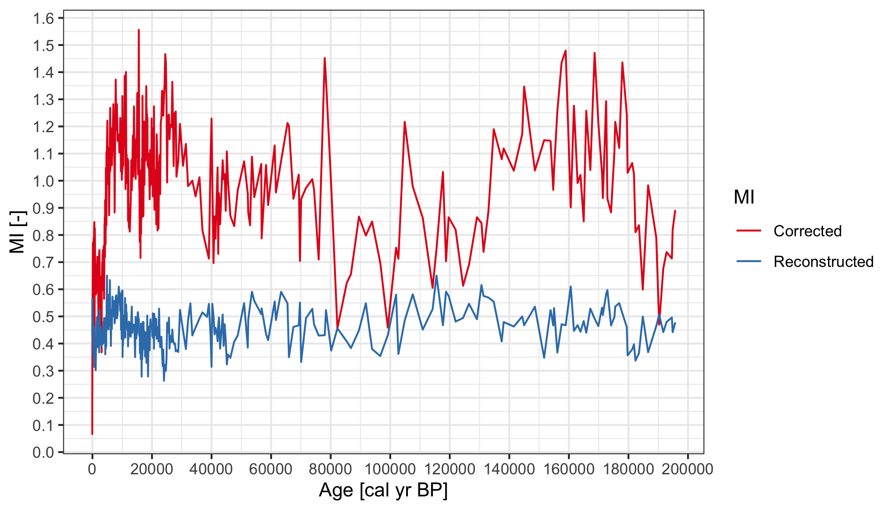

Padul Data
================

## Calculate daily temperature (modern)

CRU TS 4.04 daily interpolation from monthly data:

``` r
path <- "/path/to/CRU/4.04/"
tmin <- file.path(path, "cru_ts4.04.1901.2019.tmn.dat-clim-1961-1990-int.nc")
tmax <- file.path(path, "cru_ts4.04.1901.2019.tmx.dat-clim-1961-1990-int.nc")
output_filename <- file.path(path, "cru_ts4.04-clim-1961-1990-daily.tmp.nc")
codos::daily_temp(tmin = list(filename = tmin, id = "tmn"),
                  tmax = list(filename = tmax, id = "tmx"),
                  output_filename = output_filename)
```

##### Output file

    "cru_ts4.04-clim-1961-1990-daily.tmp.nc"

## Calculate mean growing season for daily temperature (`tmp`)

``` r
path <- "~/Desktop/iCloud/UoR/Data/CRU/4.04/"
codos::nc_gs(file.path(path, "cru_ts4.04-clim-1961-1990-daily.tmp.nc"), "tmp", thr = 0, cpus = 10)
```

##### Output file

    "cru_ts4.04-clim-1961-1990-daily.tmp-gs.nc"

Padul location: 37.0108, -3.6039

``` r
Tmp <- codos:::nc_var_get(file.path(path, "cru_ts4.04-clim-1961-1990-daily.tmp-gs.nc"), "tmp")
lat <- codos:::nc_var_get(file.path(path, "cru_ts4.04-clim-1961-1990-daily.tmp-gs.nc"), "lat")
lon <- codos:::nc_var_get(file.path(path, "cru_ts4.04-clim-1961-1990-daily.tmp-gs.nc"), "lon")
idx_y <- which.min(abs(lat$data - 37.0108))
idx_x <- which.min(abs(lon$data + 3.6039))

(aux <- Tmp$data[c(idx_x, idx_x + 1), c(idx_y - 1, idx_y)])
```

    #>         [,1]     [,2]
    #> [1,] 15.9465 14.80801
    #> [2,] 15.2319 11.76962

``` r
lat$data[c(idx_y - 1, idx_y)]
```

    #> [1] 36.75 37.25

``` r
lon$data[c(idx_x, idx_x + 1)]
```

    #> [1] -3.75 -3.25

``` r
(modern_tmp <- mean(aux))
```

    #> [1] 14.43901

## Reconstruct past temperature from `T_djf` and `T_jja`:

``` r
padul <- readr::read_csv("/path/to/padul.csv")
```

#### Calculate daily mean temperature

``` r
padul_tmp <- rowMeans(padul[, c("T_djf", "T_jja")])
```

## Obtain past CO2 from (Bereiter et al. 2015)

``` r
past_co2 <- purrr::map_dbl(padul$`Age (cal yr BP)`, codos::past_co2)
```

## Assemble the Padul data

``` r
padul2 <- tibble::tibble(age = padul$`Age (cal yr BP)`,
                         past_temp = padul_tmp,
                         past_co2 = past_co2,
                         modern_co2 = 340,
                         present_t = modern_tmp, 
                         recon_mi = padul$MI)
```

## Find corrected MI

``` r
padul2$corrected_mi <- codos::corrected_mi(padul2$present_t,
                                           padul2$past_temp,
                                           padul2$recon_mi,
                                           padul2$modern_co2,
                                           padul2$past_co2)

knitr::kable(head(padul2, 20), "html")
```

<table>

<thead>

<tr>

<th style="text-align:right;">

age

</th>

<th style="text-align:right;">

past\_temp

</th>

<th style="text-align:right;">

past\_co2

</th>

<th style="text-align:right;">

modern\_co2

</th>

<th style="text-align:right;">

present\_t

</th>

<th style="text-align:right;">

recon\_mi

</th>

<th style="text-align:right;">

corrected\_mi

</th>

</tr>

</thead>

<tbody>

<tr>

<td style="text-align:right;">

\-62

</td>

<td style="text-align:right;">

13.15918

</td>

<td style="text-align:right;">

368.020

</td>

<td style="text-align:right;">

340

</td>

<td style="text-align:right;">

14.43901

</td>

<td style="text-align:right;">

0.425809

</td>

<td style="text-align:right;">

0.1255855

</td>

</tr>

<tr>

<td style="text-align:right;">

\-56

</td>

<td style="text-align:right;">

12.86272

</td>

<td style="text-align:right;">

368.020

</td>

<td style="text-align:right;">

340

</td>

<td style="text-align:right;">

14.43901

</td>

<td style="text-align:right;">

0.471798

</td>

<td style="text-align:right;">

0.1346688

</td>

</tr>

<tr>

<td style="text-align:right;">

\-50

</td>

<td style="text-align:right;">

11.88472

</td>

<td style="text-align:right;">

364.900

</td>

<td style="text-align:right;">

340

</td>

<td style="text-align:right;">

14.43901

</td>

<td style="text-align:right;">

0.506921

</td>

<td style="text-align:right;">

0.0666097

</td>

</tr>

<tr>

<td style="text-align:right;">

\-43

</td>

<td style="text-align:right;">

13.09339

</td>

<td style="text-align:right;">

353.835

</td>

<td style="text-align:right;">

340

</td>

<td style="text-align:right;">

14.43901

</td>

<td style="text-align:right;">

0.566461

</td>

<td style="text-align:right;">

0.3253820

</td>

</tr>

<tr>

<td style="text-align:right;">

\-38

</td>

<td style="text-align:right;">

12.20387

</td>

<td style="text-align:right;">

346.520

</td>

<td style="text-align:right;">

340

</td>

<td style="text-align:right;">

14.43901

</td>

<td style="text-align:right;">

0.528049

</td>

<td style="text-align:right;">

0.2167713

</td>

</tr>

<tr>

<td style="text-align:right;">

\-31

</td>

<td style="text-align:right;">

11.87980

</td>

<td style="text-align:right;">

337.155

</td>

<td style="text-align:right;">

340

</td>

<td style="text-align:right;">

14.43901

</td>

<td style="text-align:right;">

0.522880

</td>

<td style="text-align:right;">

0.2213131

</td>

</tr>

<tr>

<td style="text-align:right;">

\-25

</td>

<td style="text-align:right;">

11.49567

</td>

<td style="text-align:right;">

331.960

</td>

<td style="text-align:right;">

340

</td>

<td style="text-align:right;">

14.43901

</td>

<td style="text-align:right;">

0.562884

</td>

<td style="text-align:right;">

0.2413042

</td>

</tr>

<tr>

<td style="text-align:right;">

\-19

</td>

<td style="text-align:right;">

12.52563

</td>

<td style="text-align:right;">

325.080

</td>

<td style="text-align:right;">

340

</td>

<td style="text-align:right;">

14.43901

</td>

<td style="text-align:right;">

0.438233

</td>

<td style="text-align:right;">

0.2826083

</td>

</tr>

<tr>

<td style="text-align:right;">

\-13

</td>

<td style="text-align:right;">

12.88969

</td>

<td style="text-align:right;">

318.840

</td>

<td style="text-align:right;">

340

</td>

<td style="text-align:right;">

14.43901

</td>

<td style="text-align:right;">

0.468382

</td>

<td style="text-align:right;">

0.3924903

</td>

</tr>

<tr>

<td style="text-align:right;">

\-6

</td>

<td style="text-align:right;">

13.13016

</td>

<td style="text-align:right;">

315.340

</td>

<td style="text-align:right;">

340

</td>

<td style="text-align:right;">

14.43901

</td>

<td style="text-align:right;">

0.483879

</td>

<td style="text-align:right;">

0.4581020

</td>

</tr>

<tr>

<td style="text-align:right;">

\-1

</td>

<td style="text-align:right;">

12.70126

</td>

<td style="text-align:right;">

312.000

</td>

<td style="text-align:right;">

340

</td>

<td style="text-align:right;">

14.43901

</td>

<td style="text-align:right;">

0.493117

</td>

<td style="text-align:right;">

0.4331878

</td>

</tr>

<tr>

<td style="text-align:right;">

6

</td>

<td style="text-align:right;">

12.72497

</td>

<td style="text-align:right;">

311.290

</td>

<td style="text-align:right;">

340

</td>

<td style="text-align:right;">

14.43901

</td>

<td style="text-align:right;">

0.490124

</td>

<td style="text-align:right;">

0.4373496

</td>

</tr>

<tr>

<td style="text-align:right;">

12

</td>

<td style="text-align:right;">

11.81530

</td>

<td style="text-align:right;">

311.730

</td>

<td style="text-align:right;">

340

</td>

<td style="text-align:right;">

14.43901

</td>

<td style="text-align:right;">

0.524648

</td>

<td style="text-align:right;">

0.3560325

</td>

</tr>

<tr>

<td style="text-align:right;">

18

</td>

<td style="text-align:right;">

11.88823

</td>

<td style="text-align:right;">

308.260

</td>

<td style="text-align:right;">

340

</td>

<td style="text-align:right;">

14.43901

</td>

<td style="text-align:right;">

0.528909

</td>

<td style="text-align:right;">

0.3895324

</td>

</tr>

<tr>

<td style="text-align:right;">

24

</td>

<td style="text-align:right;">

13.54031

</td>

<td style="text-align:right;">

304.970

</td>

<td style="text-align:right;">

340

</td>

<td style="text-align:right;">

14.43901

</td>

<td style="text-align:right;">

0.429877

</td>

<td style="text-align:right;">

0.5175019

</td>

</tr>

<tr>

<td style="text-align:right;">

30

</td>

<td style="text-align:right;">

12.42386

</td>

<td style="text-align:right;">

301.880

</td>

<td style="text-align:right;">

340

</td>

<td style="text-align:right;">

14.43901

</td>

<td style="text-align:right;">

0.446556

</td>

<td style="text-align:right;">

0.4127332

</td>

</tr>

<tr>

<td style="text-align:right;">

36

</td>

<td style="text-align:right;">

12.92161

</td>

<td style="text-align:right;">

301.000

</td>

<td style="text-align:right;">

340

</td>

<td style="text-align:right;">

14.43901

</td>

<td style="text-align:right;">

0.550525

</td>

<td style="text-align:right;">

0.5842940

</td>

</tr>

<tr>

<td style="text-align:right;">

43

</td>

<td style="text-align:right;">

12.65301

</td>

<td style="text-align:right;">

299.630

</td>

<td style="text-align:right;">

340

</td>

<td style="text-align:right;">

14.43901

</td>

<td style="text-align:right;">

0.494339

</td>

<td style="text-align:right;">

0.5027184

</td>

</tr>

<tr>

<td style="text-align:right;">

48

</td>

<td style="text-align:right;">

12.37886

</td>

<td style="text-align:right;">

295.610

</td>

<td style="text-align:right;">

340

</td>

<td style="text-align:right;">

14.43901

</td>

<td style="text-align:right;">

0.486138

</td>

<td style="text-align:right;">

0.4849940

</td>

</tr>

<tr>

<td style="text-align:right;">

60

</td>

<td style="text-align:right;">

12.49062

</td>

<td style="text-align:right;">

290.920

</td>

<td style="text-align:right;">

340

</td>

<td style="text-align:right;">

14.43901

</td>

<td style="text-align:right;">

0.486739

</td>

<td style="text-align:right;">

0.5291952

</td>

</tr>

</tbody>

</table>



  - `age < 5k`


### Plots


  - `age < 5k`


# References

Bereiter, B., Eggleston, S., Schmitt, J., Nehrbass‐Ahles, C., Stocker,
T. F., Fischer, H., Kipfstuhl, S., and Chappellaz, J. (2015), Revision
of the EPICA Dome C CO2 record from 800 to 600 kyr before present,
Geophys. Res. Lett., 42, 542– 549, <doi:10.1002/2014GL061957>.
